# 4. GC 算法(实现篇)

Now that we have reviewed the core concepts behind GC algorithms, let us move to the specific implementations one can find inside the JVM. An important aspect to recognize first is the fact that, for most JVMs out there, two different GC algorithms are needed – one to clean the Young Generation and another to clean the Old Generation.

复习了GC算法相关的概念之后, 我们一起来看看JVM中的具体实现。首先要有一个很重要的认识,对于大多数JVM来说,都需要两种不同的GC算法 —— 一种用于清理年轻代, 另一种用于清理老年代。

You can choose from a variety of such algorithms bundled into the JVM. If you do not specify a garbage collection algorithm explicitly, a platform-specific default will be used. In this chapter, the working principles of each of those algorithms will be explained.

我们可以从JVM集成的各种算法中进行选择。如果不显式地指定垃圾收集算法, 则会使用特定于平台的默认实现。在本章中,将会介绍每一种算法的实现原理。

For a quick cheat sheet, the following list is a fast way to get yourself up to speed with which algorithm combinations are possible. Note that this stands true for Java 8, for older Java versions the available combinations might differ a bit:

下面是一个快速概览的列表,显示了各种可能的组合方式。但请注意,这是Java 8中的列表,对于旧的Java版本来说,可用的组合可能会有一些不同:

<table>
	<thead>
		<tr>
			<th><b>Young</b></th>
			<th><b>Tenured</b></th>
			<th><b>JVM options</b></th>
		</tr>
	</thead>
	<tbody>
		<tr>
			<td>Incremental(增量GC)</td>
			<td>Incremental</td>
			<td>-Xincgc</td>
		</tr>
		<tr>
			<td><b>Serial</b></td>
			<td><b>Serial</b></td>
			<td><b>-XX:+UseSerialGC</b></td>
		</tr>
		<tr>
			<td>Parallel Scavenge</td>
			<td>Serial</td>
			<td>-XX:+UseParallelGC -XX:-UseParallelOldGC</td>
		</tr>
		<tr>
			<td>Parallel New</td>
			<td>Serial</td>
			<td>N/A</td>
		</tr>
		<tr>
			<td>Serial</td>
			<td>Parallel Old</td>
			<td>N/A</td>
		</tr>
		<tr>
			<td><b>Parallel Scavenge</b></td>
			<td><b>Parallel Old</b></td>
			<td><b>-XX:+UseParallelGC -XX:+UseParallelOldGC</b></td>
		</tr>
		<tr>
			<td>Parallel New</td>
			<td>Parallel Old</td>
			<td>N/A</td>
		</tr>
		<tr>
			<td>Serial</td>
			<td>CMS</td>
			<td>-XX:-UseParNewGC -XX:+UseConcMarkSweepGC</td>
		</tr>
		<tr>
			<td>Parallel Scavenge</td>
			<td>CMS</td>
			<td>N/A</td>
		</tr>
		<tr>
			<td><b>Parallel New</b></td>
			<td><b>CMS</b></td>
			<td><b>-XX:+UseParNewGC -XX:+UseConcMarkSweepGC</b></td>
		</tr>
		<tr>
			<td colspan="2" align="middle"><b>G1</b></td>
			<td><b>-XX:+UseG1GC</b></td>
		</tr>
	</tbody>
</table>

If the above looks too complex, do not worry. In reality it all boils down to just four combinations highlighted in the table above. The rest are either deprecated, not supported or just impractical to apply in real world. So, in the following chapters we cover the working principles of the following combinations:

如果看起来太复杂,不要担心。实际使用的主要是上表中黑体字显示的这四种组合。其余的要么是弃用(deprecated),要么是不支持或者是不适用于生产环境。所以,接下来我们只介绍下面这些组合以及工作原理:

- Serial GC for both the Young and Old generations
- Parallel GC for both the Young and Old generations
- Parallel New for Young + Concurrent Mark and Sweep (CMS) for the Old Generation
- G1, which encompasses collection of both Young and Old generations

 

- 年轻代和老年代的串行GC(Serial GC)
- 年轻代和老年代的并行GC(Parallel GC)
- 年轻代的并行GC() + 老年代的CMS(Concurrent Mark and Sweep)
- G1, 包括年轻代和老年代的集合

## 串行GC(Serial GC)

This collection of garbage collectors uses mark-copy for the Young Generation and mark-sweep-compact for the Old Generation. As the name implies – both of these collectors are single-threaded collectors, incapable of parallelizing the task at hand. Both collectors also trigger stop-the-world pauses, stopping all application threads.

这一类垃圾收集器针对年轻代使用 mark-copy(标记-拷贝) 算法, 对老年代使用 mark-sweep-compact(标记-清除-整理)算法. 顾名思义,两者都是单线程的垃圾收集器,不能进行并行处理。两者都会触发全线暂停(STW),停止所有的应用程序线程。

This GC algorithm cannot thus take advantage of multiple CPU cores commonly found in modern hardware. Independent of the number of cores available, just one is used by the JVM during garbage collection.

因此这种GC算法不能充分利用多核CPU。不管有多少个可用内核, JVM在垃圾收集期间都只会使用单个核心。

Enabling this collector for both the Young and Old Generation is done via specifying a single parameter in the JVM startup script:

要启用这个收集器, 只需要在JVM启动脚本中指定一个参数即可,同时对年轻代和老年代生效:

	java -XX:+UseSerialGC com.mypackages.MyExecutableClass

This option makes sense and is recommended only for the JVM with a couple of hundreds megabytes heap size, running in an environment with a single CPU. For the majority of server-side deployments this is a rare combination. Most server-side deployments are done on platforms with multiple cores, essentially meaning that by choosing Serial GC you are setting artificial limits on the use of system resources. This results in idle resources which otherwise could be used to reduce latency or increase throughput.

这个选项只在JVM堆内存只有几百MB,而且是单核CPU时有意义,而且只在这种情况下推荐使用. 对于大多数服务器,因为是多核CPU, 一般不推荐这样使用, 除非你需要限制JVM所使用的资源。大多数服务器端部署与多核平台上完成,本质上意味着通过选择串行GC你设置人工限制系统资源的使用. 最简单的就是导致资源闲置,不能有效降低延迟或增加吞吐量。

Let us now review how garbage collector logs look like when using Serial GC and what useful information one can obtain from there. For this purpose, we have turned on GC logging on the JVM using the following parameters:

现在让我们看看Serial GC的垃圾收集器日志, 以及从中可用提取什么有用的信息。为了这个目的, 我们使用下面的参数来打开GC日志记录:

	-XX:+PrintGCDetails -XX:+PrintGCDateStamps 
	-XX:+PrintGCTimeStamps

The resulting output is similar to the following:

由此产生的输出类似下面这样:

	2015-05-26T14:45:37.987-0200: 
			151.126: [GC (Allocation Failure) 
			151.126: [DefNew: 629119K->69888K(629120K), 0.0584157 secs] 
			1619346K->1273247K(2027264K), 0.0585007 secs]
		[Times: user=0.06 sys=0.00, real=0.06 secs]
	2015-05-26T14:45:59.690-0200: 
			172.829: [GC (Allocation Failure) 
			172.829: [DefNew: 629120K->629120K(629120K), 0.0000372 secs]
			172.829: [Tenured: 1203359K->755802K(1398144K), 0.1855567 secs] 
			1832479K->755802K(2027264K), 
			[Metaspace: 6741K->6741K(1056768K)], 0.1856954 secs] 
		[Times: user=0.18 sys=0.00, real=0.18 secs]

Such short snippet from the GC logs exposes a lot of information about what is taking place inside the JVM. As a matter of fact, in this snippet there were two Garbage Collection events taking place, one of them cleaning the Young Generation and another taking care of the entire heap. Let’s start by analyzing the first collection that is taking place in the Young Generation.

这样一个简短的GC日志片段,暴露了发生在JVM中的很多信息。 事实上,在这段日志中有两次GC事件发生, 其中一次清理的是年轻代,另一次处理的是整个堆内存。让我们先来分析发生在年轻代的第一次GC。

### 次要GC(Minor GC)

Following snippet contains the information about a GC event cleaning the Young Generation:

以下代码片段包含信息GC事件打扫年轻代:

> <a>`2015-05-26T14:45:37.987-0200`1</a> : <a>`151.1262`2</a> : [ <a>`GC`3</a> (<a>`Allocation Failure`4</a> 151.126:  
> [<a>`DefNew`5</a> : <a>`629119K->69888K`6</a> <a>`(629120K)`7</a> , 0.0584157 secs] <a>`1619346K->1273247K`8</a>  
> <a>`(2027264K)`9</a>, <a>`0.0585007 secs`10</a>] <a>`[Times: user=0.06 sys=0.00, real=0.06 secs]`11</a>

> 1. <a>`2015-05-26T14:45:37.987-0200`</a> – Time when the GC event started. GC事件开始的时间. 其中`-0200`是时区,而中国所在的东8区为 `+0800`。
>
> 2. <a>`151.126`</a> – Time when the GC event started, relative to the JVM startup time. Measured in seconds. 相对于JVM启动时间,GC事件开始的时间,单位是秒。
> 
> 3. <a>`GC`</a> – Flag to distinguish between Minor & Full GC. This time it is indicating that this was a Minor GC. 用来区分 Minor GC 还是 Full GC 的标志。`GC`表明这是一次**次要GC**(Minor GC)
> 
> 4. <a>`Allocation Failure`</a> – Cause of the collection. In this case, the GC is triggered due to a data structure not fitting into any region in the Young Generation. 触发垃圾收集的原因。本次GC事件, 是由于年轻代中没有适当的空间存放新的数据结构引起的。
> 
> 5. <a>`DefNew`</a> – Name of the garbage collector used. This cryptic name stands for the single-threaded mark-copy stop-the-world garbage collector used to clean Young generation. 垃圾收集器的名称。这个神秘的名字表示的是在年轻代中使用的: 单线程, 标记-拷贝(mark-copy), 全线暂停(STW) 垃圾收集器。
> 
> 6. <a>`629119K->69888K`</a> – Usage of the Young Generation before and after collection. 在垃圾收集之前和之后的年轻代使用量。
> 
> 7. <a>`(629120K)`</a> – Total size of the Young Generation. 年轻代的总大小。
> 
> 8. <a>`1619346K->1273247K`</a> – Total used heap before and after collection. 在垃圾收集之前和之后堆内存的使用情况。
> 
> 9. <a>`(2027264K)`</a> – Total available heap. 可用堆的总大小。
> 
> 10. <a>`0.0585007 secs`</a> – Duration of the GC event in seconds. GC事件持续的时间,以秒为单位。
> 
> 11. <a>`[Times: user=0.06 sys=0.00, real=0.06 secs]`</a> – Duration of the GC event, measured in different categories: GC事件的持续时间, 通过不同的类别来衡量:
> 
 - user – Total CPU time that was consumed by the garbage collector threads during this collection. 在此次垃圾回收过程中, 由GC线程所消耗的总的CPU时间

> 
 - sys – Time spent in OS calls or waiting for system event. 花在操作系统调用和等待系统事件的时间
> 
 - real – Clock time for which your application was stopped. As Serial Garbage Collector always uses just a single thread, real time is thus equal to the sum of user and system times. 应用程序被停止的系统时钟时间。因为串行垃圾收集器(Serial Garbage Collector)只使用单线程, 因此 real time 等于 user 和 system 时间的总和

From the above snippet we can understand exactly what was happening with the memory consumption inside JVM during the GC event. Before this collection, heap usage totaled at 1,619,346K. Out of this, the Young Generation consumed 629,119K. From this we can calculate the Old Generation usage being equal to 990,227K.

我们可以从上面的日志片段了解到, 在GC事件中,JVM里面的内存使用情况到底发生了什么变化。在此次垃圾收集之前, 堆内存总的使用了 **1,619,346K**。其中,年轻代使用了 **629,119K**。并可以计算出老年代使用量等于 **990,227K**。

A more important conclusion is hidden in the next batch of numbers indicating that, after the collection, Young Generation usage decreased by 559,231K but total heap usage decreased only by 346,099K. From this we can again derive that 213,132K of objects were promoted from the Young Generation to the Old Generation.

更重要的结论隐藏在下一批数字之中, 垃圾收集之后, 年轻代(Young Generation)的使用量减少了 **559231 k**, 但总的堆内存使用量只下降了 **346099 k**. 从中我们可以计算出有 **213132 k** 的对象从年轻代提升到了老年代的。

This GC event is also illustrated with the following snapshots showing memory usage right before the GC started and right after it finished:

这次GC事件也可用下面的示意图来说明, 显示的是GC开始之前, 以及刚刚结束之后, 这两个时刻的内存使用快照:

### Full GC

After understanding the first minor GC event, lets look into the second GC event in the logs:

在理解了第一个次要GC事件后,让我们看看日志中的第二个GC事件:

> <a>`2015-05-26T14:45:59.690-0200`1</a> : <a>`172.829`2</a> : [GC (Allocation Failure 172.829:  
> <a>`[DefNew: 629120K->629120K(629120K), 0.0000372 secs`3</a>] 172.829:[<a>`Tenured`4</a>:  
> <a>`1203359K->755802K`5</a> <a>`(1398144K)`6</a>, <a>`0.1855567 secs`7</a> ] <a>`1832479K->755802K`8</a>  
> <a>`(2027264K)`9</a>, <a>`[Metaspace: 6741K->6741K(1056768K)]`10</a>  
> <a>`[Times: user=0.18 sys=0.00, real=0.18 secs]`11</a>

> 
> 1. <a>`2015-05-26T14:45:59.690-0200`</a> – Time when the GC event started. GC事件开始的时间. 其中`-0200`是时区,而中国所在的东8区为 `+0800`。
> 1. <a>`172.829`</a> – Time when the GC event started, relative to the JVM startup time. Measured in seconds. 相对于JVM启动时间,GC事件开始的时间,单位是秒。
> 1. <a>`[DefNew: 629120K->629120K(629120K), 0.0000372 secs`</a> – Similar to the previous example, a minor garbage collection in the Young Generation happened during this event due to Allocation Failure. For this collection the same DefNew collector was run as before and it decreased the usage of the Young Generation from 629120K to 0. Notice that JVM reports this incorrectly due to buggy behavior and instead reports the Young Generation as being completely full. This collection took 0.0000372 seconds.
> 1. <a>`Tenured`</a> – Name of the garbage collector used to clean the Old space. The name Tenured indicates a single-threaded stop-the-world mark-sweep-compact garbage collector being used.  用于清理老年代空间的垃圾收集器名称。名称 **Tenured** 表明使用的是单线程的垃圾收集器,STW, 算法为 标记-清除-整理(mark-sweep-compact )。
> 1. <a>`1203359K->755802K`</a>  – Usage of Old generation before and after the event. 在垃圾收集之前和之后的老年代使用量。
> 1. <a>`(1398144K)`</a>  – Total capacity of the Old generation. 老年代的总大小。
> 1. <a>`0.1855567 secs`</a> – Time it took to clean the Old Generation. 清理老年代所花的时间。
> 1. <a>`1832479K->755802K`</a> – Usage of the whole heap before and after the collection of the Young and Old Generations. 在垃圾收集之前和之后堆内存的使用情况。
> 1. <a>`(2027264K)`</a> – Total heap available for the JVM. 可用堆的总大小。
> 1. <a>`[Metaspace: 6741K->6741K(1056768K)]`</a> – Similar information about Metaspace collection. As seen, no garbage was collected in Metaspace during the event.  Metaspace 空间中类似的信息。可以看到, 在GC事件中 Metaspace 中没有回收到任何垃圾。
> 1. <a>`[Times: user=0.18 sys=0.00, real=0.18 secs]`</a> – Duration of the GC event, measured in different categories: GC事件的持续时间, 通过不同的类别来衡量:
 - user – Total CPU time that was consumed by the garbage collector threads during this collection. 在此次垃圾回收过程中, 由GC线程所消耗的总的CPU时间
 - sys – Time spent in OS calls or waiting for system event. 花在操作系统调用和等待系统事件的时间
 - real – Clock time for which your application was stopped. As Serial Garbage Collector always uses just a single thread, real time is thus equal to the sum of user and system times. 应用程序被停止的系统时钟时间。因为串行垃圾收集器(Serial Garbage Collector)只使用单线程, 因此 real time 等于 user 和 system 时间的总和.

The difference with Minor GC is evident – in addition to the Young Generation, during this GC event the Old Generation and Metaspace were also cleaned. The layout of the memory before and after the event would look like the situation in the following picture:

和 Minor GC 的区别是很明显的 —— 在此次GC事件中, 除了年轻代, 还清理了老年代和Metaspace. 在GC事件前后的内存布局如下图所示:

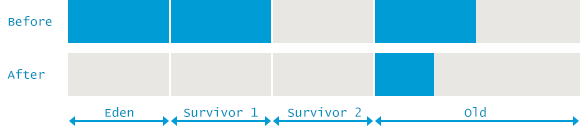

 
ccc
 
ccc
 
ccc
 
ccc

## 并行GC(Parallel GC)

This combination of Garbage Collectors uses mark-copy in the Young Generation and mark-sweep-compact in the Old Generation. Both Young and Old collections trigger stop-the-world events, stopping all application threads to perform garbage collection. Both collectors run marking and copying / compacting phases using multiple threads, hence the name ‘Parallel’. Using this approach, collection times can be considerably reduced.

这种垃圾收集器在年轻代使用 标记-拷贝(mark-copy)算法, 在老年代使用 标记-清除-整理(mark-sweep-compact)算法。年轻代和老年代的垃圾回收都会触发STW事件,暂停所有的应用程序线程再执行垃圾收集。两者在执行 标记-复制/整理阶段时都使用多个线程, 因此得名“**并行(Parallel)**”。通过使用并行方式, 使得GC时间可以大幅减少。

The number of threads used during garbage collection is configurable via the command line parameter -XX:ParallelGCThreads=NNN . The default value is equal to the number of cores in your machine.

垃圾收集时使用的线程数通过命令行参数 `-XX:ParallelGCThreads=NNN` 配置。 默认值等于机器上CPU内核的数量。

Selection of Parallel GC is done via the specification of any of the following combinations of parameters in the JVM startup script:

下面的命令行参数, 任何一组都可以用来指定并行GC:

	java -XX:+UseParallelGC com.mypackages.MyExecutableClass
	java -XX:+UseParallelOldGC com.mypackages.MyExecutableClass
	java -XX:+UseParallelGC -XX:+UseParallelOldGC com.mypackages.MyExecutableClass

Parallel Garbage Collector is suitable on multi-core machines in cases where your primary goal is to increase throughput. Higher throughput is achieved due to more efficient usage of system resources:

并行垃圾收集器适用于在多核服务器上,主要目标是增加吞吐量的情况下。因为对系统资源的有效使用,能达到更搞的吞吐量:

- during collection, all cores are cleaning the garbage in parallel, resulting in shorter pauses
- between garbage collection cycles neither of the collectors is consuming any resources

 

- 在GC期间, 所有 CPU 内核都在并行地清理垃圾, 所以暂停时间更短
- 在两次GC周期之间, 没有任何垃圾收集器在运行,不会消耗任何系统资源

On the other hand, as all phases of the collection have to happen without any interruptions, these collectors are still susceptible to long pauses during which your application threads are stopped. So if latency is your primary goal, you should check the next combinations of garbage collectors.

另一方面, 因为GC的所有阶段都不能中断, 所以这些收集器很容易出现长时间的停顿. 如果延迟是系统的主要目标, 那么应该选择下面的其他垃圾收集器组合。

Let us now review how garbage collector logs look like when using Parallel GC and what useful information one can obtain from there. For this, let’s look again at the garbage collector logs that expose once more one minor and one major GC pause:

让我们看看如何并行垃圾收集器的GC日志长什么样, 从中我们可以获取什么有用的信息。下面的GC日志中显示了一次 minor GC 和一次 major GC 暂停:

	2015-05-26T14:27:40.915-0200: 116.115: [GC (Allocation Failure) 
			[PSYoungGen: 2694440K->1305132K(2796544K)] 
		9556775K->8438926K(11185152K)
		, 0.2406675 secs] 
		[Times: user=1.77 sys=0.01, real=0.24 secs]
	2015-05-26T14:27:41.155-0200: 116.356: [Full GC (Ergonomics) 
			[PSYoungGen: 1305132K->0K(2796544K)] 
			[ParOldGen: 7133794K->6597672K(8388608K)] 8438926K->6597672K(11185152K), 
			[Metaspace: 6745K->6745K(1056768K)]
		, 0.9158801 secs]
		[Times: user=4.49 sys=0.64, real=0.92 secs]

### Minor GC

### 小GC

The first of the two events indicates a GC event taking place in the Young Generation:

第一个两个事件表示GC事件发生在年轻代:

> 5-26T14:27:40.915-02001: 116.1152:[GC3(Allocation Failure4)[PSYoungGen5: 2694440K->1305132K6(2796544K)7]9556775K->8438926K8(11185152K)9, 0.2406675 secs10][Times: user=1.77 sys=0.01, real=0.24 secs]11

> 5 - 26 - t14:27:40.915 - 02001:116.1152:[GC3(分配Failure4)[PSYoungGen5:2694440 k - > 2694440转k6(2796544 k)7]9556775 k - > 9556775 k8(11185152 k)9日0.2406675 secs10][:用户= 1.77 sys = 0.01,真实= 0.24秒)11

>
> 1. <a>`2015-05-26T14:27:40.915-0200`</a> – Time when the GC event started. GC事件开始的时间. 其中`-0200`是时区,而中国所在的东8区为 `+0800`。
> 1. <a>`116.115`</a> – Time when the GC event started, relative to the JVM startup time. Measured in seconds. 相对于JVM启动时间,GC事件开始的时间,单位是秒。
> 1. <a>`GC`</a> – Flag to distinguish between Minor & Full GC. This time it is indicating that this was a Minor GC. 用来区分 Minor GC 还是 Full GC 的标志。`GC`表明这是一次**次要GC**(Minor GC)
> 1. <a>`Allocation Failure`</a> – Cause of the collection. In this case, the GC is triggered due to a data structure not fitting into any region in the Young Generation. 触发垃圾收集的原因。本次GC事件, 是由于年轻代中没有适当的空间存放新的数据结构引起的。
> 1. <a>`PSYoungGen`</a> – Name of the garbage collector used, representing a parallel mark-copy stop-the-world garbage collector used to clean the Young generation.
> 1. <a>`2694440K->1305132K`</a> – Usage of the Young Generation before and after collection. 在垃圾收集之前和之后的年轻代使用量。
> 1. <a>`(2796544K)`</a> – Total size of the Young Generation. 年轻代的总大小。
> 1. <a>`9556775K->8438926K`</a> – Total heap usage before and after collection
> 1. <a>`(11185152K)`</a> – Total available heap. 可用堆的总大小。
> 1. <a>`0.2406675 secs`</a> – Duration of the GC event in seconds. GC事件持续的时间,以秒为单位。
> 1. <a>`[Times: user=1.77 sys=0.01, real=0.24 secs]`</a> – Duration of the GC event, measured in different categories: GC事件的持续时间, 通过不同的类别来衡量:
 - user – Total CPU time that was consumed by the garbage collector threads during this collection. 在此次垃圾回收过程中, 由GC线程所消耗的总的CPU时间
 - sys – Time spent in OS calls or waiting for system event. 花在操作系统调用和等待系统事件的时间
 - real – Clock time for which your application was stopped. With Parallel GC this number should be close to (user time + system time) divided by the number of threads used by Garbage Collector. In this particular case 8 threads were used. Note that due to some activities not being parallelizable, it always exceeds the ratio by a certain amount.

>
1。2015 - 05 - 26 t14:27:40.915 - 0200 GC事件开始的时候。
1。116.115 - GC事件开始,相对于JVM启动时间。以秒为单位来衡量。
1。GC -标记区分小&完整GC。这次是表明这是一个次要的GC。
1。分配失败——收集的原因。在这种情况下,GC将触发一个数据结构不适合任何地区的年轻代。
1。PSYoungGen——垃圾收集器使用的名字,代表一个平行mark-copy停止一切垃圾收集器用于干净的年轻代。
1。2694440 k - > 2694440 k -使用集合之前和之后的年轻代
1。(2796544 k)——年轻代的总大小
1。9556775K - > 8438926K——heap usage and后总在收集
1。(总)——heap 11185152K检验
1。0.2406675节——访问时间GC event in seconds
1。(时间:用户= 1.77 sys = 0.01,真实= 0.24秒)- GC事件期间,测量在不同的类别:
——用户——总消耗的CPU时间垃圾收集器线程在此集合
- sys -时间花在操作系统调用或等待系统事件
-真正的时钟时间为您的应用程序被停止了。与平行GC应该接近这个数字(用户时间+系统时间)除以垃圾收集器使用的线程的数量.In this particular case 8 threads were 2. Note that due to some activities not being parallelizable, it always exceeds the thewire by a certain amount.

So, in short, the total heap consumption before the collection was 9,556,775K. Out of this Young generation was 2,694,440K. This means that used Old generation was 6,862,335K. After the collection young generation usage decreased by 1,389,308K, but total heap usage decreased only by 1,117,849K. This means that 271,459K was promoted from Young generation to Old.

所以,简而言之,收集前的堆总消费量为9556775 k。的年轻代是2694440 k。这意味着用老年代是6862335 k.收集后的年轻代使用下降了1389308 k,但总堆使用情况只有1117849 k下降。这意味着271459 k从年轻代被提拔到老。

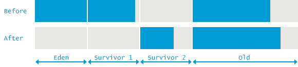

### Full GC

### 完整GC

After understanding how Parallel GC cleans the Young Generation, we are ready to look at how the whole heap is being cleaned by analyzing the next snippet from the GC logs:

年轻代了解平行GC清洁后,我们准备看看整个堆正在清理GC日志分析下一个片段:

>
2015-05-26T14:27:41.155-02001:116.3562:[Full GC3 (Ergonomics4)[PSYoungGen: 1305132K->0K(2796544K)]5[ParOldGen6:7133794K->6597672K 7(8388608K)8] 8438926K->6597672K9(11185152K)10, [Metaspace: 6745K->6745K(1056768K)] 11, 0.9158801 secs12, [Times: user=4.49 sys=0.64, real=0.92 secs]13

>
2015-05-26T14:27:41.155-02001:116.3562:[Full GC3 (Ergonomics4)[PSYoungGen: 1305132K->0K(2796544K)]5[ParOldGen6:7133794K->6597672K 7(8388608K)8] 8438926K->6597672K9(11185152K)10, [Metaspace: 6745K->6745K(1056768K)] 11, 0.9158801 secs12, [Times: user=4.49 sys=0.64, real=0.92 secs]13

>
> 1. <a>`2015-05-26T14:27:41.155-0200`</a> – Time when the GC event started. GC事件开始的时间. 其中`-0200`是时区,而中国所在的东8区为 `+0800`
> 1. <a>`116.356`</a> – Time when the GC event started, relative to the JVM startup time. Measured in seconds. 相对于JVM启动时间,GC事件开始的时间,单位是秒。 In this case we can see the event started right after the previous Minor GC finished.
> 1. <a>`Full GC`</a> – Flag indicating that the event is Full GC event cleaning both the Young and Old generations.
> 1. <a>`Ergonomics`</a> – Reason for the GC taking place. This indicates that the JVM internal ergonomics decided this is the right time to collect some garbage.
> 1. <a>`[PSYoungGen: 1305132K->0K(2796544K)]`</a> – Similar to previous example, a parallel mark-copy stop-the-world garbage collector named “PSYoungGen” was used to clean the Young Generation. Usage of Young Generation shrank from 1305132K to 0, which is the typical result of a Full GC.
> 1. <a>`ParOldGen`</a> – Type of the collector used to clean the Old Generation. In this case, parallel mark-sweep-compact stop-the-world garbage collector named ParOldGen was used. 用于清理老年代空间的垃圾收集器类型。在这里使用的是名为 **ParOldGen** 的垃圾收集器, 这是一种并行的垃圾收集器,STW, 算法为 标记-清除-整理(mark-sweep-compact)。
> 1. <a>`7133794K->6597672K `</a> – Usage of the Old Generation before and after the collection. 在垃圾收集之前和之后老年代内存的使用情况。
> 1. <a>`(8388608K)`</a> – Total size of the Old Generation. 老年代的总大小。
> 1. <a>`8438926K->6597672K`</a> – Usage of the whole heap before and after the collection. 在垃圾收集之前和之后堆内存的使用情况。
> 1. <a>`(11185152K)`</a> – Total heap available. 可用堆的总大小。
> 1. <a>`[Metaspace: 6745K->6745K(1056768K)] `</a> – Similar information about Metaspace region. As we can see, no garbage was collected in Metaspace during this event. Metaspace 空间中类似的信息。可以看到, 在GC事件中 Metaspace 中没有回收到任何垃圾。
> 1. <a>`0.9158801 secs`</a> – Duration of the GC event in seconds. GC事件持续的时间,以秒为单位。
> 1. <a>`[Times: user=4.49 sys=0.64, real=0.92 secs]`</a> – Duration of the GC event, measured in different categories: GC事件的持续时间, 通过不同的类别来衡量:
 - user – Total CPU time that was consumed by the garbage collector threads during this collection. 在此次垃圾回收过程中, 由GC线程所消耗的总的CPU时间
 - sys – Time spent in OS calls or waiting for system event. 花在操作系统调用和等待系统事件的时间
 - real – Clock time for which your application was stopped. 应用程序被停止的系统时钟时间。. With Parallel GC this number should be close to (user time + system time) divided by the number of threads used by Garbage Collector. In this particular case 8 threads were used. Note that due to some activities not being parallelizable, it always exceeds the ratio by a certain amount.

>
1。2015 - 05 - 26 t14:27:41.155 - 0200 GC事件开始的时候
1。116.356 - GC事件开始,相对于JVM启动时间。以秒为单位来衡量。在这种情况下我们可以看到事件后开始之前的小GC完成。
1。完整GC -标志,指示事件充满GC事件清洁年轻和年老年代又一代。
1。人体工程学- GC发生的原因。这表明JVM内部环境决定这是正确的时间去收集一些垃圾。
1。[PSYoungGen:1305132 k - > 0 k(2796544 k)]——类似于之前的例子,一个平行mark-copy停止一切垃圾收集器,名叫“PSYoungGen”被用来清洁的年轻代.年轻代的使用减少从1305132 k为0,这是一个完整的GC的典型结果。
1。ParOldGen -类型的收集器用于清洁老年代。在这种情况下,并行标记-清除-整理停止一切垃圾收集器,名叫ParOldGen使用。
1。7133794 k - > 7133794 k -前后使用老年代的集合
1。(8388608 k)——老年代的总大小
1。8438926 k - > 8438926 k -使用前后整个堆的集合。
1。(11185152 k)-总堆可用
1。[Metaspace:6745 k - > 6745 k(1056768 k)]——Metaspace地区类似的信息。我们可以看到,没有垃圾收集在Metaspace这个事件。
1。0.9158801秒- GC事件持续时间以秒为单位
1。(时间:用户= 4.49 sys = 0.64,真实= 0.92秒)- GC事件期间,测量在不同的类别:
——用户——总消耗的CPU时间垃圾收集器线程在此集合
- sys -时间花在操作系统调用或等待系统事件
-真正的时钟时间为您的应用程序被停止了。与平行GC应该接近这个数字(用户时间+系统时间)除以垃圾收集器使用的线程的数量.在这种特殊情况下8线程使用。注意,由于一些活动不是可平行的,它总是超过一定数量的比率。

Again, the difference with Minor GC is evident – in addition to the Young Generation, during this GC event the Old Generation and Metaspace were also cleaned. The layout of the memory before and after the event would look like the situation in the following picture:

同样,和 Minor GC 的区别是很明显的 —— 在此次GC事件中, 除了年轻代, 还清理了老年代和Metaspace. 在GC事件前后的内存布局如下图所示:

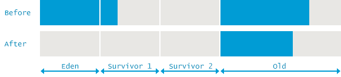

## Concurrent Mark and Sweep

## 并发标记和清扫

The official name for this collection of garbage collectors is “Mostly Concurrent Mark and Sweep Garbage Collector”. It uses the parallel stop-the-world mark-copy algorithm in the Young Generation and the mostly concurrent mark-sweep algorithm in the Old Generation.

这组垃圾收集器的官方名称是“主要并发标记和清扫垃圾收集器”.它使用并行停止一切mark-copy算法大多年轻代和并发标记-清除算法在老年代。

This collector was designed to avoid long pauses while collecting in the Old Generation. It achieves this by two means. Firstly, it does not compact the Old Generation but uses free-lists to manage reclaimed space. Secondly, it does most of the job in the mark-and-sweep phases concurrently with the application. This means that garbage collection is not explicitly stopping the application threads to perform these phases. It should be noted, however, that it still competes for CPU time with the application threads. By default, the number of threads used by this GC algorithm equals to ¼ of the number of physical cores of your machine.

这种收集器是为了避免出现长时间的停顿在收集老年代。达到这两个意思。首先,It does not compact, the Old Generation but USES free - lists to the manage reclaimed space. Secondly, it does most of the job in the mark - and - sweep phases concurrently with the application.这意味着垃圾收集没有显式地停止应用程序线程来执行这些阶段。然而,应该注意的,它仍然争夺与应用程序线程CPU时间。默认情况下,这个GC算法所使用的线程的数量等于¼物理内核的数量的机器。

This garbage collector can be chosen by specifying the following option on your command line:

这个垃圾收集器可以选择通过指定以下选项在命令行:

	java -XX:+UseConcMarkSweepGC com.mypackages.MyExecutableClass

This combination is a good choice on multi-core machines if your primary target is latency. Decreasing the duration of an individual GC pause directly affects the way your application is perceived by end-users, giving them a feel of a more responsive application. As most of the time at least some CPU resources are consumed by the GC and not executing your application’s code, CMS generally often worse throughput than Parallel GC in CPU-bound applications.

这种组合是一个很好的选择在多核机器上如果你的主要目标是延迟.减少一个单独的GC暂停时间直接影响应用程序的方法是由终端用户感知,给他们的感觉更加敏感的应用程序.大部分的时间至少有一些CPU资源消耗的GC和不执行应用程序的代码,CMS通常经常在中央处理器受限的应用程序吞吐量比平行GC。

As with previous GC algorithms, let us now see how this algorithm is applied in practice by taking a look at the GC logs that once again expose one minor and one major GC pause:

与之前的GC算法一样,现在让我们看看这个算法应用在实践中通过看GC日志,再一次暴露一个小,一个主要的GC暂停:

	2015-05-26T16:23:07.219-0200: 64.322: [GC (Allocation Failure) 64.322: [ParNew: 613404K->68068K(613440K), 0.1020465 secs] 10885349K->10880154K(12514816K), 0.1021309 secs] [Times: user=0.78 sys=0.01, real=0.11 secs]
	2015-05-26T16:23:07.321-0200: 64.425: [GC (CMS Initial Mark) [1 CMS-initial-mark: 10812086K(11901376K)] 10887844K(12514816K), 0.0001997 secs] [Times: user=0.00 sys=0.00, real=0.00 secs]
	2015-05-26T16:23:07.321-0200: 64.425: [CMS-concurrent-mark-start]
	2015-05-26T16:23:07.357-0200: 64.460: [CMS-concurrent-mark: 0.035/0.035 secs] [Times: user=0.07 sys=0.00, real=0.03 secs]
	2015-05-26T16:23:07.357-0200: 64.460: [CMS-concurrent-preclean-start]
	2015-05-26T16:23:07.373-0200: 64.476: [CMS-concurrent-preclean: 0.016/0.016 secs] [Times: user=0.02 sys=0.00, real=0.02 secs]
	2015-05-26T16:23:07.373-0200: 64.476: [CMS-concurrent-abortable-preclean-start]
	2015-05-26T16:23:08.446-0200: 65.550: [CMS-concurrent-abortable-preclean: 0.167/1.074 secs] [Times: user=0.20 sys=0.00, real=1.07 secs]
	2015-05-26T16:23:08.447-0200: 65.550: [GC (CMS Final Remark) [YG occupancy: 387920 K (613440 K)]65.550: [Rescan (parallel) , 0.0085125 secs]65.559: [weak refs processing, 0.0000243 secs]65.559: [class unloading, 0.0013120 secs]65.560: [scrub symbol table, 0.0008345 secs]65.561: [scrub string table, 0.0001759 secs][1 CMS-remark: 10812086K(11901376K)] 11200006K(12514816K), 0.0110730 secs] [Times: user=0.06 sys=0.00, real=0.01 secs]
	2015-05-26T16:23:08.458-0200: 65.561: [CMS-concurrent-sweep-start]
	2015-05-26T16:23:08.485-0200: 65.588: [CMS-concurrent-sweep: 0.027/0.027 secs] [Times: user=0.03 sys=0.00, real=0.03 secs]
	2015-05-26T16:23:08.485-0200: 65.589: [CMS-concurrent-reset-start]
	2015-05-26T16:23:08.497-0200: 65.601: [CMS-concurrent-reset: 0.012/0.012 secs] [Times: user=0.01 sys=0.00, real=0.01 secs]

### Minor GC

### 小GC

First of the GC events in log denotes a minor GC cleaning the Young space. Let’s analyze how this collector combination behaves in this regard:

首先GC日志事件代表一个小GC清洁年轻的空间。我们分析这个收集器组合在这方面的表现:

>
2015-05-26T16:23:07.219-02001: 64.3222:[GC3(Allocation Failure4) 64.322: [ParNew5: 613404K->68068K6(613440K) 7, 0.1020465 secs8] 10885349K->10880154K 9(12514816K)10, 0.1021309 secs11][Times: user=0.78 sys=0.01, real=0.11 secs]12

>
2015-05-26T16:23:07.219-02001: 64.3222:[GC3(Allocation Failure4) 64.322: [ParNew5: 613404K->68068K6(613440K) 7, 0.1020465 secs8] 10885349K->10880154K 9(12514816K)10, 0.1021309 secs11][Times: user=0.78 sys=0.01, real=0.11 secs]12

>
> 1. <a>`2015-05-26T16:23:07.219-0200`</a> – Time when the GC event started. GC事件开始的时间. 其中`-0200`是时区,而中国所在的东8区为 `+0800`。
> 1. <a>`64.322`</a> – Time when the GC event started, relative to the JVM startup time. Measured in seconds. 相对于JVM启动时间,GC事件开始的时间,单位是秒。
> 1. <a>`GC`</a> – Flag to distinguish between Minor & Full GC. This time it is indicating that this was a Minor GC. 用来区分 Minor GC 还是 Full GC 的标志。`GC`表明这是一次**次要GC**(Minor GC)
> 1. <a>`Allocation Failure`</a> – Cause of the collection. In this case, the GC is triggered due to a requested allocation not fitting into any region in Young Generation.
> 1. <a>`ParNew`</a> – Name of the collector used, this time it indicates a parallel mark-copy stop-the-world garbage collector used in the Young Generation, designed to work in conjunction with Concurrent Mark & Sweep garbage collector in the Old Generation.
> 1. <a>`613404K->68068K`</a> – Usage of the Young Generation before and after collection. 在垃圾收集之前和之后的年轻代使用量。
> 1. <a>`(613440K) `</a> – Total size of the Young Generation. 年轻代的总大小。
> 1. <a>`0.1020465 secs`</a> – Duration for the collection w/o final cleanup.
> 1. <a>`10885349K->10880154K `</a> – Total used heap before and after collection. 在垃圾收集之前和之后堆内存的使用情况。
> 1. <a>`(12514816K)`</a> – Total available heap. 可用堆的总大小。
> 1. <a>`0.1021309 secs`</a> – The time it took for the garbage collector to mark and copy live objects in the Young Generation. This includes communication overhead with ConcurrentMarkSweep collector, promotion of objects that are old enough to the Old Generation and some final cleanup at the end of the garbage collection cycle.
> 1. <a>``[Times: user=0.78 sys=0.01, real=0.11 secs]``</a> – Duration of the GC event, measured in different categories: GC事件的持续时间, 通过不同的类别来衡量:
 - user – Total CPU time that was consumed by the garbage collector threads during this collection. 在此次垃圾回收过程中, 由GC线程所消耗的总的CPU时间
 - sys – Time spent in OS calls or waiting for system event. 花在操作系统调用和等待系统事件的时间
 - real – Clock time for which your application was stopped. 应用程序被停止的系统时钟时间。. With Parallel GC this number should be close to (user time + system time) divided by the number of threads used by the Garbage Collector. In this particular case 8 threads were used. Note that due to some activities not being parallelizable, it always exceeds the ratio by a certain amount.

>
1。2015 - 05 - 26 t16:23:07.219 - 0200 GC事件开始的时候。
1。64.322 - GC事件开始,相对于JVM启动时间。以秒为单位来衡量。
1。GC -标记区分小&完整GC。这次是表明这是一个次要的GC。
1。分配失败——收集的原因。在这种情况下,GC由于触发请求分配不符合年轻代的任何地区。
1。ParNew收集器使用的名字,这一次,它表明一个平行mark-copy停止一切垃圾收集器在年轻代中使用,设计工作与并发标记和清扫垃圾收集器在老年代。
1。613404 k - > 613404 k -使用集合之前和之后的年轻代。
1。613440K)——合计(" Young严重。
1。0.1020465干燥——不得不for the收藏w / o最后地区清扫活动等。
1。10885349K→10880154K——总数heap胎儿和收藏friedberg所用。
1。(12514816 k)-总可用堆。
1。0.1021309秒-垃圾收集器的时间标记,在年轻代活的对象。这包括通信开销ConcurrentMarkSweep收集器,推广对象年龄老的一代和一些最后的清理垃圾收集周期结束。
1。(时间:用户= 0.78 sys = 0.01,真实= 0.11秒)”- GC事件期间,测量在不同的类别:
——用户——总消耗的CPU时间垃圾收集器线程在此集合
- sys -时间花在操作系统调用或等待系统事件
-真正的时钟时间为您的应用程序被停止了。与平行GC应该接近这个数字(用户时间+系统时间)除以垃圾收集器使用的线程的数量.在这种特殊情况下8线程使用。注意,由于一些活动不是可平行的,它总是超过一定数量的比率。

From the above we can thus see that before the collection the total used heap was 10,885,349K and the used Young Generation share was 613,404K. This means that the Old Generation share was 10,271,945K. After the collection, Young Generation usage decreased by 545,336K but total heap usage decreased only by 5,195K. This means that 540,141K was promoted from the Young Generation to Old.

从上面我们可以看到,在收藏前总使用堆是10885349 k,年轻代使用份额是613404 k。这意味着老年代份额是10271年,945 k。集合后,年轻代的使用减少了545336 k但总堆使用只有5195 k下降。这意味着540141 k被提拔年轻代的历史。

### Full GC

### 完整GC

Now, just as you are becoming accustomed to reading GC logs already, this chapter will introduce a completely different format for the next garbage collection event in the logs. The lengthy output that follows consists of all the different phases of the mostly concurrent garbage collection in the Old Generation. We will review them one by one but in this case we will cover the log content in phases instead of the entire event log at once for more concise representation. But to recap, the whole event for the CMS collector looks like the following:

现在,就像你已经越来越习惯于阅读GC日志,本章将介绍一种完全不同的格式在接下来的垃圾收集事件日志中.冗长的输出,包括所有不同的阶段主要是并发垃圾收集的老的一代.We will review them one by one, but in this case We will cover the log content in home phases the - the event log at once for more concise representation. But to recap,整个事件的CMS收集器看起来如下:

	2015-05-26T16:23:07.321-0200: 64.425: [GC (CMS Initial Mark) [1 CMS-initial-mark: 10812086K(11901376K)] 10887844K(12514816K), 0.0001997 secs] [Times: user=0.00 sys=0.00, real=0.00 secs]
	2015-05-26T16:23:07.321-0200: 64.425: [CMS-concurrent-mark-start]
	2015-05-26T16:23:07.357-0200: 64.460: [CMS-concurrent-mark: 0.035/0.035 secs] [Times: user=0.07 sys=0.00, real=0.03 secs]
	2015-05-26T16:23:07.357-0200: 64.460: [CMS-concurrent-preclean-start]
	2015-05-26T16:23:07.373-0200: 64.476: [CMS-concurrent-preclean: 0.016/0.016 secs] [Times: user=0.02 sys=0.00, real=0.02 secs]
	2015-05-26T16:23:07.373-0200: 64.476: [CMS-concurrent-abortable-preclean-start]
	2015-05-26T16:23:08.446-0200: 65.550: [CMS-concurrent-abortable-preclean: 0.167/1.074 secs] [Times: user=0.20 sys=0.00, real=1.07 secs]
	2015-05-26T16:23:08.447-0200: 65.550: [GC (CMS Final Remark) [YG occupancy: 387920 K (613440 K)]65.550: [Rescan (parallel) , 0.0085125 secs]65.559: [weak refs processing, 0.0000243 secs]65.559: [class unloading, 0.0013120 secs]65.560: [scrub symbol table, 0.0008345 secs]65.561: [scrub string table, 0.0001759 secs][1 CMS-remark: 10812086K(11901376K)] 11200006K(12514816K), 0.0110730 secs] [Times: user=0.06 sys=0.00, real=0.01 secs]
	2015-05-26T16:23:08.458-0200: 65.561: [CMS-concurrent-sweep-start]
	2015-05-26T16:23:08.485-0200: 65.588: [CMS-concurrent-sweep: 0.027/0.027 secs] [Times: user=0.03 sys=0.00, real=0.03 secs]
	2015-05-26T16:23:08.485-0200: 65.589: [CMS-concurrent-reset-start]
	2015-05-26T16:23:08.497-0200: 65.601: [CMS-concurrent-reset: 0.012/0.012 secs] [Times: user=0.01 sys=0.00, real=0.01 secs]

Just to bear in mind – in real world situation Minor Garbage Collections of the Young Generation can occur anytime during concurrent collecting the Old Generation. In such case the major collection records seen below will be interleaved with the Minor GC events covered in previous chapter.

只是要记住——在真实世界情况下小垃圾收集的年轻代可以随时发生在并发收集老年代.在这种情况下,主要收集记录所示将交叉小GC事件在前一章。

**Phase 1: Initial Mark**. This is one of the two stop-the-world events during CMS. The goal of this phase is to mark all the objects in the Old Generation that are either direct GC roots or are referenced from some live object in the Young Generation. The latter is important since the Old Generation is collected separately.

* *第1阶段:初始马克* *。这是其中一个CMS期间停止一切活动.这个阶段的目的是为了纪念所有对象在老年代直接GC根或引用一些对象在年轻代的生活.后者分别收集非常重要,因为老年代。

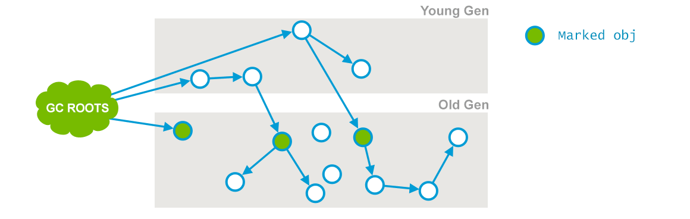

>
2015-05-26T16:23:07.321-0200: 64.421: [GC (CMS Initial Mark2[1 CMS-initial-mark: 10812086K3(11901376K)4] 10887844K5(12514816K)6, 0.0001997 secs] [Times: user=0.00 sys=0.00, real=0.00 secs]7

>
2015-05-26T16:23:07.321-0200: 64.421: [GC (CMS Initial Mark2[1 CMS-initial-mark: 10812086K3(11901376K)4] 10887844K5(12514816K)6, 0.0001997 secs] [Times: user=0.00 sys=0.00, real=0.00 secs]7

>
> 1. <a>`2015-05-26T16:23:07.321-0200: 64.42`</a> – Time the GC event started, both clock time and relative to the time from the JVM start. For the following phases the same notion is used throughout the event and is thus skipped for brevity.
> 1. <a>`CMS Initial Mark – Phase of the collection – “Initial Mark” in this occasion`</a> – that is collecting all GC Roots.
> 1. <a>`10812086K`</a> – Currently used Old Generation.
> 1. <a>`(11901376K)`</a> – Total available memory in the Old Generation.
> 1. <a>`10887844K`</a> – Currently used heap
> 1. <a>`(12514816K)`</a> – Total available heap. 可用堆的总大小。
> 1. <a>`0.0001997 secs] [Times: user=0.00 sys=0.00, real=0.00 secs]`</a> – Duration of the phase, measured also in user, system and real time.

>
1。2015 - 05 - 26 - t16:23:07.321 - 0200:64.42 - GC事件开始,时钟时间和相对于从JVM开始的时间.下列阶段使用了相同的概念在整个事件,因此跳过简洁。
1。CMS初始马克-收集阶段的“初始标记”这一次——这是收集所有GC根。
1。10812086 k -当前使用老的一代。
1。可用内存(11901376 k)——总在老年代。
1。10887844 k -当前使用的堆
1。(12514816 k)-总可用堆
1。0.0001997秒][*:用户= 0.00 sys = 0.00,真实= 0.00秒)-持续时间的阶段,测量也在用户,系统和实时。

**Phase 2: Concurrent Mark.** During this phase the Garbage Collector traverses the Old Generation and marks all live objects, starting from the roots found in the previous phase of “Initial Mark”. The “Concurrent Mark” phase, as its name suggests, runs concurrently with your application and does not stop the application threads. Note that not all the live objects in the Old Generation may be marked, since the application is mutating references during the marking.

* *第二阶段:并发标记。* *在此阶段垃圾收集器遍历老的一代和标记所有活动对象,从根开始前一阶段发现的“初始标记”.“并发标记”阶段,顾名思义,与您的应用程序同时运行,不停止应用程序线程.请注意,并不是所有的老年代可能被标记为活动对象,由于应用程序变异引用标记。

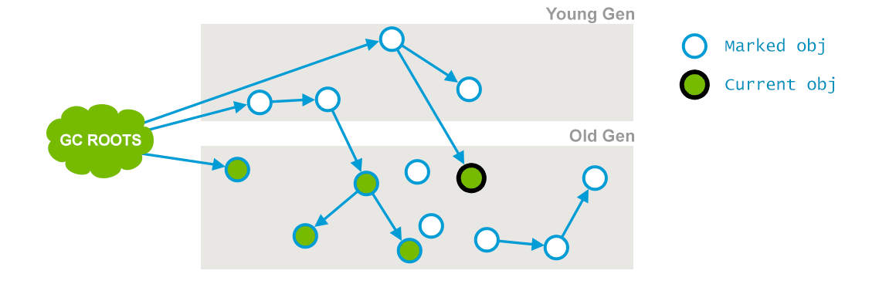

In the illustration, a reference pointing away from the “Current object” was removed concurrently with the marking thread.

插图,一个引用指向远离“当前对象”被标记线程并发。

>
2015-05-26T16:23:07.321-0200: 64.425: [CMS-concurrent-mark-start]

>
2015-05-26T16:23:07.321-0200: 64.425: [CMS-concurrent-mark-start]

>
2015-05-26T16:23:07.357-0200: 64.460: [CMS-concurrent-mark1: 035/0.035 secs2] [Times: user=0.07 sys=0.00, real=0.03 secs]3

>
2015-05-26T16:23:07.357-0200: 64.460: [CMS-concurrent-mark1: 035/0.035 secs2] [Times: user=0.07 sys=0.00, real=0.03 secs]3

>
> 1. <a>`CMS-concurrent-mark – Phase of the collection – “Concurrent Mark” in this occasion`</a> – that is traversing the Old Generation and marking all live objects.
> 1. <a>`035/0.035 secs`</a> – Duration of the phase, showing elapsed time and wall clock time correspondingly.
> 1. <a>`[Times: user=0.07 sys=0.00, real=0.03 secs]`</a> – “Times” section is less meaningful for concurrent phases as it is measured from the start of the concurrent marking and includes more than just the work done for the concurrent marking.

>
1。CMS-concurrent-mark阶段的集合——“并发标记”这一次——这是遍历老的一代和标记所有活动对象。
1。035/0.035秒的时间阶段,显示运行时间和相应的挂钟时间。
1。(时间:用户= 0.07 sys = 0.00,= 0.03秒)-“*”部分对并发阶段不太有意义的,因为这是测量从一开始的并发标记的工作,包括的不仅仅是并发标记。

**Phase 3: Concurrent Preclean.** This is again a concurrent phase, running in parallel with the application threads, not stopping them. While the previous phase was running concurrently with the application, some references were changed. Whenever that happens, the JVM marks the area of the heap (called “Card”) that contains the mutated object as “dirty” (this is known as Card Marking).

* *阶段3:并发Preclean。* *这又是一个并发阶段,与应用程序线程并行运行,没有阻止他们.在前一阶段是与应用程序同时运行,一些引用被改变了。每当发生这种情况,JVM堆的标志着区域(称为“卡”)包含突变对象作为“脏”(这就是所谓的卡片标记)。

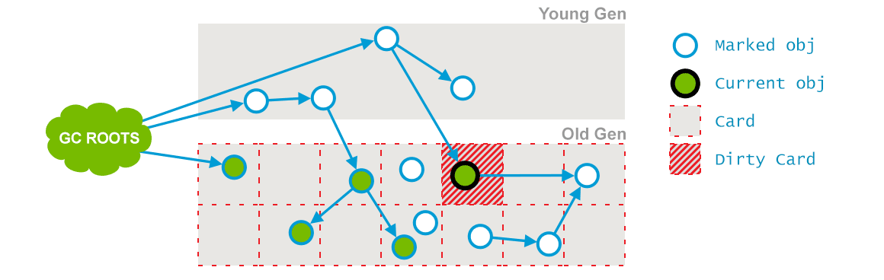

In the pre-cleaning phase, these dirty objects are accounted for, and the objects reachable from them are also marked. The cards are cleaned when this is done.

在预清洗阶段,占这些肮脏的对象,对象可以从他们也明显。当这样做是卡片清洁。

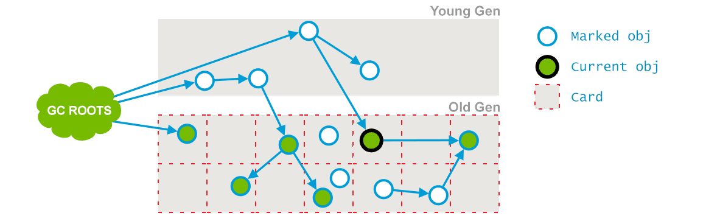

Additionally, some necessary housekeeping and preparations for the Final Remark phase are performed.

此外,一些必要的家务,准备最后的评论阶段执行。

>
2015-05-26T16:23:07.357-0200: 64.460: [CMS-concurrent-preclean-start]
>
2015-05-26T16:23:07.373-0200: 64.476: [CMS-concurrent-preclean1: 0.016/0.016 secs2] [Times: user=0.02 sys=0.00, real=0.02 secs]3

>
2015 - 05 - 26 - t16:23:07.357 - 0200:64.460:[CMS-concurrent-preclean-start]
>
2015 - 05 - 26 - t16:23:07.373 - 0200:64.476:[CMS-concurrent-preclean1:0.016/0.016 secs2][:用户= 0.02 sys = 0.00,真实= 0.02秒)3

>
> 1. <a>`CMS-concurrent-preclean – Phase of the collection – “Concurrent Preclean” in this occasion`</a> – accounting for references being changed during previous marking phase.
> 1. <a>`0.016/0.016 secs`</a> – Duration of the phase, showing elapsed time and wall clock time correspondingly.
> 1. <a>`[Times: user=0.02 sys=0.00, real=0.02 secs]`</a> – The “Times” section is less meaningful for concurrent phases as it is measured from the start of the concurrent marking and includes more than just the work done for the concurrent marking.

>
1。CMS-concurrent-preclean阶段的集合——“并发Preclean”这一次,占引用被改变了以前的标记阶段。
1。0.016/0.016秒的时间阶段,显示运行时间和相应的挂钟时间。
1。[时报:运用= 0.02 sys = 0.00 millan = 0.02秒)——“*”部分对并发阶段不太有意义的,因为这是测量从一开始的并发标记的工作,包括的不仅仅是并发标记。

**Phase 4: Concurrent Abortable Preclean.** Again, a concurrent phase that is not stopping the application’s threads. This one attempts to take as much work off the shoulders of the stop-the-world Final Remark as possible. The exact duration of this phase depends on a number of factors, since it iterates doing the same thing until one of the abortion conditions (such as the number of iterations, amount of useful work done, elapsed wall clock time, etc) is met.

* * 4阶段:并发Abortable Preclean。* *,并发阶段,这并不能阻止应用程序的线程.这一尝试尽可能多的工作的肩膀停止一切最后的话。这一阶段的具体时间取决于很多因素,因为它迭代堕胎做同样的事情,直到其中的一个条件(如迭代的数量,数量的有用的工作,经过挂钟时间,等等)是满足。

>
2015-05-26T16:23:07.373-0200: 64.476: [CMS-concurrent-abortable-preclean-start]
>
2015-05-26T16:23:08.446-0200: 65.550: [CMS-concurrent-abortable-preclean1: 0.167/1.074 secs2] [Times: user=0.20 sys=0.00, real=1.07 secs]3

>
2015 - 05 - 26 - t16:23:07.373 - 0200:64.476:[CMS-concurrent-abortable-preclean-start]
>
2015 - 05 - 26 - t16:23:08.446 - 0200:65.550:[CMS-concurrent-abortable-preclean1:0.167/1.074 secs2][:用户= 0.20 sys = 0.00,真实= 1.07秒)3

>
> 1. <a>`CMS-concurrent-abortable-preclean`</a> – Phase of the collection “Concurrent Abortable Preclean” in this occasion
> 1. <a>`0.167/1.074 secs – Duration of the phase, showing elapsed and wall clock time respectively. It is interesting to note that the user time reported is a lot smaller than clock time. Usually we have seen that real time is less than user time, meaning that some work was done in parallel and so elapsed clock time is less than used CPU time. Here we have a little amount of work`</a> – for 0.167 seconds of CPU time, and garbage collector threads were doing a lot of waiting. Essentially, they were trying to stave off for as long as possible before having to do an STW pause. By default, this phase may last for up to 5 seconds.
> 1. <a>`[Times: user=0.20 sys=0.00, real=1.07 secs]`</a> – The “Times” section is less meaningful for concurrent phases, as it is measured from the start of the concurrent marking and includes more than just the work done for the concurrent marking.

>
1。CMS-concurrent-abortable-preclean -阶段的集合”并发Abortable Preclean”在这个场合
1。0.167/1.074秒的时间阶段,分别显示逃逸和挂钟时间。有趣的是,据用户时间比时钟时间小很多.通常我们已经看到实时小于用户时间,这意味着一些并行工作,所以运行时钟时间小于使用的CPU时间.这里我们有少量的工作—CPU时间的0.167秒,垃圾收集器线程所做的很多的等待。本质上,他们试图避免尽可能长时间之前必须做一个STW暂停。默认情况下,这个阶段可能持续5秒。
1。(时间:用户= 0.20 sys = 0.00,真实= 1.07秒)——“*”部分不太有意义的并发阶段,是测量从一开始的并发标记的工作,包括的不仅仅是并发标记。

This phase may significantly impact the duration of the upcoming stop-the-world pause, and has quite a lot of non-trivial configuration options and fail modes.

这个阶段可能的持续时间显著影响即将停止一切停顿,并且有相当多的非平凡的配置选项和失败模式。

**Phase 5: Final Remark.** This is the second and last stop-the-world phase during the event. The goal of this stop-the-world phase is to finalize marking all live objects in the Old Generation. Since the previous preclean phases were concurrent, they may have been unable to keep up with the application’s mutating speeds. A stop-the-world pause is required to finish the ordeal.

* *阶段5:最后的评论。* *这是第二个和最后一个在活动期间停止一切阶段。停止一切阶段的目标是完成标志着老年代所有活动对象.并发前preclean阶段以来,他们可能无法跟上应用程序的变异速度。需要停止一切暂停完成考验。

Usually CMS tries to run final remark phase when Young Generation is as empty as possible in order to eliminate the possibility of several stop-the-world phases happening back-to-back.

通常CMS试图运行最后的话尽可能空阶段当年轻代为了消除几个背靠背停止一切阶段发生的可能性。

This event looks a bit more complex than previous phases:

这个事件看起来有点更复杂的比之前的阶段:

>
2015-05-26T16:23:08.447-0200: 65.5501: [GC (CMS Final Remark2) [YG occupancy: 387920 K (613440 K)3]65.550: [Rescan (parallel) , 0.0085125 secs]465.559: [weak refs processing, 0.0000243 secs]65.5595: [class unloading, 0.0013120 secs]65.5606: [scrub string table, 0.0001759 secs7][1 CMS-remark: 10812086K(11901376K)8] 11200006K(12514816K) 9, 0.0110730 secs10] [[Times: user=0.06 sys=0.00, real=0.01 secs]11

>
2015-05-26T16:23:08.447-0200: 65.5501: [GC (CMS Final Remark2) [YG occupancy: 387920 K (613440 K)3]65.550: [Rescan (parallel) , 0.0085125 secs]465.559: [weak refs processing, 0.0000243 secs]65.5595: [class unloading, 0.0013120 secs]65.5606: [scrub string table, 0.0001759 secs7][1 CMS-remark: 10812086K(11901376K)8] 11200006K(12514816K) 9, 0.0110730 secs10] [[Times: user=0.06 sys=0.00, real=0.01 secs]11

>
> 1. <a>`2015-05-26T16:23:08.447-0200: 65.550`</a> – Time the GC event started, both clock time and relative to the time from the JVM start.
> 1. <a>`CMS Final Remark – Phase of the collection – “Final Remark” in this occasion`</a> – that is marking all live objects in the Old Generation, including the references that were created/modified during previous concurrent marking phases.
> 1. <a>`YG occupancy: 387920 K (613440 K)`</a> – Current occupancy and capacity of the Young Generation.
> 1. <a>`[Rescan (parallel) , 0.0085125 secs]`</a> – The “Rescan” completes the marking of live objects while the application is stopped. In this case the rescan was done in parallel and took 0.0085125 seconds.
> 1. <a>`weak refs processing, 0.0000243 secs]65.559`</a> – First of the sub-phases that is processing weak references along with the duration and timestamp of the phase.
> 1. <a>`class unloading, 0.0013120 secs]65.560`</a> – Next sub-phase that is unloading the unused classes, with the duration and timestamp of the phase.
> 1. <a>`scrub string table, 0.0001759 secs`</a> – Final sub-phase that is cleaning up symbol and string tables which hold class-level metadata and internalized string respectively. Clock time of the pause is also included.
> 1. <a>`10812086K(11901376K)`</a> – Occupancy and the capacity of the Old Generation after the phase.
> 1. <a>`11200006K(12514816K) `</a> – Usage and the capacity of the total heap after the phase.
> 1. <a>`0.0110730 secs`</a> – Duration of the phase.
> 1. <a>`[Times: user=0.06 sys=0.00, real=0.01 secs]`</a> – Duration of the pause, measured in user, system and real time categories.

>
1。2015 - 05 - 26 - t16:23:08.447 - 0200:65.550 - GC事件开始,时钟时间和相对于从JVM开始的时间。
1。CMS最后评论-阶段的收集在这一次“最后评论”——纪念所有活动对象的老的一代,包括引用过程中创建/修改以前的并发标记阶段。
1。YG入住率:387920 K(613440 K)-目前年轻代的入住率和能力。
1。(重新扫描(平行),0.0085125秒]——“重新扫描”就完成了活动对象的标记而应用程序停止。在这种情况下,重新扫描并行完成,0.0085125秒。
1。弱参处理,0.0000243秒]65.559 -第一的sub-phases处理弱引用以及持续时间和时间戳的阶段。
1。类卸载,0.0013120秒]65.560 -下sub-phase卸载未使用的类,持续时间和时间戳的阶段。
1。擦洗字符串表,0.0001759秒-最终sub-phase清理象征和字符串表分别持有类级别的元数据和内部化字符串.时钟时间的停顿也包括在内。
1。10812086 k(11901376 k)-入住率和老一辈的容量后阶段。
1。11200006 k(12514816 k)——使用和总堆的容量后阶段。
1。0.0110730秒-持续时间的阶段。
1。(时间:用户= 0.06 sys = 0.00,真实= 0.01秒)-持续时间的停顿,以用户、系统和实时类别。

After the five marking phases, all live objects in the Old Generation are marked and now garbage collector is going to reclaim all unused objects by sweeping the Old Generation:

五个标记阶段之后,都生活在老年代标记对象,现在垃圾收集器将回收所有未使用的对象通过全面老年代:

Phase 6: Concurrent Sweep. Performed concurrently with the application, without the need for the stop-the-world pauses. The purpose of the phase is to remove unused objects and to reclaim the space occupied by them for future use.

Phase 6: Concurrent Sweep. Performed concurrently with the application, without the need for the stop - the - world pauses.阶段的目的是删除未使用的对象和收回他们占据的空间,以供将来使用。

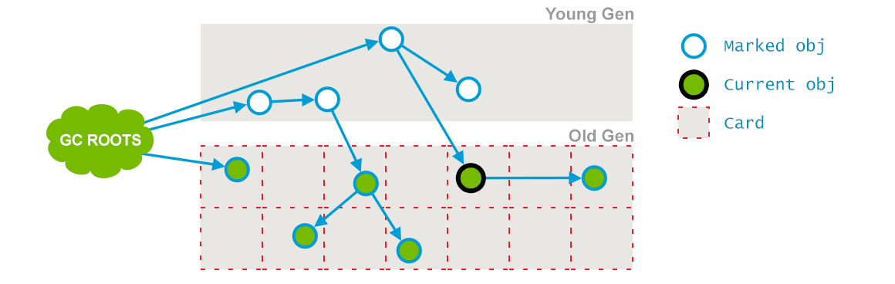

>
2015-05-26T16:23:08.458-0200: 65.561: [CMS-concurrent-sweep-start] 2015-05-26T16:23:08.485-0200: 65.588: [CMS-concurrent-sweep1: 0.027/0.027 secs2] [[Times: user=0.03 sys=0.00, real=0.03 secs] 3

>
2015-05-26T16:23:08.458-0200: 65.561: [CMS-concurrent-sweep-start] 2015-05-26T16:23:08.485-0200: 65.588: [CMS-concurrent-sweep1: 0.027/0.027 secs2] [[Times: user=0.03 sys=0.00, real=0.03 secs] 3

>
> 1. <a>`CMS-concurrent-sweep`</a> – Phase of the collection “Concurrent Sweep” in this occasion, sweeping unmarked and thus unused objects to reclaim space.
> 1. <a>`0.027/0.027 secs`</a> – Duration of the phase, showing elapsed time and wall clock time correspondingly.
> 1. <a>`[Times: user=0.03 sys=0.00, real=0.03 secs] `</a> – “Times” section is less meaningful on concurrent phases, as it is measured from the start of the concurrent marking and includes more than just the work done for the concurrent marking.

>
1。CMS-concurrent-sweep -阶段的集合“并发扫描”这一次,彻底的无名,因此未使用的对象回收空间。
1。0.027/0.027秒的时间阶段,显示运行时间和相应的挂钟时间。
1。(时间:用户= 0.03 sys = 0.00,真实= 0.03秒)——“*”部分不太有意义的并发阶段,是测量从一开始的并发标记的工作,包括的不仅仅是并发标记。

**Phase 7: Concurrent Reset.** Concurrently executed phase, resetting inner data structures of the CMS algorithm and preparing them for the next cycle.

* *阶段7:并发重置。* *并发执行阶段,重置CMS的内部数据结构算法和准备为下一个循环。

>
2015-05-26T16:23:08.485-0200: 65.589: [CMS-concurrent-reset-start] 2015-05-26T16:23:08.497-0200: 65.601: [CMS-concurrent-reset1: 0.012/0.012 secs2] [[Times: user=0.01 sys=0.00, real=0.01 secs]3

>
2015-05-26T16:23:08.485-0200: 65.589: [CMS-concurrent-reset-start] 2015-05-26T16:23:08.497-0200: 65.601: [CMS-concurrent-reset1: 0.012/0.012 secs2] [[Times: user=0.01 sys=0.00, real=0.01 secs]3

>
> 1. <a>`CMS-concurrent-reset – The phase of the collection – “Concurrent Reset” in this occasion`</a> – that is resetting inner data structures of the CMS algorithm and preparing for the next collection.
> 1. <a>`0.012/0.012 secs`</a> – Duration of the the phase, measuring elapsed and wall clock time respectively.
> 1. <a>`[Times: user=0.01 sys=0.00, real=0.01 secs]`</a> – The “Times” section is less meaningful on concurrent phases, as it is measured from the start of the concurrent marking and includes more than just the work done for the concurrent marking.

>
1。CMS-concurrent-reset——集合的阶段——“并发重置”这一次——这是重置CMS的内部数据结构算法和准备下一个集合。
1。0.012/0.012秒的时间阶段,分别测量运行和挂钟时间。
1。(时间:用户= 0.01 sys = 0.00,真实= 0.01秒)——“*”部分不太有意义的并发阶段,是测量从一开始的并发标记的工作,包括的不仅仅是并发标记。

All in all, the CMS garbage collector does a great job at reducing the pause durations by offloading a great deal of the work to concurrent threads that do not require the application to stop. However, it, too, has some drawbacks, the most notable of them being the Old Generation fragmentation and the lack of predictability in pause durations in some cases, especially on large heaps.

总之,CMS垃圾收集器是一个伟大的工作在减少停顿时间通过出售大量的并发线程的工作不需要应用程序停止.然而,它也有一些缺点,其中最著名的是老的代分裂和缺乏可预测性暂停时间在某些情况下,特别是在大型堆。

## G1 – Garbage First

## G1 -垃圾第一

One of the key design goals of G1 was to make the duration and distribution of stop-the-world pauses due to garbage collection predictable and configurable. In fact, Garbage-First is a soft real-time garbage collector, meaning that you can set specific performance goals to it. You can request the stop-the-world pauses to be no longer than x milliseconds within any given y-millisecond long time range, e.g. no more than 5 milliseconds in any given second. Garbage-First GC will do its best to meet this goal with high probability (but not with certainty, that would be hard real-time).

G1的主要设计目标之一就是使停止一切停顿的时间和分配由于垃圾收集可预测和可配置的。事实上,garbage first是软实时垃圾收集器,这意味着您可以设置特定的性能目标.你可以要求停止一切停顿不超过x毫秒任何y-millisecond长时间范围内,如不超过5毫秒在任何给定的第二.garbage first GC将尽力满足这个目标有高概率(但不确定,这将是硬实时)。

To achieve this, G1 builds upon a number of insights. First, the heap does not have to be split into contiguous Young and Old generation. Instead, the heap is split into a number (typically about 2048) smaller heap regions that can house objects. Each region may be an Eden region, a Survivor region or an Old region. The logical union of all Eden and Survivor regions is the Young Generation, and all the Old regions put together is the Old Generation:

为了达到这个目标,G1构建在一些见解。首先,堆不需要分成连续的年轻和年老的一代。而不是,堆被分成许多小(通常约2048)堆区域可以房子对象。每个地区可能是一个伊甸园地区,幸存者地区或一个旧地区.逻辑联盟的伊甸园和幸存者地区是年轻代,和所有的旧区域放在一起是老年代:

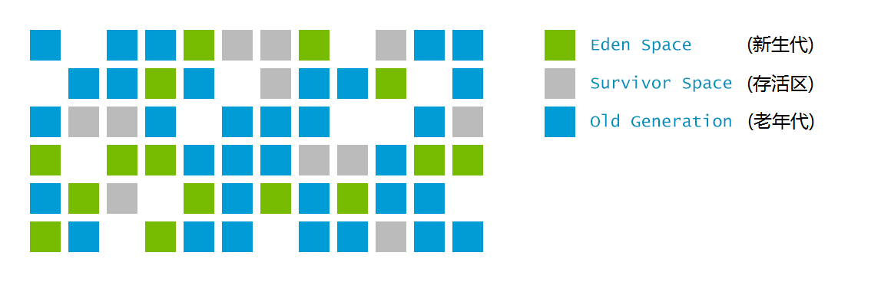

This allows the GC to avoid collecting the entire heap at once, and instead approach the problem incrementally: only a subset of the regions, called the collection set will be considered at a time. All the Young regions are collected during each pause, but some Old regions may be included as well:

这允许GC避免收集整个堆,而以增量的方式进行问题:只有一个子集的区域,称为集将被视为一次集合.收集所有年轻的地区在每个停顿,但一些旧地区可能包括:

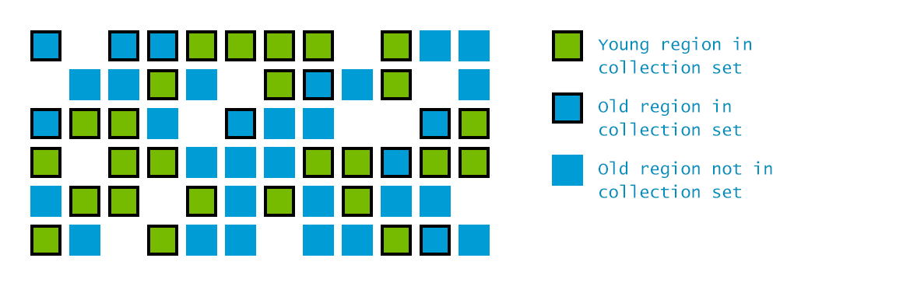

Another novelty of G1 is that during the concurrent phase it estimates the amount of live data that each region contains. This is used in building the collection set: the regions that contain the most garbage are collected first. Hence the name: garbage-first collection.

G1的另一个新奇的是,在并发阶段估计每个区域包含的实时数据。这是用于构建集合集合:区域包含最垃圾的收集。因此,名称:garbage first集合。

To run the JVM with the G1 collector enabled, run your application as

启用了G1收集器的JVM运行,运行您的应用程序

	java -XX:+UseG1GC com.mypackages.MyExecutableClass

### Evacuation Pause: Fully Young

### 疏散暂停:完全年轻

In the beginning of the application’s lifecycle, G1 does not have any additional information from the not-yet-executed concurrent phases, so it initially functions in the fully-young mode. When the Young Generation fills up, the application threads are stopped, and the live data inside the Young regions is copied to Survivor regions, or any free regions that thereby become Survivor.

在应用程序的生命周期的开始,G1没有任何额外的信息并未执行并发的阶段,所以它最初功能fully-young模式.年轻代填满时,应用程序线程停止,和年轻的地区内的实时数据复制到幸存者地区,或任何自由地区,从而成为幸存者。

The process of copying these is called Evacuation, and it works in pretty much the same way as the other Young collectors we have seen before. The full logs of evacuation pauses are rather large, so, for simplicity’s sake we will leave out a couple of small bits that are irrelevant in the first fully-young evacuation pause. We will get back to them after the concurrent phases are explained in greater detail. In addition, due to the sheer size of the log record, the parallel phase details and “Other” phase details are extracted to separate sections:

复制这些叫做疏散的过程中,它在几乎相同的方式工作的其他年轻收藏家我们见过的。疏散的全部日志停顿是相当大的,所以,为简单起见,我们将离开了几小块无关的fully-young疏散暂停.我们将回到他们后并发阶段进行更详细的解释。此外,由于庞大的日志记录,并行阶段细节和“其他”阶段细节提取分离部分:

>
	0.134: [GC pause (G1 Evacuation Pause) (young), 0.0144119 secs]1
	    [Parallel Time: 13.9 ms, GC Workers: 8]2
	        …3
	    [Code Root Fixup: 0.0 ms]4
	    [Code Root Purge: 0.0 ms]5
	    [Clear CT: 0.1 ms]
	    [Other: 0.4 ms]6
	        …7
	    [Eden: 24.0M(24.0M)->0.0B(13.0M) 8Survivors: 0.0B->3072.0K 9Heap: 24.0M(256.0M)->21.9M(256.0M)]10
	     [Times: user=0.04 sys=0.04, real=0.02 secs] 11

>
0.134:[GC暂停(G1疏散停顿)(年轻),0.0144119秒]1
(平行时间:13.9毫秒,GC工人:8)2
3…
(代码根固定:0.0毫秒)4
(代码根清洗:0.0毫秒)5
(明确的CT:0.1毫秒)
(其他:0.4毫秒)6
7…
【伊甸:24.0米(24.0米)- > 0.0 b(13.0米)8幸存者:0.0 b - > 3072.0 k 9堆:24.0米(256.0米)- > 256.0米(256.0米)]10
[时报:运用sys 0.04 = = = 0.02干燥0.04 millan 11]

>
> 1. <a>`0.134: [GC pause (G1 Evacuation Pause) (young), 0.0144119 secs]`</a> – G1 pause cleaning only (young) regions. The pause started 134ms after the JVM startup and the duration of the pause was 0.0144 seconds measured in wall clock time.
> 1. <a>`[Parallel Time: 13.9 ms, GC Workers: 8]`</a> – Indicating that for 13.9 ms (real time) the following activities were carried out by 8 threads in parallel
> 1. <a>`…`</a> – Cut for brevity, see the following section below for the details.
> 1. <a>`[Code Root Fixup: 0.0 ms]`</a> – Freeing up the data structures used for managing the parallel activities. Should always be near-zero. This is done sequentially.
> 1. <a>`[Code Root Purge: 0.0 ms]`</a> – Cleaning up more data structures, should also be very fast, but non necessarily almost zero. This is done sequentially.
> 1. <a>`[Other: 0.4 ms]`</a> – Miscellaneous other activities, many of which are also parallelized
> 1. <a>`…`</a> – See the section below for details
> 1. <a>`[Eden: 24.0M(24.0M)->0.0B(13.0M) `</a> – Eden usage and capacity before and after the pause
> 1. <a>`Survivors: 0.0B->3072.0K `</a> – Space used by Survivor regions before and after the pause
> 1. <a>`Heap: 24.0M(256.0M)->21.9M(256.0M)]`</a> – Total heap usage and capacity before and after the pause.
> 1. <a>`[Times: user=0.04 sys=0.04, real=0.02 secs] `</a> – Duration of the GC event, measured in different categories: GC事件的持续时间, 通过不同的类别来衡量:
 - user – Total CPU time that was consumed by the garbage collector threads during this collection. 在此次垃圾回收过程中, 由GC线程所消耗的总的CPU时间
 - sys – Time spent in OS calls or waiting for system event. 花在操作系统调用和等待系统事件的时间
 - real – Clock time for which your application was stopped. 应用程序被停止的系统时钟时间。. With the parallelizable activities during GC this number is ideally close to (user time + system time) divided by the number of threads used by Garbage Collector. In this particular case 8 threads were used. Note that due to some activities not being parallelizable, it always exceeds the ratio by a certain amount.

>
1。0.134:[GC暂停(G1疏散停顿)(年轻),0.0144119秒]- G1暂停只清洗(年轻)地区。暂停后开始134 ms JVM启动和暂停的持续时间是0.0144秒在挂钟时间测量。
1。(平行时间:13.9毫秒,GC工人:8]——表明13.9毫秒(实时)以下活动是由8线程并行
1。…——削减为简便起见,看看下面的部分下面的细节。
1。(代码根固定:0.0毫秒)——释放数据结构用于管理并行活动。应该是接近于零。这是按顺序来完成的。
1。(代码根清洗:0.0毫秒)——清理更多的数据结构,也应该非常快,但非必要几乎为零。这是按顺序来完成的。
1。(其他:0.4毫秒)——各种各样的其他活动,其中许多也并行
1。有关详细信息,请参阅下面的部分…
1。【伊甸:24.0米(24.0米)- > 24.0 b(13.0米)——伊甸园前后暂停使用和能力
1。幸存者:0.0 b - > 3072.0 k -空间由幸存者地区之前和之后暂停使用
1。堆:24.0米(256.0米)- > 256.0米(256.0米)]——总堆使用情况和能力之前和之后的停顿。
1。(时间:用户= 0.04 sys = 0.04,真实= 0.02秒)- GC事件期间,测量在不同的类别:
——用户——总消耗的CPU时间垃圾收集器线程在此集合
- sys -时间花在操作系统调用或等待系统事件
-真正的时钟时间为您的应用程序被停止了.与并行的活动在GC这个数字最接近(用户时间+系统时间)除以垃圾收集器使用的线程的数量.在这种特殊情况下8线程使用。注意,由于一些活动不是可平行的,它总是超过一定数量的比率。

Most of the heavy-lifting is done by multiple dedicated GC worker threads. Their activities are described in the following section of the log:

最繁重的任务由多个专用的GC工作线程。下一节中描述了他们的活动日志:

>
	[Parallel Time: 13.9 ms, GC Workers: 8]1
	     [GC Worker Start (ms)2: Min: 134.0, Avg: 134.1, Max: 134.1, Diff: 0.1]
	    [Ext Root Scanning (ms)3: Min: 0.1, Avg: 0.2, Max: 0.3, Diff: 0.2, Sum: 1.2]
	    [Update RS (ms): Min: 0.0, Avg: 0.0, Max: 0.0, Diff: 0.0, Sum: 0.0]
	        [Processed Buffers: Min: 0, Avg: 0.0, Max: 0, Diff: 0, Sum: 0]
	    [Scan RS (ms): Min: 0.0, Avg: 0.0, Max: 0.0, Diff: 0.0, Sum: 0.0]
	    [Code Root Scanning (ms)4: Min: 0.0, Avg: 0.0, Max: 0.2, Diff: 0.2, Sum: 0.2]
	    [Object Copy (ms)5: Min: 10.8, Avg: 12.1, Max: 12.6, Diff: 1.9, Sum: 96.5]
	    [Termination (ms)6: Min: 0.8, Avg: 1.5, Max: 2.8, Diff: 1.9, Sum: 12.2]
	        [Termination Attempts7: Min: 173, Avg: 293.2, Max: 362, Diff: 189, Sum: 2346]
	    [GC Worker Other (ms)8: Min: 0.0, Avg: 0.0, Max: 0.0, Diff: 0.0, Sum: 0.1]
	    GC Worker Total (ms)9: Min: 13.7, Avg: 13.8, Max: 13.8, Diff: 0.1, Sum: 110.2]
	    [GC Worker End (ms)10: Min: 147.8, Avg: 147.8, Max: 147.8, Diff: 0.0]

>
【平行时间:13.9毫秒,GC工人:8]1
[GC工人开始(ms)2:分钟:134.0,平均值:134.1,马克斯:134.1,差异:0.1)
(Ext根扫描(ms)3:分钟:0.1,平均值:0.2,马克斯:0.3,差异:0.2,金额:1.2)
[更新RS(ms):最小值:0.0,平均值:0.0,马克斯:0.0,差异:0.0,金额:0.0)
【处理缓冲区:分钟:0,Avg:0.0,马克斯:0,Diff:0,金额:0]
(扫描RS(女士):分钟:0.0,平均值:0.0,马克斯:0.0,差异:0.0,金额:0.0)
(代码根扫描(ms)4:分钟:0.0,平均值:0.0,马克斯:0.2,差异:0.2,金额:0.2)
(对象复制(ms)5:分钟:10.8,平均值:12.1,马克斯:12.6,差异:1.9,金额:96.5)
(终止(ms)6:分钟:0.8,平均值:1.5,马克斯:2.8,差异:1.9,金额:12.2)
[终止Attempts7:分钟:173年,Avg:293.2,马克斯:362年,Diff:189,金额:2346]
[GC工人其他(ms)8:分钟:0.0,平均值:0.0,马克斯:0.0,差异:0.0,金额:0.1)
GC职工总数(ms)9:分钟:13.7,平均值:13.8,马克斯:13.8,差异:0.1,和110.2):
[GC工作结束(ms)10:分钟:147.8,平均值:147.8,马克斯:147.8,差异:0.0)

>
> 1. <a>`[Parallel Time: 13.9 ms, GC Workers: 8]`</a> – Indicating that for 13.9 ms (clock time) the following activities were carried out by 8 threads in parallel
> 1. <a>`[GC Worker Start (ms)`</a> – The moment in time at which the workers started their activity, matching the timestamp at the beginning of the pause. If Min and Max differ a lot, then it may be an indication that too many threads are used or other processes on the machine are stealing CPU time from the garbage collection process inside the JVM
> 1. <a>`[Ext Root Scanning (ms)`</a> – How long it took to scan the external (non-heap) roots such as classloaders, JNI references, JVM system roots, etc. Shows elapsed time, “Sum” is CPU time
> 1. <a>`[Code Root Scanning (ms)`</a> – How long it took to scan the roots that came from the actual code: local vars, etc.
> 1. <a>`[Object Copy (ms)`</a> – How long it took to copy the live objects away from the collected regions.
> 1. <a>`[Termination (ms)`</a> – How long it took for the worker threads to ensure that they can safely stop and that there’s no more work to be done, and then actually terminate
> 1. <a>`[Termination Attempts`</a> – How many attempts worker threads took to try and terminate. An attempt is failed if the worker discovers that there’s in fact more work to be done, and it’s too early to terminate.
> 1. <a>`[GC Worker Other (ms)`</a> – Other miscellaneous small activities that do not deserve a separate section in the logs.
> 1. <a>`GC Worker Total (ms)`</a> – How long the worker threads have worked for in total
> 1. <a>`[GC Worker End (ms)`</a> – The timestamp at which the workers have finished their jobs. Normally they should be roughly equal, otherwise it may be an indication of too many threads hanging around or a noisy neighbor

>
1。(平行时间:13.9毫秒,GC工人:8]——表明13.9毫秒(时钟时间)以下活动是由8线程并行
1。[GC工人开始(女士)——的时候工人们开始活动,匹配时间戳开始暂停。如果最小和最大差别很大,它可能是一个迹象表明,太多的线程使用或窃取其他进程的机器上的CPU时间在JVM的垃圾收集过程
1。(Ext根扫描(女士)——用了多长时间来扫描外部(短命)等根类加载器,JNI引用,JVM系统根,等。显示了运行时间,“和”是CPU时间
1。(代码根扫描(女士)——用了多长时间扫描的根源来自于实际代码:当地的var,等等。
1。(对象复制(ms)——用了多长时间复制活动对象从收集到的地区。
1。(终止(女士)——用了多长时间的工作线程,以确保他们可以安全地停止,没有更多的工作要做,然后终止
1。(终止尝试多少次工作线程试图终止。一次尝试是失败的,如果工人发现实际上有更多的工作要做,它还为时过早终止。
1。[GC工人其他杂项(女士)——小活动日志中不配拥有一个单独的部分。
1。GC职工总数(ms)——工作线程工作多长时间
1。[gc worker end(ms)- the timestamp at which the workers have人生their jobs。normally they含有be roughly equal,否则它可能是一个迹象表明太多的线程闲逛或吵闹的邻居

Additionally, there are some miscellaneous activities that are performed during the Evacuation pause. We will only cover a part of them in this section. The rest will be covered later.

此外,有一些杂项疏散期间暂停执行的活动。我们只会讨论的一部分,他们在这一节中。剩下的稍后将覆盖。

>
	[Other: 0.4 ms]1
	    [Choose CSet: 0.0 ms]
	    [Ref Proc: 0.2 ms]2
	    [Ref Enq: 0.0 ms]3
	    [Redirty Cards: 0.1 ms]
	    [Humongous Register: 0.0 ms]
	    [Humongous Reclaim: 0.0 ms]
	    [Free CSet: 0.0 ms]4

>
(其他:0.4毫秒)1
(选择CSet:0.0毫秒)
(Ref Proc:0.2毫秒)2
(Ref询问:0.0毫秒)3
(女士Redirty卡:0.1)
(女士巨大无比的寄存器:0.0)
(女士巨大无比的回收:0.0)
[自由:0.0 ms他学校均应不加]4

>
> 1. <a>`[Other: 0.4 ms]`</a> – Miscellaneous other activities, many of which are also parallelized
> 1. <a>`[Ref Proc: 0.2 ms]`</a> – The time it took to process non-strong references: clear them or determine that no clearing is needed.
> 1. <a>`[Ref Enq: 0.0 ms]`</a> – The time it took to enqueue the remaining non-strong references to the appropriate ReferenceQueue
> 1. <a>`[Free CSet: 0.0 ms]`</a> – The time it takes to return the freed regions in the collection set so that they are available for new allocations.

>
1。(其他:0.4毫秒)——各种各样的其他活动,其中许多也并行
1。(Ref Proc:0.2毫秒)——时间过程non-strong引用:明确或确定不需要清理。
1。(Ref询问:0.0毫秒),剩下的时间来排队non-strong引用适当的ReferenceQueue
1。(免费CSet:0.0毫秒),所花费的时间返回释放地区收集集,可用于新的分配。

### Concurrent Marking

### 并发标记

The G1 collector builds up on many concepts of CMS from the previous section, so it is a good idea to make sure that you have a sufficient understanding of it before proceeding. Even though it differs in a number of ways, the goals of the Concurrent Marking are very similar.  G1 Concurrent Marking uses the Snapshot-At-The-Beginning approach that marks all the objects that were live at the beginning of the marking cycle, even if they have turned into garbage meanwhile. The information on which objects are live allows to build up the liveness stats for each region so that the collection set could be efficiently chosen afterwards.

G1收集器建立在许多CMS的前一节的概念,所以它是一个好主意,以确保你有一个充分的理解它之前.虽然它在很多方面不同,并发标记非常相似的目标.G1并发标记使用Snapshot-At-The-Beginning方法标志着所有的对象都是生活在标记的开始循环,即使他们已经变成了垃圾同时.对象是生活的信息允许建立活性统计每个区域,以便收集设置可以有效地选择。

This information is then used to perform garbage collection in the Old regions. It can happen fully concurrently, if the marking determines that a region contains only garbage, or during a stop-the-world evacuation pause for Old regions that contain both garbage and live objects.

,或停止一切疏散期间暂停旧地区包含垃圾和活动对象。

Concurrent Marking starts when the overall occupancy of the heap is large enough. By default, it is 45%, but this can be changed by the InitiatingHeapOccupancyPercent JVM option. Like in CMS, Concurrent Marking in G1 consists of a number of phases, some of them fully concurrent, and some of them requiring the application threads to be stopped.

并发标记开始时的总体占用堆足够大。默认情况下,它是45%,但这可以改变通过InitiatingHeapOccupancyPercent JVM选项。在CMS,并发标记在G1由一系列的阶段,他们中的一些人完全并发,其中的一些要求应用程序线程被阻止。

**Phase 1: Initial Mark.** This phase marks all the objects directly reachable from the GC roots. In CMS, it required a separate stop-the world pause, but in G1 it is typically piggy-backed on an Evacuation Pause, so its overhead is minimal. You can notice this pause in GC logs by the “(initial-mark)” addition in the first line of an Evacuation Pause:

* *阶段1:最初的标志。* *这个阶段是所有对象直接从GC根可及。在CMS,它需要一个独立的阻止世界暂停,但在G1,它通常是据此设计疏散暂停,所以它的开销是最小的.你可以注意到这个暂停GC日志”(初始标记)除了在第一行的疏散暂停:

	1.631: [GC pause (G1 Evacuation Pause) (young) (initial-mark), 0.0062656 secs]

**Phase 2: Root Region Scan.** This phase marks all the live objects reachable from the so-called root regions, i.e. the ones that are not empty and that we might end up having to collect in the middle of the marking cycle. Since moving stuff around in the middle of concurrent marking will cause trouble, this phase has to complete before the next evacuation pause starts. If it has to start earlier, it will request an early abort of root region scan, and then wait for it to finish. In the current implementation, the root regions are the survivor regions: they are the bits of Young Generation that will definitely be collected in the next Evacuation Pause.

* *第二阶段:根区域扫描。* *此阶段标志着所谓的根可接触的所有活动对象区域,即.那些非空,我们可能最终不得不收集中间的周期。因为搬东西在中间的并发标记会导致麻烦,这一阶段下疏散暂停开始之前完成。如果早些时候开始,它将请求根地区的早期中止扫描,然后等待它完成.在当前实现中,根地区的幸存者区域:他们是年轻代的位,肯定会被收集在未来疏散暂停。

	1.362: [GC concurrent-root-region-scan-start]
	1.364: [GC concurrent-root-region-scan-end, 0.0028513 secs]

**Phase 3. Concurrent Mark.** This phase is very much similar to that of CMS: it simply walks the object graph and marks the visited objects in a special bitmap. To ensure that the semantics of snapshot-at-the beginning are met, G1 GC requires that all the concurrent updates to the object graph made by the application threads leave the previous reference known for marking purposes.

* *阶段3。并发标记。* *这个阶段非常类似于CMS:它只是走对象图和标志着访问对象在一个特殊的位图.确保开始照的语义,G1 GC要求所有对象图的并发更新的应用程序线程离开以前的参考标记的目的。

This is achieved by the use of the Pre-Write barriers (not to be confused with Post-Write barriers discussed later and memory barriers that relate to multithreaded programming). Their function is to, whenever you write to a field while G1 Concurrent Marking is active, store the previous referee in the so-called log buffers, to be processed by the concurrent marking threads.

这是通过使用Pre-Write障碍(不要混淆Post-Write壁垒后面讨论和记忆障碍与多线程编程)。他们的功能是,当你写一个字段而G1并发标记是活跃的,店前裁判在所谓的日志缓冲区,处理并发线程。

	1.364: [GC concurrent-mark-start]
	1.645: [GC concurrent-mark-end, 0.2803470 secs]

**Phase 4. Remark.** This is a stop-the-world pause that, like previously seen in CMS, completes the marking process. For G1, it briefly stops the application threads to stop the inflow of the concurrent update logs and processes the little amount of them that is left over, and marks whatever still-unmarked objects that were live when the concurrent marking cycle was initiated. This phase also performs some additional cleaning, e.g. reference processing (see the Evacuation Pause log) or class unloading.

* * 4级。的话。* *这是一个停止一切停顿,就像以前在CMS,做好标记的过程。为G1,它短暂的停止应用程序线程停止流入的并发更新日志和过程他们剩下的少量,和标志无论still-unmarked对象并发标记周期时启动。这一阶段也执行一些额外的清洁,如.参考处理(见疏散暂停日志)或类卸载。

	1.645: [GC remark 1.645: [Finalize Marking, 0.0009461 secs]
	1.646: [GC ref-proc, 0.0000417 secs] 1.646: 
		[Unloading, 0.0011301 secs], 0.0074056 secs]
	[Times: user=0.01 sys=0.00, real=0.01 secs]

**Phase 5. Cleanup.** This final phase prepares the ground for the upcoming evacuation phase, counting all the live objects in the heap regions, and sorting these regions by expected GC efficiency. It also performs all the house-keeping activities required to maintain the internal state for the next iteration of concurrent marking.

5 * *阶段。清理。* *最后阶段准备为即将到来的疏散阶段,计算所有活动对象在堆中地区,这些地区和排序,将GC效率.它也执行所需的所有辅助活动保持并发标记的内部状态为下一次迭代。

Last but not least, the regions that contain no live objects at all are reclaimed in this phase. Some parts of this phase are concurrent, such as the empty region reclamation and most of the liveness calculation, but it also requires a short stop-the-world pause to finalize the picture while the application threads are not interfering. The logs for such stop-the-world pauses would be similar to:

最后但并非最不重要,不包含活动对象的区域都是再生在这个阶段。这一阶段是并发的一些地区,如空地区开垦和大多数的活性计算,但它也需要一个短暂的停止一切暂停完成图片而不影响应用程序线程.这种停止一切停顿将类似的日志:

	1.652: [GC cleanup 1213M->1213M(1885M), 0.0030492 secs]
	[Times: user=0.01 sys=0.00, real=0.00 secs]

In case when some heap regions that only contain garbage were discovered, the pause format can look a bit different, similar to:
	
	1.872: [GC cleanup 1357M->173M(1996M), 0.0015664 secs]
	[Times: user=0.01 sys=0.00, real=0.01 secs]
	1.874: [GC concurrent-cleanup-start]
	1.876: [GC concurrent-cleanup-end, 0.0014846 secs]						
### Evacuation Pause: Mixed

以防当一些堆区域只包含垃圾被发现后,暂停格式可以看起来有点不同,类似于:
1.872:[GC清理1357 - > 173(1996),0.0015664秒)
(时间:用户= 0.01 sys = 0.00,真实= 0.01秒)
1.874(GC concurrent-cleanup-start):
1.876(GC concurrent-cleanup-end,0.0014846秒):
# # #疏散暂停:混合

It’s a pleasant case when concurrent cleanup can free up entire regions in Old Generation, but it may not always be the case. After Concurrent Marking has successfully completed, G1 will schedule a mixed collection that will not only get the garbage away from the young regions, but also throw in a bunch of Old regions to the collection set.

时这是一个愉快的情况并发清理可以释放整个地区在老年代,但它可能并不总是如此。后并发标记已成功完成,G1将安排一个混合收集,不仅会让垃圾远离年轻的地区,但也扔在一堆旧地区收藏集。

A mixed Evacuation pause does not always immediately follow the end of the concurrent marking phase. There is a number of rules and heuristics that affect this. For instance, if it was possible to free up a large portion of the Old regions concurrently, then there is no need to do it.

混合疏散立即暂停并不总是遵循并发标记的最后阶段。有许多规则和启发式影响。例如,如果可以腾出很大一部分旧区域的同时,就没有必要去做。

There may, therefore, easily be a number of fully-young evacuation pauses between the end of concurrent marking and a mixed evacuation pause.

因此,有可能容易一些fully-young疏散之间的停顿并发标记和混合疏散暂停。

The exact number of Old regions to be added to the collection set, and the order in which they are added, is also selected based on a number of rules. These include the soft real-time performance goals specified for the application, the liveness and gc efficiency data collected during concurrent marking, and a number of configurable JVM options. The process of a mixed collection is largely the same as we have already reviewed earlier for fully-young gc, but this time we will also cover the subject of remembered sets.

旧区域的确切数字添加到收藏集,和他们的顺序,也选择基于规则的数量.其中包括软实时性能目标指定的应用程序中,活性和gc期间收集的数据并发标记效率,和一些可配置JVM选项.混合收集的过程在很大程度上是一样的我们已经回顾了早些时候fully-young gc,但这一次我们还将覆盖记得集的主题。

Remembered sets are what allows the independent collection of different heap regions. For instance, when collecting region A,B and C, we have to know whether or not there are references to them from regions D and E to determine their liveness. But traversing the whole heap graph would take quite a while and ruin the whole point of incremental collection, therefore an optimization is employed. Much like we have the Card Table for independently collecting Young regions in other GC algorithms, we have Remembered Sets in G1.

记得设置是允许独立不同的堆区域的集合。例如,当收集区域A、B和C,我们需要知道是否有提到他们从区域D和E来确定他们的活性.但是遍历整个堆图需要相当长一段时间,毁了整个增量收集,因此采用一种优化.就像我们有独立的牌桌收集年轻地区其他GC算法,我们记得在G1组。

As shown in the illustration below, each region has a remembered set that lists the references pointing to this region from the outside. These references will then be regarded as additional GC roots. Note that objects in Old regions that were determined to be garbage during concurrent marking will be ignored even if there are outside references to them: the referents are also garbage in that case.

下面的插图所示,每个地区都有一组记得列出从外部的引用指向这个地区。这些引用将被视为额外的GC根.注意对象在旧地区被确定为垃圾在并发标记将被忽略,即使有外部引用:在这种情况下参照物也垃圾。

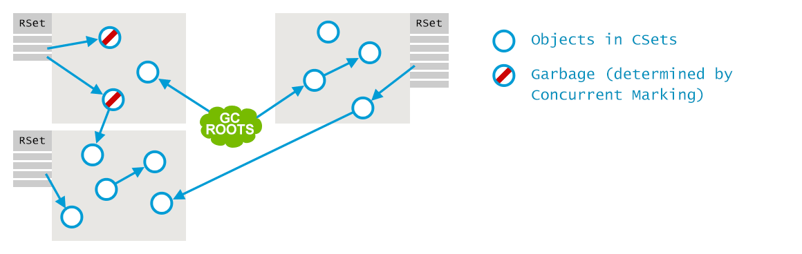

What happens next is the same as what other collectors do: multiple parallel GC threads figure out what objects are live and which ones are garbage:

接下来会发生什么其他藏家所做的一样:多个平行的GC线程找出对象是生活和哪些是垃圾:

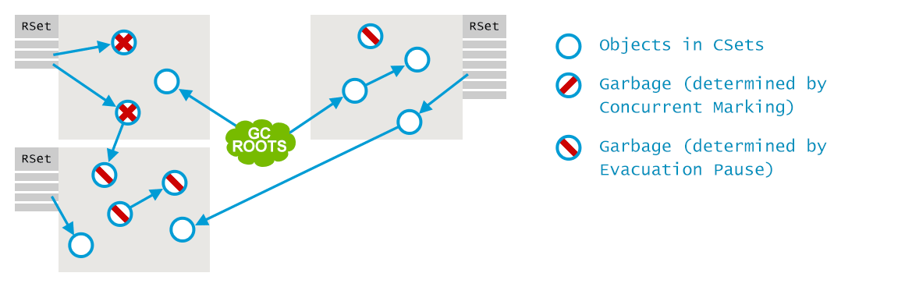

And, finally, the live objects are moved to survivor regions, creating new if necessary. The now empty regions are freed and can be used for storing objects in again.

最后,活动对象是搬到幸存者”地区,在必要时创建新的。现在空的区域释放,又可以用于存储对象。

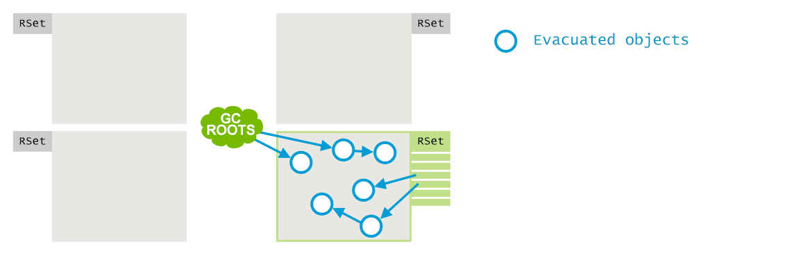

To maintain the remembered sets, during the runtime of the application, a Post-Write Barrier is issued whenever a write to a field is performed. If the resulting reference is cross-region, i.e. pointing from one region to another, a corresponding entry will appear in the Remembered Set of the target region. To reduce the overhead that the Write Barrier introduces, the process of putting the cards into the Remembered Set is asynchronous and features quite a number of optimizations. But basically it boils down to the Write Barrier putting the dirty card information into a local buffer, and a specialized GC thread picking it up and propagating the information to the remembered set of the referred region.

保持记忆集,在应用程序的运行时,发出Post-Write障碍只要执行写入一个字段。如果生成的参考区域,即.指从一个地区到另一个地方,会出现一个对应的条目在记得设定的目标地区。写障碍介绍减少开销,将卡片放入记得设置的过程是异步和特性相当多的优化.但基本上它归结为写障碍把脏卡信息到一个本地缓冲区,和一个专门的GC线程,并传播的信息记得集称为区域。

In the mixed mode, the logs publish certain new interesting aspects when compared to the fully young mode:

在混合模式下,日志发布某些新的有趣的方面相比完全年轻模式:

>
	[Update RS (ms)1: Min: 0.7, Avg: 0.8, Max: 0.9, Diff: 0.2, Sum: 6.1]
	[Processed Buffers2: Min: 0, Avg: 2.2, Max: 5, Diff: 5, Sum: 18]
	[Scan RS (ms)3: Min: 0.0, Avg: 0.1, Max: 0.2, Diff: 0.2, Sum: 0.8]
	[Clear CT: 0.2 ms]4
	[Redirty Cards: 0.1 ms]5

>
[更新RS(ms)1:最小值:0.7,平均值:0.8,马克斯:0.9,差异:0.2,金额:6.1)
[加工Buffers2:分钟:0,Avg:2.2,马克斯:5,Diff:5,总和:18)
(扫描RS(ms)3:分钟:0.0,平均值:0.1,马克斯:0.2,差异:0.2,金额:0.8)
(明确的CT:0.2毫秒)4
(Redirty卡:0.1毫秒)5

>
> 1. <a>`[Update RS (ms)`</a> – Since the Remembered Sets are processed concurrently, we have to make sure that the still-buffered cards are processed before the actual collection begins. If this number is high, then the concurrent GC threads are unable to handle the load. It may be, e.g., because of an overwhelming number of incoming field modifications, or insufficient CPU resources.
> 1. <a>`[Processed Buffers`</a> – How many local buffers each worker thread has processed.
> 1. <a>`[Scan RS (ms)`</a> – How long it took to scan the references coming in from remembered sets.
> 1. <a>`[Clear CT: 0.2 ms]`</a> – Time to clean the cards in the card table. Cleaning simply removes the “dirty” status that was put there to signify that a field was updated, to be used for Remembered Sets.
> 1. <a>`[Redirty Cards: 0.1 ms]`</a> – The time it takes to mark the appropriate locations in the card table as dirty. Appropriate locations are defined by the mutations to the heap that GC does itself, e.g. while enqueuing references.

>
1。(更新RS(女士)——自记得设置并发处理,我们必须确保still-buffered卡片收集实际开始前处理.如果这个数字很高,并发GC线程无法处理负载。它可能是。的,因为绝大多数的字段的修改,或CPU资源不足。
1。(处理缓冲区——有多少本地缓冲区每个工作线程处理。
1。(扫描RS(女士)——用了多长时间扫描的引用来自记忆集。
1。(明确CT:0.2毫秒)——时间清洁卡在卡表。清洗简单地删除“脏”状态,是表示一个字段更新,用于记忆集。
1。(女士Redirty卡:0.1),所花费的时间卡表中适当的位置标记为脏。适当的位置是由突变的堆GC本身,如.排队时引用。

### 总结

This should give one a sufficient basic understanding of how G1 functions. There are, of course, still quite some implementation details that we have left out for brevity, like dealing with humongous objects. All things considered, G1 is the most technologically advanced production-ready collector available in HotSpot. On top of that, it is being relentlessly improved by the HotSpot Engineers, with new optimizations or features coming in with newer java versions.

通过本节的内容, 你应该对G1的基本功能有一定的了解。当然, 为了简洁, 就像处理一个庞大无比的对象一样, 我们省略了很多的实现细节。通过全方位的考虑, G1是HotSpot中可用的最先进的**准产品级(production-ready)**垃圾收集器。最重要的是, HotSpot 工程师的主要精力都用在不断改进G1上面, 在新的java版本中将会带来新的功能和优化。

As we have seen, G1 addressed a wide range of problems that CMS has, starting from pause predictability and ending with heap fragmentation. Given an application not constrained by CPU utilization, but very sensitive to the latency of individual operations, G1 is very likely to be the best available choice for HotSpot users, especially when running the latest versions of Java. However, these latency improvements do not come for free: throughput overhead of G1 is larger thanks to the additional write barriers and more active background threads. So, if the application is throughput-bound or is consuming 100% of CPU, and does not care as much about individual pause durations, then CMS or even Parallel may be better choices.

正如我们所见,G1 解决了 CMS 中各种各样的问题, 包括暂停时间的可预见性和以及终结了堆内存的碎片化。对于CPU使用不受限制, 但对单个业务的延迟非常敏感的系统, G1很可能是HotSpot中最好的选择,特别是在最新的Java版本中。然而,这种低延迟的改进也不是没有代价的: 由于额外的写屏障(write barriers)和更积极的后台线程, G1的开销会更大。所以, 如果系统属于吞吐量优先,或者CPU消耗了100%, 而又不在乎单次GC的暂停时间, 那么CMS应该是更好的选择。

> 总之: G1适合大内存,需要低延迟的场景。

The only viable way to select the right GC algorithm and settings is through trial and errors, but we do give the general guidelines in the next chapter.

唯一可行的方式来选择正确的GC算法和设置是通过尝试和错误,但是我们在下一章给通用的指导原则。

Note that G1 will probably be the default GC for Java 9: http://openjdk.java.net/jeps/248

注意,G1可能会默认GC对于Java 9:http://openjdk.java.net/jeps/248

## Shenandoah 的性能

We have outlined all of the production-ready algorithms in HotSpot that you can just take and use right away. There is another one in the making, a so-called Ultra-Low-Pause-Time Garbage Collector. It is aimed for large multi-core machines with large heaps, the goal is to manage heaps of 100GB and larger with pauses of 10ms or shorter. This is traded off against throughput: the implementers are aiming at a no more than 10% of a performance penalty for applications with no GC pauses.

我们列出了所有的生产就绪算法热点,你可以马上取和使用。有另一个,所谓Ultra-Low-Pause-Time垃圾收集器.它目的是大堆的大型多核机器,目的是管理大量的100 gb和较大的停顿10 ms或短。这是交易与吞吐量:实现者是针对性能损失不超过10%的应用程序没有GC暂停。

We are not going to go into the implementation details before the new algorithm is released as production-ready, but it also builds upon many of the ideas already covered in earlier chapters, such as concurrent marking and incremental collecting. It does a lot of things differently, however. It does not split the heap into multiple generations, instead having a single space only. That’s right, Shenandoah is not a generational garbage collector. This allows it to get rid of card tables and remembered sets. It also uses forwarding pointers and a Brooks style read barrier to allow for concurrent copying of live objects, thus reducing the number and duration of pauses.

我们不会去实现细节之前发布的新算法作为生产就绪,但它也构建在许多的想法已经在早些章节覆盖,如并发标记和增量收集。然而,它确实很多事情是不同的。它不将堆分为多个后代,而不是只拥有一个空格.没错,谢南多厄河并不是一个新一代的垃圾收集器。这允许它摆脱卡套表和记忆.它还使用转发指针和布鲁克斯风格阅读障碍允许并发活动对象的复制,从而减少的数量和持续时间停顿。

A lot of more detailed and up-to-date information about Shenandoah is available on the Internet, for instance in this blog: https://rkennke.wordpress.com/

关于 Shenandoah 性能的更多信息,请参考博客: [https://rkennke.wordpress.com/](https://rkennke.wordpress.com/), 或Google搜索。

原文链接: [GC Algorithms: Implementations](https://plumbr.eu/handbook/garbage-collection-algorithms-implementations)

