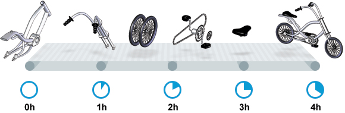
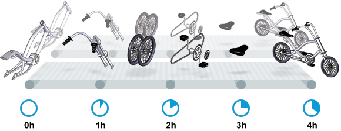

# 5. GC 调优(基础篇)

Tuning garbage collection is no different from any other performance-tuning activity. It is easy to fall into the trap of randomly tweaking one of the 200 GC-related JVM parameters or to start changing random parts of your application code. Instead, following a simple process will guarantee that you are actually moving towards the right target while being transparent about the progress:

GC调优(Tuning Garbage Collection)和其他性能调优行为并没有什么不同。一般人可能会陷入 200 多个 GC相关的JVM参数中, 漫无目的随便调整某个参数或者随便改变程序的一部分代码。但只要遵循一些简单的步骤，就能保证你朝着正确的目标前进:

1. State your performance goals
1. Run tests
1. Measure the results
1. Compare the results with the goals
1. If goals are not met, make a change and go back to running tests

 

1. 列出性能目标(State your performance goals)
2. 执行测试(Run tests)
3. 衡量结果(Measure the results)
4. 与目标进行对比(Compare the results with the goals)
5. 如果没有达到目标, 修改配置, 然后继续测试(go back to running tests)

So, as the first step we need to set clear performance goals in regards of Garbage Collection. The goals fall into three categories, which are common to all performance monitoring and management topics:

所以,第一步我们需要制定明确的性能目标(关于GC方面的)。目标分为三类, 对所有性能监控和管理主题都是通用的:

- 延迟(Latency)
- 吞吐量(Throughput)
- 容量(Capacity)

After explaining the concepts in general, we will demonstrate how to apply these goals in the context of Garbage Collection. If you are already familiar with the concepts of latency, throughput and capacity, you may decide to skip the next section.

在解释概念之后,我们将演示如何在垃圾收集的情景下应用这些目标。如果您延迟、吞吐量和容量的概念很熟悉, 则可以决定跳过下一小节。

## 核心概念

Let us start with an example from manufacturing by observing an assembly line in a factory. The line is assembling bikes from ready-made components. Bikes are built on this line in a sequential manner. Monitoring the line in action, we measure that it takes four hours to complete a bike from the moment the frame enters the line until the assembled bike leaves the line at the other end.

我们先来看看制造业中一家工厂的装配线。生产线将现成的组件组装成自行车。自行车按顺序在这条生产线上组装。通过实际观察, 我们发现从组件进入生产线，到另一端组装成自行车需要4个小时。

Continuing our observations we can also see that one bike is assembled after each minute, 24 hours a day, every day. Simplifying the example and ignoring maintenance windows, we can forecast that in any given hour such an assembly line assembles 60 bikes.

继续观察,我们还发现,此后每分钟就有1辆自行车完成组装, 每天24小时,一直如此。将示例简化并忽略维护窗口期后,我们可以说, 这种流水线在任意1小时可以组装60辆自行车。

> 说明: 时间窗口、窗口期，请类比车站卖票的窗口，是一段规定/限定做某件事的时间段。

Equipped with these two measurements, we now possess crucial information about the current performance of the assembly line in regards of latency and throughput:

通过这两个测量值,我们现在就有了关于当前性能的关键信息： 生产线的延迟与吞吐量:

- Latency of the assembly line: 4 hours
- Throughput of the assembly line: 60 bikes/hour

- 生产线的延迟: 4小时
- 生产线的吞吐量: 60辆/小时

Notice that latency is measured in time units suitable for the task at hand – anything from nanoseconds to millennia can be a good choice. Throughput of a system is measured in completed operations per time unit. Operations can be anything relevant to the specific system. In this example the chosen time unit was hours and operations were the assembled bikes.

请注意, 衡量延迟的时间单位根据需要确定 —— 从纳秒(nanosecond)到几千年(millennia)都是可能的。系统的吞吐量是每个单位时间内完成的操作。操作(Operations)一般是特定系统相关的东西。在本例中,选择的时间单位是小时, 操作就是自行车的组装。

Having been equipped with the definitions of latency and throughput, let us carry out a performance tuning exercise in the very same factory. The demand for the bikes has been steady for a while and the assembly line has kept producing bikes with the latency of four hours and the throughput of 60 bikes/hour for months. Let us now imagine a situation where the sales team has been successful and the demand for the bikes suddenly doubles. Instead of the usual 60*24 = 1,440 bikes/day the customers demand twice as many. The performance of the factory is no longer satisfactory and something needs to be done.

介绍完延迟和吞吐量的定义之后,让我们在同一个工厂进行性能调优实战吧。自行车的需求在一段时间内都很稳定,生产线生产自行车需要四小时的延迟,并且吞吐量几个月以来都是60辆/小时。现在让我们假设某个销售团队取得成功,自行车的需求量突然增加了1倍。而不再是 60 * 24 = 1440辆/天,客户的需求变为了两倍。工厂的产能不再令人满意，需要调整某些地方来改善性能。

The factory manager seemingly correctly concludes that the latency of the system is not a concern – instead he should focus on the total number of bikes produced per day. Coming to this conclusion and assuming he is well funded, the hypothetical manager would immediately take the necessary steps to improve throughput by adding capacity.

工厂老板看似正确地得出结论,系统的延迟并不需要担心——他应该关注每天的自行车生产总数。得出这个结论以后, 假设他资金充足,那么老板应该立即采取必要的措施来改善吞吐量以增加产能。

As a result we would now be observing not one but two identical assembly lines in the same factory. Both of these assembly lines would be assembling the very same bike every minute of every day. By doing this, our imaginary factory has doubled the number of bikes produced per day. Instead of the 1,440 bikes the factory is now capable of shipping 2,880 bikes each day. It is important to note that we have not reduced the time to complete an individual bike by even a millisecond – it still takes four hours to complete a bike from start to finish.

因此我们将看到在这家工厂有两条相同的生产线。这两条生产线每分钟都能各自装配一辆自行车。通过这样做,我们可以想象得到，工厂每天生产的自行车数量会增加一倍。不是1440辆,而是每天2880辆自行车。重要的是请注意,我们没有减少任何一辆自行车的制造时间 —— 从开始到结束仍然需要四个小时。

In the example above a performance optimization task was carried out, coincidentally impacting both throughput and capacity. As in any good example we started by measuring the system’s current performance, then set a new target and optimized the system only in the aspects required to meet the target.

巧合的是，在上面的例子中进行的性能优化任务,同时影响了吞吐量和产能。一般来说，我们会先测量系统的当前性能,然后设定新目标, 只优化系统的单方面性能以满足目标。

In this example an important decision was made – the focus was on increasing throughput, not on reducing latency. While increasing the throughput, we also needed to increase the capacity of the system. Instead of a single assembly line we now needed two assembly lines to produce the required quantity. So in this case the added throughput was not free, the solution needed to be scaled out in order to meet the increased throughput requirement.

这个例子中还做了一个重要的决定 —— 重点是增加吞吐量,而不是减少延迟。在增加吞吐量的同时,我们也需要增加系统的能力。我们现在需要两条流水线来生产所需的数量。所以在这种情况下增加的吞吐量并不是免费的,需要向外扩展的解决方案以满足增加的吞吐量需求。

An important alternative should also be considered for the performance problem at hand. The seemingly non-related latency of the system actually hides a different solution to the problem. If the latency of the assembly line could have been reduced from 1 minute to 30 seconds, the very same increase of throughput would suddenly be possible without any additional capacity.

在处理性能问题有一个重要的选择也应该考虑。看似不相关的系统延迟实际上隐藏了一个不同的解决办法。如果生产线的延迟可以从1分钟减少到30秒,那么吞吐量同样可以增加。

Whether or not reducing latency was possible or economical in this case is not relevant. What is important is a concept very similar to software engineering – you can almost always choose between two solutions to a performance problem. You can either throw more hardware towards the problem or spend time improving the poorly performing code.

减少延迟是否可能或者经济条件不需要关心。有一个和软件工程非常类似的概念 —— 总是可以选择两种不同的性能问题解决方案。可以使用更多的硬件来解决问题或者花时间来改善性能低下的代码。

### 延迟(Latency)

Latency goals for the GC have to be derived from generic latency requirements. Generic latency requirements are typically expressed in a form similar to the following:

GC的延迟指标是由通用的延迟需求得出的。通用的延迟需求通常类似下面的形式:

- All user transactions must respond in less than 10 seconds
- 90% of the invoice payments must be carried out in under 3 seconds
- Recommended products must be rendered to a purchase screen in less than 100 ms

- 所有用户事务必须在10秒以内得到响应
- 90%的付款必须在3秒内处理
- 推荐产品必须在不到100 ms时展示到购买屏幕上

When facing performance goals similar to the above, we would need to make sure that the duration of GC pauses during the transaction does not contribute too much to violating the requirements. “Too much” is application-specific and needs to take into account other factors contributing to latency including round-trips to external data sources, lock contention issues and other safe points among these.

在面对与上述类似的性能目标时, 我们需要确保GC不要在事务中占用太多的暂停时间，以免满足不了需求。“不要占用太多” 的意思是各个系统都是不一样的,需要考虑到其他因素,包括外部数据源往返时间(round-trips),锁竞争问题(lock contention)或者是其他安全点。

Let us assume our performance requirements state that 90% of the transactions to the application need to complete under 1,000 ms and no transaction can exceed 10,000 ms. Out of those generic latency requirements let us again assume that GC pauses cannot contribute more than 10%. From this, we can conclude that 90% of GC pauses have to complete under 100 ms, and no GC pause can exceed 1,000 ms. For simplicity’s sake let us ignore in this example multiple pauses that can occur during the same transaction.

假设我们的性能需求为: 90%的事务要在1000 ms内完成,任何一个事务都不能超过10秒。 一般延迟需求让我们再次假设GC暂停的占比不能超过10%。由此,我们可以得出结论, 90%的GC暂停需要在100 ms以内完成, 不能有GC停顿超过 1000ms 的情况。为简单起见, 让我们忽略在同一事务发生多次停顿的可能性。

Having formalized the requirement, the next step is to measure pause durations. There are many tools for the job, covered in more detail in the chapter on Tooling, but in this section, let us use GC logs, namely for the duration of GC pauses. The information required is present in different log snippets so let us take a look which parts of date/time data are actually relevant, using the following example:

有了正式的需求,下一步就是衡量暂停时间。有许多工具可以使用, 在接下来的工具篇中会详细介绍, 但在本节中,我们通过GC日志, 看看GC暂停的时间。所需的信息存在于不同的日志片段中, 让我们看看下面这个例子中日期/时间相关的数据:

	2015-06-04T13:34:16.974-0200: 2.578: [Full GC (Ergonomics)
			[PSYoungGen: 93677K->70109K(254976K)] 
			[ParOldGen: 499597K->511230K(761856K)] 
			593275K->581339K(1016832K),
			[Metaspace: 2936K->2936K(1056768K)]
		, 0.0713174 secs]
		[Times: user=0.21 sys=0.02, real=0.07 secs

The example above expresses a single GC pause triggered at 13:34:16 on June 4, 2015, just 2,578 ms after the JVM was started.

上面的例子表示单次GC暂停, 在 `2015-06-04T13:34:16` 这个时刻触发. 也即JVM启动之后的 `2,578 ms`。

The event stopped the application threads for 0.0713174 seconds. Even though it took 210 ms of CPU times on multiple cores, the important number for us to measure is the total stop time for application threads, which in this case, where parallel GC was used on a multi-core machine, is equal to a bit more than 70 ms. This specific GC pause is thus well under the required 100 ms threshold and fulfils both requirements.

事件让程序线程暂停了0.0713174秒。虽然在多核CPU上花费的总时间为 210 ms, 但对我们的测量最重要的数字是程序线程暂停的总时间, 在这里，因为是在多核机器上使用并行GC, 所以大约是 `70ms` 多一点。因此此次GC的暂停时间远低于所要求的100 ms阈值，因此满足需求。

Extracting information similar to the example above from all GC pauses, we can aggregate the numbers and see whether or not we are violating the set requirements for any of the pause events triggered.

像上面这样, 从所有GC日志中提取出暂停相关的数字信息, 汇总之后就可以得知是否满足需求。

### 吞吐量(Throughput)

Throughput requirements are different from latency requirements. The only similarity that the throughput requirements share with latency is the fact that again, these requirements need to be derived from generic throughput requirements. Generic requirements for throughput can be similar to the following:

吞吐量和延迟有很大的不同。唯一相似的是两者都是根据通用的吞吐量需求而得来的。通用的吞吐量需求(Generic requirements for throughput) 类似下面这样:

- The solution must be able to process 1,000,000 invoices/day
- The solution must support 1,000 authenticated users each invoking one of the functions A, B or C every five to ten seconds
- Weekly statistics for all customers have to be composed in no more than six hours each Sunday night between 12 PM and 6 AM

- 解决方案必须能处理 100万 发票/天
- 解决方案必须支持1000个认证用户在5-10秒内调用一个函数: A、B或C
- 每周对所有客户的统计不能超过6个小时，时间为每周日晚上12点到次日6点之间

So, instead of setting requirements for a single operation, the requirements for throughput specify how many operations the system must process in a given time unit. Similar to the latency requirements, the GC tuning part now requires determining the total time that can be spent on GC during the time measured. How much is tolerable for the particular system is again application-specific, but as a rule of thumb, anything over 10% would look suspicious.

因此,吞吐量的需求不是针对单个操作的, 而是在给定的时间范围内系统必须处理完成多少次操作。类似于延迟需求, 现在GC调优需要确定花在GC期间的的总时间。每个系统可以接受多长的时间是不一样的,但作为最佳实践, GC占用的总时间一般都不能超过 10%。

Let us now assume that the requirement at hand foresees that the system processes 1,000 transactions per minute. Let us also assume that the total duration of GC pauses during any minute cannot exceed six seconds (or 10%) of this time.

现在假设需求是,系统每分钟要处理 1000个事务。同时假设在每一分钟内, GC暂停的总时间不能超过6秒(即10%)。

Having formalized the requirements, the next step would be to harvest the information we need. The source to be used in the example is again GC logs, from which we would get information similar to the following:

有了正式的需求,下一步就是获取需要的信息。使用的数据源依然是GC日志,从中我们可以看到类似下面这样的信息:

	2015-06-04T13:34:16.974-0200: 2.578: [Full GC (Ergonomics)
			[PSYoungGen: 93677K->70109K(254976K)] 
			[ParOldGen: 499597K->511230K(761856K)] 
			593275K->581339K(1016832K), 
			[Metaspace: 2936K->2936K(1056768K)], 
		 0.0713174 secs] 
		 [Times: user=0.21 sys=0.02, real=0.07 secs

This time we are interested in user and system times instead of real time. In this case we should focus on 23 milliseconds (21 + 2 ms in user and system times) during which the particular GC pause kept CPUs busy. Even more important is the fact that the system was running on a multi-core machine, translating to the actual stop-the-world pause of 0.0713174 seconds, which is the number to be used in the following calculations.

这次我们感兴趣的用户耗时(user)和系统耗时(sys),不再关心实际耗时(real)。在这种情况下我们应该专注于23毫秒(user+sys = 21 + 2 ms), 这段时间中GC暂停使得 cpu 满负载。更重要的是,系统是运行在多核机器上的, 转换为实际的停顿时间(stop-the-world)是0.0713174秒, 下面的计算会用到这个数字。

Extracting the information similar to the above from the GC logs across the test period, all that is left to be done is to verify the total duration of the stop-the-world pauses during each minute. In case the total duration of the pauses does not exceed 6,000ms or six seconds in any of these one-minute periods, we have fulfilled our requirement.

从GC日志中提取出在测试期间的相应信息后, 剩下要做的就是验证每分钟内的GC停顿总时间。看看是否满足我们的要求: 任何一分钟的时间周期内总的停顿时间不超过6000毫秒(6秒)的时间,。

### 容量(Capacity)

Capacity requirements put additional constraints on the environment where the throughput and latency goals can be met. These requirements might be expressed either in terms of computing resources or in cold hard cash. The ways in which such requirements can be described can, for example, take the following form:

容量(Capacity)需求是对吞吐量和延迟指标达成的环境进行的额外约束。这些需求可能会因为计算资源或者资金的原因而被压缩。例如下面这样的要求:

- The system must be deployed on Android devices with less than 512 MB of memory
- The system must be deployed on Amazon EC2 The maximum required instance size must not exceed the configuration c3.xlarge (8 G, 4 cores)
- The monthly invoice from Amazon EC2 for running the system must not exceed $12,000

- 系统必须部署在小于512 MB内存的Android设备上
- 系统必须部署在Amazon EC2实例上, 最大不得超过c3.xlarge (8 G, 4 cores)配置。
- 运行系统的Amazon EC2月度账单不得超过 12000 美元

Thus, capacity has to be taken into account when fulfilling the latency and throughput requirements. With unlimited computing power, any kind of latency and throughput targets could be met, yet in the real world the budget and other constraints have a tendency to set limits on the resources one can use.

因此, 在满足延迟和吞吐量需求的基础上必须考虑容量问题。如果有无限的计算能力,任何延迟和吞吐量目标都能够达成,然而在现实世界中预算(budget)和其他约束限制了可用的资源。

## 相关示例(Example)

Now that we have covered the three dimensions of performance tuning, we can start investigating setting and hitting GC performance goals in practice.

介绍完性能调优的三个维度之后,我们在实践中进行配置以达成GC性能目标。

For this purpose, let us take a look at an example code:

为此,让我们看一段示例代码:

	//imports skipped for brevity
	public class Producer implements Runnable {
	
	  private static ScheduledExecutorService executorService
			 = Executors.newScheduledThreadPool(2);
	
	  private Deque<byte[]> deque;
	  private int objectSize;
	  private int queueSize;
	
	  public Producer(int objectSize, int ttl) {
	    this.deque = new ArrayDeque<byte[]>();
	    this.objectSize = objectSize;
	    this.queueSize = ttl * 1000;
	  }
	
	  @Override
	  public void run() {
	    for (int i = 0; i < 100; i++) { 
			deque.add(new byte[objectSize]); 
			if (deque.size() > queueSize) {
		        deque.poll();
			}
	    }
	  }
	
	  public static void main(String[] args) 
			throws InterruptedException {
	    executorService.scheduleAtFixedRate(
			new Producer(200 * 1024 * 1024 / 1000, 5), 
			0, 100, TimeUnit.MILLISECONDS
		);
	    executorService.scheduleAtFixedRate(
			new Producer(50 * 1024 * 1024 / 1000, 120), 
			0, 100, TimeUnit.MILLISECONDS);
	    TimeUnit.MINUTES.sleep(10);
	    executorService.shutdownNow();
	  }
	}

The code submits two jobs to run every 100 ms. Each job emulates objects with a specific lifespan: it creates objects, lets them leave for a predetermined amount of time and then forgets about them, allowing GC to reclaim the memory.

这段代码每100毫秒提交两个作业(job)来调度执行。每个作业都模拟特定的生命周期: 创建对象,在预定的时间后释放,接着就不管了, 以允许GC回收内存。

When running the example with GC logging turned on with the following parameters:

在运行这个示例程序时，通过以下参数打开GC日志记录:

	-XX:+PrintGCDetails -XX:+PrintGCDateStamps -XX:+PrintGCTimeStamps

we immediately see the impact of GC in the log files, similarly to the following:

在日志文件中我们可以看到对GC的影响,类似下面这样:

	2015-06-04T13:34:16.119-0200: 1.723: [GC (Allocation Failure) 
			[PSYoungGen: 114016K->73191K(234496K)] 
		421540K->421269K(745984K), 
		0.0858176 secs] 
		[Times: user=0.04 sys=0.06, real=0.09 secs] 

	2015-06-04T13:34:16.738-0200: 2.342: [GC (Allocation Failure) 
			[PSYoungGen: 234462K->93677K(254976K)] 
		582540K->593275K(766464K), 
		0.2357086 secs] 
		[Times: user=0.11 sys=0.14, real=0.24 secs] 

	2015-06-04T13:34:16.974-0200: 2.578: [Full GC (Ergonomics) 
			[PSYoungGen: 93677K->70109K(254976K)] 
			[ParOldGen: 499597K->511230K(761856K)] 
		593275K->581339K(1016832K), 
			[Metaspace: 2936K->2936K(1056768K)], 
		0.0713174 secs] 
		[Times: user=0.21 sys=0.02, real=0.07 secs]

Based on the information in the log we can start improving the situation with three different goals in mind:

基于日志中的信息, 我们可以通过三个不同的目标来改善这种情况:

1. Making sure the worst-case GC pause does not exceed a predetermined threshold
1. Making sure the total time during which application threads are stopped does not exceed a predetermined threshold
1. Reducing infrastructure costs while making sure we can still achieve reasonable latency and/or throughput targets

 

1. 确保最坏情况下GC暂停实际不超过预定的阀值
1. 确保在总的运行时间中,线程暂停的实际不超过预定的阀值
1. 降低设备成本, 同时确保仍然可以实现合理的延迟和吞吐量目标

For this, the code above was run for 10 minutes on three different configurations providing three very different results summarized in the following table:

为此,将上面的代码在三种不同的配置下运行10分钟, 提供了三个不同的结果, 汇总如下:

<table>
	<thead>
		<tr>
			<th><b>堆内存大小(Heap)</b></th>
			<th><b>GC算法(GC Algorithm)</b></th>
			<th><b>有效时间比(Useful work)</b></th>
			<th><b>最长停顿时间(Longest pause)</b></th>
		</tr>
	</thead>
	<tbody>
		<tr>
			<td>-Xmx12g</td>
			<td>-XX:+UseConcMarkSweepGC</td>
			<td>89.8%</td>
			<td><strong>560 ms</strong></td>
		</tr>
		<tr>
			<td>-Xmx12g</td>
			<td>-XX:+UseParallelGC</td>
			<td>91.5%</td>
			<td>1,104 ms</td>
		</tr>
		<tr>
			<td>-Xmx8g</td>
			<td>-XX:+UseConcMarkSweepGC</td>
			<td>66.3%</td>
			<td>1,610 ms</td>
		</tr>
	</tbody>
</table>

The experiment ran the same code with different GC algorithms and different heap sizes to measure the duration of Garbage Collection pauses with regards to latency and throughput. Details of the experiments and an interpretation of the results are given in the following chapters.

实验通过不同的GC算法和不同的堆大小来运行相同的代码, 以衡量GC暂停时间与延迟、吞吐量的关系。实验的细节和结果将在后面的章节进行解释。

Note that in order to keep the example as simple as possible only a limited amount of input parameters were changed, for example the experiments do not test on different number of cores or with a different heap layout.

注意,为了保持尽可能简单, 示例中只改变了很小的输入参数, 而实验没有在不同的CPU数量或不同的堆布局下进行测试。

### 对延迟进行调优(Tuning for Latency)

Let us assume we have a requirement stating that all jobs must be processed in under 1,000 ms. Knowing that the actual job processing takes just 100 ms we can simplify and deduct the latency requirement for individual GC pauses. Our requirement now states that no GC pause can stop the application threads for longer than 900 ms. Answering this question is easy, one would just need to parse the GC log files and find the maximum pause time for an individual GC pause.

假设有一个需求说, 每个作业必须在1000 ms内处理。我们知道实际的作业处理只需要100 ms就可以了，简化后可以得出， 两者相减就是 GC暂停的延迟要求。现在需求说明如下: GC暂停不可以超过900ms。回答这个问题是很容易的,只需要解析GC日志文件并找到每个单独的GC暂停中最大的暂停时间即可。

Looking again at the three configuration options used in the test:

再看看上面测试用的三份配置:

<table>
	<thead>
		<tr>
			<th><b>堆内存大小(Heap)</b></th>
			<th><b>GC算法(GC Algorithm)</b></th>
			<th><b>有效时间比(Useful work)</b></th>
			<th><b>最长停顿时间(Longest pause)</b></th>
		</tr>
	</thead>
	<tbody>
		<tr>
			<td>-Xmx12g</td>
			<td>-XX:+UseConcMarkSweepGC</td>
			<td>89.8%</td>
			<td><strong>560 ms</strong></td>
		</tr>
		<tr>
			<td>-Xmx12g</td>
			<td>-XX:+UseParallelGC</td>
			<td>91.5%</td>
			<td>1,104 ms</td>
		</tr>
		<tr>
			<td>-Xmx8g</td>
			<td>-XX:+UseConcMarkSweepGC</td>
			<td>66.3%</td>
			<td>1,610 ms</td>
		</tr>
	</tbody>
</table>

we can see that there is one configuration that already matches this requirement. Running the code with:

我们可以看到,其中有一个配置已经达到了此项要求。运行的参数为:

	java -Xmx12g -XX:+UseConcMarkSweepGC Producer

results in a maximum GC pause of 560 ms, which nicely passes the 900 ms threshold set for satisfying the latency requirement. If neither the throughput nor the capacity requirements are violated, we can conclude that we have fulfilled our GC tuning task and can finish the tuning exercise.

结果中最大的GC停顿时间为 `560 ms`, 这很好地通过了为延迟设置的`900 ms`阀值的要求。如果不违反吞吐量和容量的要求,则可以得出结论,我们成功达成GC调优目标, 可以结束调优活动了。

### 吞吐量调优(Tuning for Throughput)

Let us assume that we have a throughput goal to process 13,000,000 jobs/hour. The example configurations used again give us a configuration where the requirement is fulfilled:

假定我们的吞吐量指标是处理作业: 1300万次/小时。再次使用上面的示例配置, 其中有一个配置满足我们的需求:

<table>
	<thead>
		<tr>
			<th><b>堆内存大小(Heap)</b></th>
			<th><b>GC算法(GC Algorithm)</b></th>
			<th><b>有效时间比(Useful work)</b></th>
			<th><b>最长停顿时间(Longest pause)</b></th>
		</tr>
	</thead>
	<tbody>
		<tr>
			<td>-Xmx12g</td>
			<td>-XX:+UseConcMarkSweepGC</td>
			<td>89.8%</td>
			<td>560 ms</td>
		</tr>
		<tr>
			<td>-Xmx12g</td>
			<td>-XX:+UseParallelGC</td>
			<td><strong>91.5%</strong></td>
			<td>1,104 ms</td>
		</tr>
		<tr>
			<td>-Xmx8g</td>
			<td>-XX:+UseConcMarkSweepGC</td>
			<td>66.3%</td>
			<td>1,610 ms</td>
		</tr>
	</tbody>
</table>

Running this configuration as:

执行此配置的参数为:

	java -Xmx12g -XX:+UseParallelGC Producer

we can see that the CPUs are blocked by GC for 8.5% of the time, leaving 91.5% of the computing power for useful work. For simplicity’s sake we will ignore other safe points in the example. Now we have to take into account that:

我们可以看到,有8.5%的CPU时间是被GC阻塞的,剩下的 `91.5%` 是有效的计算时间。为简单起见, 我们将忽略示例中的其他安全点。现在我们必须考虑:

1. One job is processed in 100 ms by a single core
1. Thus, in one minute, 60,000 jobs could be processed by one core
1. In one hour, a single core could thus process 3.6 M jobs
1. We have four cores available, which could thus process 4 x 3.6 M = 14.4 M jobs in an hour

 

1. 单个核心需要 100毫秒 来处理一次作业
1. 因此, 在一分钟内, 每个核心可以处理 60,000 次作业(**!!这里算法有问题**)
1. 在一个小时内,一个核心可以处理 360万次作业
1. 我们有四个可用的内核, 则每小时可以处理 4 x 3.6M = 1440万次作业

With this amount of theoretical processing power we can make a simple calculation and conclude that during one hour we can in reality process 91.5% of the 14.4 M theoretical maximum resulting in 13,176,000 processed jobs/hour, fulfilling our requirement.

通过这个理论上处理能力的数量，通过一个简单的计算我们可以得出结论, 每小时理论上可以处理的实际作业数为: 14.4 M *  91.5% = 13,176,000 次作业,实现了我们的需求。

It is important to note that if we simultaneously needed to fulfill the latency requirements set in the previous section, we would be in trouble, as the worst-case latency for this case is close to two times of the previous configuration. This time the longest GC pause on record was blocking the application threads for 1,104 ms.

特别需要注意的是,如果还需要满足上一节中的延迟性需求, 那我们就有大麻烦了, 最坏情况下延迟时间是上一种配置的两倍左右。此次GC暂停时间最长的记录为1,104 ms。

##
##
##
##

### 对容量进行调优(Tuning for Capacity)

Let us assume we have to deploy our solution to the commodity-class hardware with up to four cores and 10 G RAM available. From this we can derive our capacity requirement that the maximum heap space for the application cannot exceed 8 GB. Having this requirement in place, we would need to turn to the third configuration on which the test was run:

假设我们必须将解决方案部署到 企业级的硬件中(commodity-class hardware), 有`4`个核心以及 `10G` RAM可用。从这一点可以得出我们的容量要求是程序的最大的堆空间不能超过`8 GB`。有了这个需求, 我们需要根据第三套配置进行测试:

<table>
	<thead>
		<tr>
			<th><b>堆内存大小(Heap)</b></th>
			<th><b>GC算法(GC Algorithm)</b></th>
			<th><b>有效时间比(Useful work)</b></th>
			<th><b>最长停顿时间(Longest pause)</b></th>
		</tr>
	</thead>
	<tbody>
		<tr>
			<td>-Xmx12g</td>
			<td>-XX:+UseConcMarkSweepGC</td>
			<td>89.8%</td>
			<td>560 ms</td>
		</tr>
		<tr>
			<td>-Xmx12g</td>
			<td>-XX:+UseParallelGC</td>
			<td>91.5%</td>
			<td>1,104 ms</td>
		</tr>
		<tr>
			<td><strong>-Xmx8g</strong></td>
			<td>-XX:+UseConcMarkSweepGC</td>
			<td>66.3%</td>
			<td>1,610 ms</td>
		</tr>
	</tbody>
</table>

The application is able to run on this configuration as

程序可以通过如下配置运行:

	java -Xmx8g -XX:+UseConcMarkSweepGC Producer

but both the latency and especially throughput numbers fall drastically:

但却伴随着延迟大幅上涨, 特别是吞吐量却大幅下跌:

- GC now blocks CPUs from doing useful work a lot more, as this configuration only leaves 66.3% of the CPUs for useful work. As a result, this configuration would drop the throughput from the best-case-scenario of 13,176,000 jobs/hour to a meager 9,547,200 jobs/hour
- Instead of 560 ms we are now facing 1,610 ms of added latency in the worst case

 

- 现在,GC阻塞了 CPU 做更多的有用功, 这个配置只有 `66.3%` 的有效CPU时间。因此,这个配置将吞吐量从最好的情况 13,176,000 作业/小时 下降到 不足 9,547,200次作业/小时.
- 最坏情况延迟不是560 ms，现在面临的延迟是 1,610 ms 

Walking through the three dimensions it is indeed obvious that you cannot just optimize for “performance” but instead need to think in three different dimensions, measuring and tuning both latency and throughput, and taking the capacity constraints into account.

通过三个维度,很明显,你不能只是优化你的“性能(performance)”, 而是应该从三个不同的维度进行考虑, 测量以及调优延迟和吞吐量,并需要考虑容量约束。

原文链接:  [GC Tuning: Basics](https://plumbr.eu/handbook/gc-tuning)

