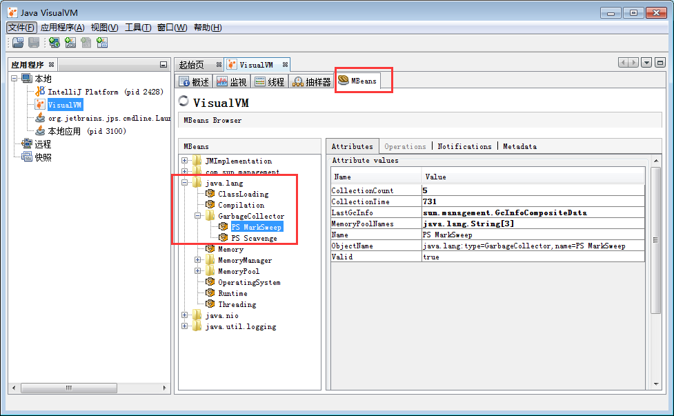
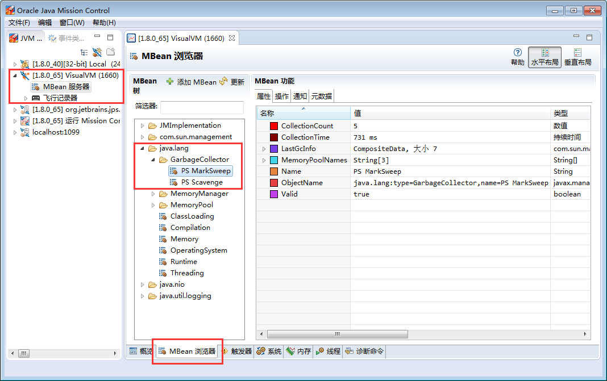
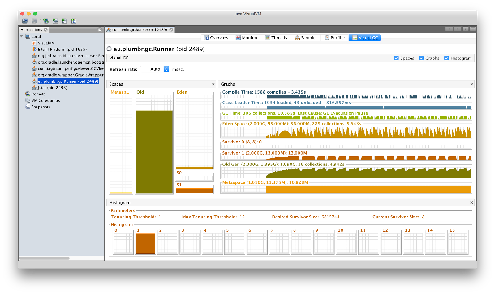
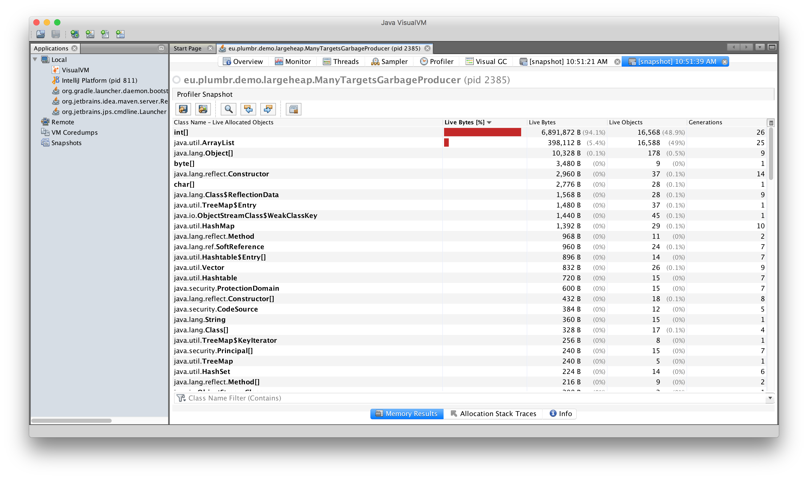
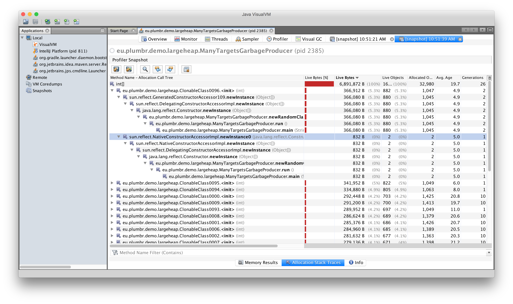

# 6. GC 调优(工具篇)

Before you can optimize your JVM for more efficient garbage collection, you need to get information about its current behavior to understand the impact that GC has on your application and its perception by end users. There are multiple ways to observe the work of GC and in this chapter we will cover several different possibilities.

你需要明确了解当前的GC行为对应用系统和对用户感知有多大的影响,才能更好地优化JVM的GC效率. 有很多种方法来观察GC行为,在本章我们将介绍一些常用的工具。

While observing GC behavior there is raw data provided by the JVM runtime. In addition, there are derived metrics that can be calculated based on that raw data. The raw data, for instance, contains:

在JVM运行的同时,可以提供原始的GC行为数据。此外,可以根据原始数据生成各种指标。原始数据(raw data)包含:

- current occupancy of memory pools,
- capacity of memory pools,
- durations of individual GC pauses,
- duration of the different phases of those pauses.

 

- 当前内存池的使用情况,
- 各个内存池的容量,
- 每个GC暂停的持续时间,
- GC暂停不同阶段的持续时间。

The derived metrics include, for example, the allocation and promotion rates of the application. In this chapter will talk mainly about ways of acquiring the raw data. The most important derived metrics are described in the following chapter discussing the most common GC-related performance problems.

派生的指标主要包括: 程序内存的分配率和晋升率。本章主要讨论获取原始数据的方式.后续章节中将介绍和讨论最重要的派生指标，以及GC相关的性能问题。

## JMX API

The most basic way to get GC-related information from the running JVM is via the standard JMX API. This is a standardized way for the JVM to expose internal information regarding the runtime state of the JVM. You can access this API either programmatically from your own application running inside the very same JVM, or using JMX clients.

从运行中的JVM 获取GC相关(GC-related)信息的最基本方式是通过标准 JMX API . JMX是揭露JVM内部关于运行时状态信息的标准化API. 我们可以用编程的方式通过这个AP来访问当前运行此程序的JVM，也可以通过JMX客户端来(远程)访问。

Two of the most popular JMX clients are JConsole and JVisualVM (with a corresponding plugin installed). Both of these tools are part of the standard JDK distribution, so getting started is easy. If you are running on JDK 7u40 or later, a third tool bundled into the JDK called Java Mission Control is also available.

最常见的两个JMX客户端是 JConsole 和 JVisualVM (需要安装相关插件)。这两款工具都是标准JDK的一部分,所以很容易入门. 如果使用的是JDK 7u40或之后的版本,还可以使用Java Mission Control 工具( 大致翻译为 Java飞行控制中心, `jmc.exe`)。

> JVisualVM安装MBeans插件,通过 工具(T)--插件(G)--可用插件-勾选VisualVM-MBeans--安装--下一步--等待...

All the JMX clients run as a separate application connecting to the target JVM. The target JVM can be either local to the client if running both in the same machine, or remote. For the remote connections from client, JVM has to explicitly allow remote JMX connections. This can be achieved by setting a specific system property to the port where you wish to enable the JMX RMI connection to arrive:

所有的JMX客户端都是一个单独的程序,可以连接到目标JVM。目标JVM可以是本机的JVM,也可以是远程的JVM. 如果要连接远程JVM, 则目标JVM必须显式地允许远程JMX连接. 如果要启用远程JMX RMI连接可以通过设置系统属性来指定端口号,例如:

	java -Dcom.sun.management.jmxremote.port=5432 com.yourcompany.YourApp

In the example above, the JVM opens port 5432 for JMX connections.

在上面的示例中,JVM 打开端口5432以支持JMX连接。

After connecting your JMX client to the JVM of interest and navigating to the MBeans list, select MBeans under the node “java.lang/GarbageCollector”. See below for two screenshots exposing information about GC behavior from JVisualVM and Java Mission Control, respectively:

通过 JVisualVM  连接到某个JVM之后, 导航到 MBeans list, 选择 “java.lang/GarbageCollector” 下的 MBeans. 下面是展示 JVisualVM 和Java Mission Control 中GC行为信息的截图:

As the screenshots above indicate, there are two garbage collectors present. One of these collectors is responsible for cleaning the young generation and one for the old generation. The names of those elements correspond to the names of the garbage collectors used. In the screenshots above we can see that the particular JVM is running with ParallelNew for the young generation and with Concurrent Mark and Sweep for the old generation.

上面的截图信息显示, 存在两个垃圾收集器。其中一个负责清理年轻代，另一个负责清理老年代. 元素的名称就对应所使用的垃圾收集器的名字. 上面截图中可以看到,该JVM使用的年轻代垃圾收集器是 **PS Scavenge** , 而老年代使用的是 **PS MarkSweep**。

For each collector the JMX API exposes the following information:

对每个垃圾收集器, JMX API 公开的信息包括:

- CollectionCount – the total number of times this collector has run in this JVM,
- CollectionTime – the accumulated duration of the collector running time. The time is the sum of the wall-clock time of all GC events,
- LastGcInfo – detailed information about the last garbage collection event. This information contains the duration of that event, and the start and end time of the event along with the usage of different memory pools before and after the last collection,
- MemoryPoolNames – names of the memory pools that this collector manages,
- Name – the name of the garbage collector
- ObjectName – the name of this MBean, as dictated by JMX specifications,
- Valid – shows whether this collector is valid in this JVM. I personally have never seen anything but “true” in here

 

- **CollectionCount** : 此垃圾收集器在JVM中运行的总次数,
- **CollectionTime**: 收集器运行时间的累计。此时间是所有GC事件时间的总和,
- **LastGcInfo**: 最后一次GC事件的详细信息。包括GC事件的 持续时间(duration),  开始时间(startTime) 和 结束时间(endTime), 以及各个内存池在最后一次GC之前和之后的使用情况,
- **MemoryPoolNames**:  该收集器管理的内存池的名字,
- **Name**: 垃圾收集器的名称
- **ObjectName**: 此 MBean的名字,由JMX规范定义,
- **Valid**: 在此JVM中这个收集器是否有效。本人只见过为 "true"的情况

In my experience this information is not enough to make any conclusions about the efficiency of the garbage collector. The only case where it can be of any use is when you are willing to build custom software to get JMX notifications about garbage collection events. This approach can rarely be used as we will see in the next sections, which give better ways of getting beneficial insight into garbage collection activities.

根据我的经验, 这些信息并不足以对GC的效率得出任何结论. 唯一可能使用的情况是用来构建自己的软件,通过定制来获取GC事件相关的 JMX 通知. 在下一节中我们可以看到,这种方法使用的较少, 但对于我们认识垃圾收集活动倒是挺有用的。

## JVisualVM

JVisualVM adds extra information to the basic JMX client functionality via a separate plugin called “VisualGC”. It provides a real-time view into GC events and the occupancy of different memory regions inside JVM.

JVisualVM 在基本的JMX客户端功能之外, 通过单独的插件 “VisualGC”,  添加了额外的信息. 它提供了一个实时视图, 来展示GC事件和JVM中各个内存区域的使用情况。

The most common use-case for the Visual GC plugin is the monitoring of the locally running application, when an application developer or a performance specialist wants an easy way to get visual information about the general behavior of the GC during a test run of the application.

Visual GC 插件最常见的使用情况就是用来监控本地运行的应用程序, 比如开发人员或者性能专家想要在测试的时候, 通过一种简单的方式来获取GC行为的可视化信息时。

On the left side of the charts you can see the real-time view of the current usages of the different memory pools: Metaspace or Permanent Generation, Old Generation, Eden Generation and two Survivor Spaces.

左边的图表可以看到各个内存池当前的使用情况: Metaspace/永久代,老年代,Eden区以及两个存活区空间。

On the right side, top two charts are not GC related, exposing JIT compilation times and class loading timings. The following six charts display the history of the memory pools usages, the number of GC collections of each pool and cumulative time of GC for that pool. In addition for each pool its current size, peak usage and maximum size are displayed.

在右边, 最上面两个 Chart 与 GC无关, 显示的是 JIT编译时间 和 类加载的时间。下面的6个图显示的是内存池的使用情况历史记录, 每个内存池的GC次数,GC总时间。此外就是每个内存池的最大值，峰值,以及当前使用情况。

Below is the distribution of objects ages that currently reside in the Young generation. The full discussion of objects tenuring monitoring is outside of the scope of this chapter.

再下面是 HistoGram, 显示的是对象年龄分布图, 当前存在于年轻代。对象的任期监控(objects tenuring monitoring)超出了本章的讨论范围。

When compared with pure JMX tools, the VisualGC add-on to JVisualVM does offer slightly better insight to the JVM, so when you have only these two tools in your toolkit, pick the VisualGC plug-in. If you can use any other solutions referred to in this chapter, read on. Alternative options can give you more information and better insight. There is however a particular use-case discussed in the “Profilers” section where JVisualVM is suitable for – namely allocation profiling, so by no means we are demoting the tool in general, just for the particular use case.

与纯粹的JMX工具相比, VisualGC 附加到JVisualVM 以后对 JVM的内部信息提供了更好的视图, 如果手头上没有其他工具,请选择VisualGC插件. 如果还有其他工具可用, 那么请继续阅读本章, 其他工具可以给你更多的信息以及更好的视角. 当然， 在“分析器”一节中，也会讲到 JVisualVM 的适用场景 —— 即分配分析(allocation profiling), 所以我们绝不是贬低哪一款工具, 关键还得看实际情况。

## jstat

The next tool to look at is also part of the standard JDK distribution. The tool is called “jstat” – a Java Virtual Machine statistics monitoring tool. This is a command line tool that can be used to get metrics from the running JVM. The JVM connected can again either be local or remote. A full list of metrics that jstat is capable of exposing can be obtained by running “jstat -option” from the command line. The most commonly used options are:

接下来要介绍的 jstat 工具也是标准JDK的一部分。jstat 是一款JVM统计监控工具(Java Virtual Machine statistics monitoring tool). 这款命令行工具, 可以用来从正在运行的JVM中获取各种指标。JVM连接可以是本地的或者是远程的. 可用的指标选项列表可以通过执行 “`jstat -options`” 来查看。最常用的指标选项包括:

	+-----------------+---------------------------------------------------------------+
	|     Option      |                          Displays...                          |
	+-----------------+---------------------------------------------------------------+
	|class            | Statistics on the behavior of the class loader                |
	|compiler         | Statistics  on  the behavior of the HotSpot Just-In-Time com- |
	|                 | piler                                                         |
	|gc               | Statistics on the behavior of the garbage collected heap      |
	|gccapacity       | Statistics of the capacities of  the  generations  and  their |
	|                 | corresponding spaces.                                         |
	|gccause          | Summary  of  garbage collection statistics (same as -gcutil), |
	|                 | with the cause  of  the  last  and  current  (if  applicable) |
	|                 | garbage collection events.                                    |
	|gcnew            | Statistics of the behavior of the new generation.             |
	|gcnewcapacity    | Statistics of the sizes of the new generations and its corre- |
	|                 | sponding spaces.                                              |
	|gcold            | Statistics of the behavior of the old and  permanent  genera- |
	|                 | tions.                                                        |
	|gcoldcapacity    | Statistics of the sizes of the old generation.                |
	|gcpermcapacity   | Statistics of the sizes of the permanent generation.          |
	|gcutil           | Summary of garbage collection statistics.                     |
	|printcompilation | Summary of garbage collection statistics.                     |
	+-----------------+---------------------------------------------------------------+

This tool is extremely useful for getting a quick overview of JVM health to see whether the garbage collector behaves as expected. You can run it via “jstat -gc -t PID 1s”, for example, where PID is the process ID of the JVM you want to monitor. You can acquire PID via running “jps” to get the list of running Java processes. As a result, each second jstat will print a new line to the standard output similar to the following example:

这款工具对于快速查看JVM中的GC行为是否按预期方式运行是很有用的。可以通过 “`jstat -gc -t PID 1s`” 这种方式来启动, 例如,PID 就是要监视的JVM的进程ID。正在运行的Java进程列表可用通过 `jps` 命令得到。

	jps
	jstat -gc -t 2428 1s

上面命令的结果, 是 jstat 每秒钟往标准输出打印出新的一行,类似下面这样:

	Timestamp  S0C    S1C    S0U    S1U      EC       EU        OC         OU       MC     MU    CCSC   CCSU   YGC     YGCT    FGC    FGCT     GCT   
	200.0  	 8448.0 8448.0 8448.0  0.0   67712.0  67712.0   169344.0   169344.0  21248.0 20534.3 3072.0 2807.7     34    0.720  658   133.684  134.404
	201.0 	 8448.0 8448.0 8448.0  0.0   67712.0  67712.0   169344.0   169343.2  21248.0 20534.3 3072.0 2807.7     34    0.720  662   134.712  135.432
	202.0 	 8448.0 8448.0 8102.5  0.0   67712.0  67598.5   169344.0   169343.6  21248.0 20534.3 3072.0 2807.7     34    0.720  667   135.840  136.559
	203.0 	 8448.0 8448.0 8126.3  0.0   67712.0  67702.2   169344.0   169343.6  21248.0 20547.2 3072.0 2807.7     34    0.720  669   136.178  136.898
	204.0 	 8448.0 8448.0 8126.3  0.0   67712.0  67702.2   169344.0   169343.6  21248.0 20547.2 3072.0 2807.7     34    0.720  669   136.178  136.898
	205.0 	 8448.0 8448.0 8134.6  0.0   67712.0  67712.0   169344.0   169343.5  21248.0 20547.2 3072.0 2807.7     34    0.720  671   136.234  136.954
	206.0 	 8448.0 8448.0 8134.6  0.0   67712.0  67712.0   169344.0   169343.5  21248.0 20547.2 3072.0 2807.7     34    0.720  671   136.234  136.954
	207.0 	 8448.0 8448.0 8154.8  0.0   67712.0  67712.0   169344.0   169343.5  21248.0 20547.2 3072.0 2807.7     34    0.720  673   136.289  137.009
	208.0 	 8448.0 8448.0 8154.8  0.0   67712.0  67712.0   169344.0   169343.5  21248.0 20547.2 3072.0 2807.7     34    0.720  673   136.289  137.009

Let us interpret the output above using the explanation given to output attributes in the jstat manpage. Using the knowledge acquired, we can see that:

让我们解释一下上面的输出。通过 manpage 获得的知识, 我们可以看到:

- jstat connected to the JVM 200 seconds from the time this JVM was started. This information is present in the first column labeled “Timestamp”. As seen from the very same column, the jstat harvests information from the JVM once every second as specified in the “1s” argument given in the command.
- From the first line we can see that up to this point the young generation has been cleaned 34 times and the whole heap has been cleaned 658 times, as indicated by the “YGC” and “FGC” columns, respectively.
- The young generation garbage collector has been running for a total of 0.720 seconds, as indicated in the “YGCT” column.
- The total duration of the full GC has been 133.684 seconds, as indicated in the “FGCT” column. This should immediately catch our eye – we can see that out of the total 200 seconds the JVM has been running, 66% of the time has been spent in Full GC cycles.

 

- jstat 在JVM启动后 200s 连接到了此 JVM 。此信息由第一列 “Timestamp” 得知。继续查看第一列, jstat 每秒钟从JVM 接收一次信息, 也就是命令行参数中 "**1s**" 的意思。
- 从第一行我们可以看到,年轻代已经清理了34次(由 “**YGC**” 列表示), 整个堆内存已经清理了 658次(由  “**FGC**” 列表示)。
- 年轻代的垃圾收集器执行的总时间为 0.720 秒, 显示在“**YGCT**” 这一列。
- full GC 的总持续时间为 133.684 秒, 由“**FGCT**”列显示. 这立刻就吸引了我们的目光,我们可以看到,JVM总的才运行了200秒的时间, 但66%的时间由 Full GC 周期占用了。

The problem becomes even clearer when we look at the next line, harvesting information a second later.

我们再看下一行, 问题就变得非常明显了。

- Now we can see that there have been four more Full GCs running during the one second between the last time jstat printed out the data as indicated in the “FGC” column.
- These four GC pauses have taken almost the entire second – as seen in the difference in the “FGCT” column. Compared to the first row, the Full GC has been running for 928 milliseconds, or 92.8% of the total time.
- At the same time, as indicated by the “OC” and “OU” columns, we can see that from almost all of the old generation capacity of 169,344.0 KB (“OC“), after all the cleaning work that the four collection cycles tried to accomplish, 169,344.2 KB (“OU“) is still in use. Cleaning 800 bytes in 928 ms should not be considered a normal behavior.

 

- 现在我们看到, 在刚刚过去的那一秒内执行了 4 次Full GC。参见 "**FGC**" 列.
- 这4次 GC暂停 占用了几乎整整 1秒的时间(根据 **FGCT**列的差异)。与第一行相比,  Full GC 运行了 928 毫秒, 或者说是总时间的92.8%。
- 与此同时, 根据 “**OC** 和 “**OU**” 列, 我们可以看到, 几乎整个老年代的空间 169,344.0 KB (“OC“), 在 4 次GC之后依然占用了 169,344.2 KB (“OU“)。在 928ms 之内只清理了 800个字节, 怎么看都不能算是正常的行为。

Only these two rows from the jstat output give us insight that something is terribly wrong with the application. Applying the same analytics to the next rows, we can confirm that the problem persists and is getting even worse.

只看这两行 jstat 的输出内容, 我们就感觉到程序出了什么严重的问题。继续分析下一行,我们可以确认问题依然存在,而且变得更糟。

The JVM is almost stalled, with GC eating away more than 90% of the available computing power. And as a result of all this cleaning, almost all the old generation still remains in use, further confirming our doubts. As a matter of fact, the example died in under a minute later with a “java.lang.OutOfMemoryError: GC overhead limit exceeded” error, removing the last remaining doubts whether or not things are truly sour.

JVM几乎停滞(stalled), 因为GC占用了超过90%的计算能力。清理的结果是, 几乎所有的老代空间仍然在使用, 这进一步证实了我们的怀疑。事实上,这个示例程序在一分钟后就挂了, 抛出了 “java.lang.OutOfMemoryError: GC overhead limit exceeded”  错误, 不需要再怀疑什么了。

As seen from the example, jstat output can quickly reveal symptoms about JVM health in terms of misbehaving garbage collectors. As general guidelines, just looking at the jstat output will quickly reveal the following symptoms:

从这个例子中可以看到, jstat 的输出可以很快发现对JVM健康极为不利的GC行为。一般来说, 只看 jstat 的输出可以很快发现以下症状:

- Changes in the last column, “GCT”, when compared to the total runtime of the JVM in the “Timestamp” column, give information about the overhead of garbage collection. If you see that every second, the value in that column increases significantly in comparison to the total runtime, a high overhead is exposed. How much GC overhead is tolerable is application-specific and should be derived from the performance requirements you have at hand, but as a ground rule, anything more than 10% looks truly suspicious.
- Rapid changes in the “YGC” and “FGC” columns tracking the young and Full GC counts also tend to expose problems. Much too frequent GC pauses when piling up again affect the throughput via adding many stop-the-world pauses for application threads.
- When you see that the old generation usage in the “OU” column is almost equal to the maximum capacity of the old generation in the “OC” column without a decrease after an increase in the “FGC” column count has signaled that old generation collection has occurred, you have exposed yet another symptom of poorly performing GC.

 

- 最后一列, “**GCT**” 的变化, 与JVM的总运行时间 “**Timestamp**” 的比值, 就是GC 的开销。如果每一秒中, "**GCT**" 列中的值都会显著增加, 那么总运行时相比, 就暴露出高开销的事实. 具体 GC开销占多少比例是可容忍的, 一般由具体的系统来决定, 由性能要求来决定, 但作为一般原则, 任何超过 10% 的开销看起来都是有问题的。
- “**YGC**” 和 “**FGC**” 列的快速变化往往也是有问题的. 太频繁的GC暂停会积累并导致更多的线程停顿(stop-the-world pauses),影响到吞吐量。
- 当你看到  “**OU**” 列中 老年代的使用量几乎等于老年代最大容量“**OC**”而不会降低时则表示, 虽然执行了老年代垃圾收集, 但GC的性能非常的差劲。

##
##
##
##

## GC日志(GC logs)

The next source for GC-related information is accessible via garbage collector logs. As they are built in the JVM, GC logs give you (arguably) the most useful and comprehensive overview about garbage collector activities. GC logs are de facto standard and should be referenced as the ultimate source of truth for garbage collector evaluation and optimization.

第二来源GC-related信息是通过垃圾收集器日志。因为他们都是建立在JVM中,GC日志给你(可以说)有关垃圾收集器活动最有用的和全面的概述.GC日志是事实上的标准,应该引用作为垃圾收集器的终极真理的来源评估和优化。

A garbage collector log is in plain text and can be either printed out by the JVM to standard output or redirected to a file. There are many JVM options related to GC logging. For example, you can log the total time for which the application was stopped before and during each GC event (-XX:+PrintGCApplicationStoppedTime) or expose the information about different reference types being collected (-XX:+PrintReferenceGC).

垃圾收集器的日志在纯文本和JVM可以打印到标准输出或重定向到一个文件中。有许多JVM选项与GC日志记录。例如,你可以登录应用程序的总时间是停止之前和期间每个GC事件(- xx:+ PrintGCApplicationStoppedTime)或公开信息不同的引用类型收集(- xx:+ PrintReferenceGC)。

The minimum that each JVM should be logging can be achieved by specifying the following in your startup scripts:

最低,每个JVM应该记录可以通过指定以下你的启动脚本:

	-XX:+PrintGCTimeStamps -XX:+PrintGCDateStamps -XX:+PrintGCDetails -Xloggc:<filename>

This will instruct JVM to print every GC event to the log file and add the timestamp of each event to the log. The exact information exposed to the logs varies depending on the GC algorithm used. When using ParallelGC the output should look similar to the following:

这将指示JVM打印每个GC事件日志文件,并将每个事件的时间戳添加到日志中。确切的信息暴露在日志根据GC算法不同.当使用ParallelGC输出应该类似如下:

	199.879: [Full GC (Ergonomics) [PSYoungGen: 64000K->63998K(74240K)] [ParOldGen: 169318K->169318K(169472K)] 233318K->233317K(243712K), [Metaspace: 20427K->20427K(1067008K)], 0.1473386 secs] [Times: user=0.43 sys=0.01, real=0.15 secs]
	200.027: [Full GC (Ergonomics) [PSYoungGen: 64000K->63998K(74240K)] [ParOldGen: 169318K->169318K(169472K)] 233318K->233317K(243712K), [Metaspace: 20427K->20427K(1067008K)], 0.1567794 secs] [Times: user=0.41 sys=0.00, real=0.16 secs]
	200.184: [Full GC (Ergonomics) [PSYoungGen: 64000K->63998K(74240K)] [ParOldGen: 169318K->169318K(169472K)] 233318K->233317K(243712K), [Metaspace: 20427K->20427K(1067008K)], 0.1621946 secs] [Times: user=0.43 sys=0.00, real=0.16 secs]
	200.346: [Full GC (Ergonomics) [PSYoungGen: 64000K->63998K(74240K)] [ParOldGen: 169318K->169318K(169472K)] 233318K->233317K(243712K), [Metaspace: 20427K->20427K(1067008K)], 0.1547695 secs] [Times: user=0.41 sys=0.00, real=0.15 secs]
	200.502: [Full GC (Ergonomics) [PSYoungGen: 64000K->63999K(74240K)] [ParOldGen: 169318K->169318K(169472K)] 233318K->233317K(243712K), [Metaspace: 20427K->20427K(1067008K)], 0.1563071 secs] [Times: user=0.42 sys=0.01, real=0.16 secs]
	200.659: [Full GC (Ergonomics) [PSYoungGen: 64000K->63999K(74240K)] [ParOldGen: 169318K->169318K(169472K)] 233318K->233317K(243712K), [Metaspace: 20427K->20427K(1067008K)], 0.1538778 secs] [Times: user=0.42 sys=0.00, real=0.16 secs]

These different formats are discussed in detail in the chapter “GC Algorithms: Implementations”, so if you are not familiar with the output, please read this chapter first. If you can already interpret the output above, then you are able to deduct that:

这一章中详细讨论这些不同格式“GC算法:实现”,如果你不熟悉输出,请先阅读本章.如果你已经可以解释上面的输出,那么你可以扣除:

- The log is extracted around 200 seconds after the JVM was started.
- During the 780 milliseconds present in the logs, the JVM paused five times for GC (we are excluding the 6th pause as it started, not ended on the timestamp present). All these pauses were full GC pauses.
- The total duration of these pauses was 777 milliseconds, or 99.6% of the total runtime.
- At the same time, as seen from the old generation capacity and consumption, almost all of the old generation capacity (169,472 kB) remains used (169,318 K) after the GC has repeatedly tried to free up some memory.

——提取日志JVM开始后200秒左右。
——在780毫秒出现在日志中,JVM为GC停顿了五次(我们扣除6日暂停开始,没有结束的时间戳).所有这些停顿GC暂停。
——这些停顿的总持续时间是777毫秒,占总数的99.6%运行时。
——与此同时,从旧的发电能力和消费,几乎所有的老发电能力(169472 kB)仍然使用(169,后318 K)GC一再试图释放一些内存。

From the output, we can confirm that the application is not performing well in terms of GC. The JVM is almost stalled, with GC eating away more than 99% of the available computing power. And as a result of all this cleaning, almost all the old generation still remains in use, further confirming our suspicions. The example application, being the same as used in the previous jstat section, died in just a few minutes later with the “java.lang.OutOfMemoryError: GC overhead limit exceeded” error, confirming that the problem was severe.

从输出,我们可以证实,应用程序不能正确执行GC。JVM几乎停滞,GC侵蚀超过99%的可用的计算能力.由于所有这些清洗,几乎所有的旧一代仍然在使用,进一步证实了我们的怀疑。示例应用程序,

As seen from the example, GC logs are valuable input to reveal symptoms about JVM health in terms of misbehaving garbage collectors. As general guidelines, the following symptoms can quickly be revealed by just looking at GC logs:

从这个例子中,GC日志是有价值的输入显示症状对JVM健康行为不端的垃圾收集器。一般的指导方针,以下症状很快就可以揭示了只是看着GC日志:

- Too much GC overhead. When the total time for GC pauses is too long, the throughput of the application suffers. The limit is application-specific, but as a general rule anything over 10% already looks suspicious.
- Excessively long individual pauses. Whenever an individual pause starts taking too long, the latency of the application starts to suffer. When the latency requirements require the transactions in the application to complete under 1,000 ms, for example, you cannot tolerate any GC pauses taking more than 1,000 ms.
- Old generation consumption at the limits. Whenever the old generation remains close to being fully utilized even after several full GC cycles, you face a situation in which GC becomes the bottleneck, either due to under-provisioning resources or due to a memory leak. This symptom always triggers GC overhead to go through the roof as well.

——太多的GC开销。当总GC暂停时间太长,应用程序的吞吐量受到损害。极限是特定于应用程序的,但作为一般规则已经看上去可疑的10%以上。
——个人停顿过长。每当一个人停顿太久,开始应用程序的延迟开始受到影响.当延迟需求要求事务应用程序中完成在1000 ms,例如,你不能容忍任何GC暂停服用超过1000毫秒。
岁的一代消费限制。当老的代仍然接近充分利用即使几个完整的GC周期,你面临的情况GC成为瓶颈,由于资源供给不足或由于内存泄漏。这症状总是触发GC开销飞涨。

As we can see, GC logs can give us very detailed information about what is going on inside the JVM in relation to garbage collection. However, for all but the most trivial applications, this results in vast amounts of data, which tend to be difficult to read and interpret by a human being.

我们可以看到,GC日志可以让我们非常详细的信息是怎么回事在JVM的垃圾收集。然而,除了最简单的应用程序,这导致了大量的数据,这往往是由一个人难以阅读和解释。

## GCViewer

##GCViewer

One way to cope with the information flood in GC logs is to write custom parsers for GC log files to visualize the information. In most cases it would not be a reasonable decision due to the complexity of different GC algorithms that are producing the information. Instead, a good way would be to start with a solution that already exists: GCViewer.

一个方法来对付洪水的信息GC日志是为GC日志文件编写自定义解析器可视化信息.在大多数情况下,它不会是一个合理的决定,由于不同的GC算法的复杂性产生的信息。而不是,的一个好方法就是从一个已经存在的解决方案:GCViewer。

GCViewer is an open source tool for parsing and analyzing GC log files. The GitHub web page provides a full description of all the presented metrics. In the following we will review the most common way to use this tool.

GCViewer是一个开源工具解析和分析GC日志文件。GitHub web页面提供了一个完整描述所有提出的指标.在下面我们将审查最常见的方式使用这个工具。

The first step is to get useful garbage collection log files. They should reflect the usage scenario of your application that you are interested in during this performance optimization session. If your operational department complains that every Friday afternoon, the application slows down, and if you want to verify whether GC is the culprit, there is no point in analyzing GC logs from Monday morning.

第一步是把有用的垃圾收集日志文件。他们应该反映你的应用程序的使用场景,你有兴趣在这个性能优化会话.如果你的操作部门抱怨每星期五下午,应用程序慢下来,如果你想验证是否GC是罪魁祸首,是没有意义的分析GC日志从周一早上。

After you have received the log, you can feed it into GCViewer to see a result similar to the following:

您已经收到了日志之后,可以喂它到GCViewer看到类似下面的结果:

The chart area is devoted to the visual representation of GC events. The information available includes the sizes of all memory pools and GC events. In the picture above, only two metrics are visualized: the total used heap is visualized with blue lines and individual GC pause durations with black bars underneath.

图表区域是致力于GC事件的可视化表示。提供的信息包括所有内存池的大小和GC事件。在上面的图片中,只有两个指标可视化:总与蓝线和个人堆可视化使用GC暂停时间和黑条下面。

The first interesting thing that we can see from this picture is the fast growth of memory usage. In just around a minute the total heap consumption reaches almost the maximum heap available. This indicates a problem – almost all the heap is consumed and new allocations cannot proceed, triggering frequent full GC cycles. The application is either leaking memory or set to run with under-provisioned heap size.

第一个有趣的事,从这张图片我们可以看到内存使用量的快速增长。在短短一分钟左右堆总消费量达到几乎最大堆可用.这说明一个问题——几乎所有堆消耗和新的分配不能进行,引发频繁的完整GC周期.应用程序内存泄露或将运行under-provisioned堆大小。

The next problem visible in the charts is the frequency and duration of GC pauses. We can see that after the initial 30 seconds GC is almost constantly running, with the longest pauses exceeding 1.4 seconds.

下一个问题图表中可见GC暂停的频率和持续时间。我们可以看到,在最初的30秒GC几乎不间断地运行,最长暂停超过1.4秒。

On the right there is small panel with three tabs. Under the “Summary” tab the most interesting numbers are “Throughput” and “Number of GC pauses”, along with the “Number of full GC pauses”. Throughput shows the portion of the application run time that was devoted to running your application, as opposed to spending time in garbage collection.

在右边有小面板有三个选项卡。在“摘要”选项卡最有趣的数字是“吞吐”和“数量的GC暂停”,以及“完整GC暂停的数量”.吞吐量的显示了部分应用程序运行时用于运行您的应用程序,而不是把时间花在垃圾收集。

In our example we are facing throughput of 6.28%. This means that 93.72% of the CPU time was spent on GC. It is a clear symptom of the application suffering – instead of spending precious CPU cycles on actual work, it spends most of the time trying to get rid of the garbage.

在我们的示例中我们面临吞吐量的6.28%。这意味着93.72%的CPU时间是花在GC.这是应用程序的一个明确的症状痛苦——而不是实际工作上花费宝贵的CPU周期,它大部分时间试图摆脱垃圾。

The next interesting tab is “Pause”:

下一个有趣的选项卡是“暂停”:

The “Pause” tab exposes the totals, averages, minimum and maximum values of GC pauses, both as a grand total and minor/major pauses separately. Optimizing the application for low latency, this gives the first glimpse of whether or not you are facing pauses that are too long. Again, we can get confirmation that both the accumulated pause duration of 634.59 seconds and the total number of GC pauses of 3,938 is much too high, considering the total runtime of just over 11 minutes.

“暂停”选项卡使总数,平均水平,GC暂停时间的最小值和最大值,既是单独总数和小/大停顿。优化低延迟申请,这给第一眼你是否正面临暂停,太长了。再一次,我们可以确认634年积累的暂停时间.59秒,GC暂停的总数3938多过高,考虑在11分钟的总运行时。

More detailed information about GC events can be obtained from the “Event details” tab of the main area:

可以获得更详细的信息关于GC事件的“事件详细信息”选项卡主要区域:

Here you can see a summary of all the important GC events recorded in the logs: minor and major pauses and concurrent, not stop-the-world GC events. In our case, we can see an obvious “winner”, a situation in which full GC events are contributing the most to both throughput and latency, by again confirming the fact that the 3,928 full GC pauses took 634 seconds to complete.

在这里你可以看到所有重要的摘要GC事件记录在日志:轻度和重度停顿和并发,而不是停止一切GC事件。在我们的例子中,我们可以看到一个明显的“赢家”,的情况完整GC事件贡献最吞吐量和延迟,3928年再次确认这一事实完整GC暂停了634秒才能完成。

As seen from the example, GCViewer can quickly visualize symptoms that tell us whether or not the JVM is healthy in terms of misbehaving garbage collectors. As general guidelines, the following symptoms can quickly be revealed, visualizing the behavior of the GC:

从这个例子中,GCViewer快速可视化症状能告诉我们是否JVM健康行为不端的垃圾收集器。一般的指导方针,以下症状可以快速被揭示,可视化GC的行为:

- Low throughput. When the throughput of the application decreases and falls under a tolerable level, the total time that the application spends doing useful work gets reduced. What is “tolerable” depends on your application and its usage scenario. One rule of thumb says that any value below 90% should draw your attention and may require GC optimization.
- Excessively long individual GC pauses. Whenever an individual pause starts taking too long, the latency of the application starts to suffer. When the latency requirements require the transactions in the application to complete under 1,000 ms, for example, you cannot tolerate any GC pauses taking more than 1,000 ms.
- High heap consumption. Whenever the old generation remains close to being fully utilized even after several full GC cycles, you face a situation where the application is at its limits, either due to under-provisioning resources or due to a memory leak. This symptom always has a significant impact on throughput as well.

——低吞吐量。当应用程序的吞吐量下降,属于可容忍的水平,应用程序花费的总时间做有用的工作得到减少.什么是“容忍”取决于您的应用程序和它的使用场景。一个经验法则说任何值低于90%应该引起你的注意和GC可能需要优化。
——个人GC暂停时间过长。每当一个人停顿太久,开始应用程序的延迟开始受到影响.当延迟需求要求事务应用程序中完成在1000 ms,例如,你不能容忍任何GC暂停服用超过1000毫秒。
——高堆消费。当老的代仍然接近充分利用甚至几个完整的GC周期之后,你面临的情况应用程序在其局限性,由于资源供给不足或由于内存泄漏。这个症状总是对吞吐量产生重大影响。

As a general comment – visualizing GC logs is definitely something we recommend. Instead of directly working with lengthy and complex GC logs, you get access to humanly understandable visualization of the very same information.

一般的评论——可视化GC日志绝对是我们推荐的东西。而不是直接使用冗长而复杂的GC日志,你获得人类可以理解的同一信息的可视化。

## Profilers

##分析器

The next set of tools to introduce is profilers. As opposed to the tools introduced in previous sections, GC-related areas are a subset of the functionality that profilers offer. In this section we focus only on the GC-related functionality of profilers.

下一组工具引入分析器。相对于前面介绍的工具,GC-related区域分析器提供的功能的一个子集.在本节中,我们只关注GC-related分析器的功能。

The chapter starts with a warning – profilers as a tool category tend to be misunderstood and used in situations for which there are better alternatives. There are times when profilers truly shine, for example when detecting CPU hot spots in your application code. But for several other situations there are better alternatives.

The个分会——profilers高压警报规范类往往摩洛哥和经济状况(更好的替代办法。在profilers shine并递解时报》,例如,当检测CPU热点在您的应用程序代码。但对于其他情况有更好的选择。

This also applies to garbage collection tuning. When it comes to detecting whether or not you are suffering from GC-induced latency or throughput issues, you do not really need a profiler. The tools mentioned in previous chapters (jstat or raw/visualized GC logs) are quicker and cheaper ways of detecting whether or not you have anything to worry about in the first place. Especially when gathering data from production deployments, profilers should not be your tool of choice due to the introduced performance overhead.

这也适用于垃圾收集调优。当涉及到检测你是否患有GC-induced延迟或吞吐量问题,你真的不需要一个分析器.在前几章提到的工具(jstat或生/可视化GC日志)更快和更便宜的方法检测你是否有什么需要担心的.特别是当收集数据从生产部署,分析器应该不是你选择的工具由于引入性能开销。

But whenever you have verified you indeed need to optimize the impact GC has on your application, profilers do have an important role to play by exposing information about object creation. If you take a step back – GC pauses are triggered by objects not fitting into a particular memory pool. This can only happen when you create objects. And all profilers are capable of tracking object allocations via allocation profiling, giving you information about what actually resides in the memory along with the allocation traces.

但是当你证实你确实需要优化GC对应用程序的影响,分析器有可发挥重要作用,让对象创建的信息.如果你退一步,GC暂停时间是由对象不适合一个特定的内存池。这只会发生在当你创建对象.和所有分析器能够跟踪对象分配通过分配分析,给你信息实际驻留在内存分配的痕迹。

Allocation profiling gives you information about the places where your application creates the majority of the objects. Exposing the top memory consuming objects and the threads in your application that produce the largest number of objects is the benefit you should be after when using profilers for GC tuning.

分配分析给你信息的地方您的应用程序创建的大多数对象.暴露前内存消耗对象和应用程序中的线程产生最多的对象是好处后你应该当使用分析器为GC调优。

In the following sections we will see three different allocation profilers in action: hprof, JVisualVM and AProf. There are plenty more different profilers out there to choose from, both commercial and free solutions, but the functionality and benefits of each are similar to the ones discussed in the following sections.

在下面几节中我们将看到三个不同的分配分析器在行动:hprof,JVisualVM AProf。有很多不同的评测器可供选择,商业和免费的解决方案,但每个类似的功能和好处的在以下部分中讨论。

#### hprof

####hprof

Bundled with the JDK distribution is hprof profiler. As it is present in all environments, this is the first profiler to be considered when harvesting information.

捆绑与JDK分布hprof分析器。因为它是出现在所有环境中,这是第一个分析器时要考虑获取信息。

To run your application with hprof, you need to modify the startup scripts of the JVM similarly to the following example:

与hprof运行您的应用程序,您需要修改JVM的启动脚本类似下面的例子:

	java -agentlib:hprof=heap=sites com.yourcompany.YourApplication

On application exit, it will dump the allocation information to a java.hprof.txt file to the working directory. Open the file with a text editor of your choice and search for the phrase “SITES BEGIN” giving you information similar to the following:

在应用程序退出时,它将java.hprof转储配置信息。txt文件到工作目录中.与您选择的文本编辑器打开文件并搜索“网站开始”这个词给你信息类似如下:

	SITES BEGIN (ordered by live bytes) Tue Dec  8 11:16:15 2015
	          percent          live          alloc'ed  stack class
	 rank   self  accum     bytes objs     bytes  objs trace name
	    1  64.43% 4.43%   8370336 20121  27513408 66138 302116 int[]
	    2  3.26% 88.49%    482976 20124   1587696 66154 302104 java.util.ArrayList
	    3  1.76% 88.74%    241704 20121   1587312 66138 302115 eu.plumbr.demo.largeheap.ClonableClass0006
	    ... cut for brevity ...

	SITES END

From the above, we can see the allocations ranked by the number of objects created per allocation. The first line shows that 64.43% of all objects were integer arrays (int[]) created at the site identified by the number 302116. Searching the file for “TRACE 302116” gives us the following information:

从上面,我们可以看到排名分配的每个创建的对象的数量分配。第一行显示64.43%的所有对象都是整数数组(int[])在现场被302116号创建的。文件搜索“跟踪302116”给了我们以下信息:

	TRACE 302116:
	
	
		eu.plumbr.demo.largeheap.ClonableClass0006.<init>(GeneratorClass.java:11)
		sun.reflect.GeneratedConstructorAccessor7.newInstance(<Unknown Source>:Unknown line)
		sun.reflect.DelegatingConstructorAccessorImpl.newInstance(DelegatingConstructorAccessorImpl.java:45)
		java.lang.reflect.Constructor.newInstance(Constructor.java:422)

Now, knowing that 64.43% of the objects were allocated as integer arrays in the ClonableClass0006 constructor, in the line 11, you can proceed with optimizing the code to reduce the burden on GC.

现在,知道64.43%的对象被分配为整数数组ClonableClass0006构造函数,在第11行,您可以继续优化代码减少GC的负担。

#### Java VisualVM

####Java VisualVM

JVisualVM makes a second appearance in this chapter. In the first section we ruled JVisualVM out from the list of tools monitoring your JVM for GC behavior, but in this section we will demonstrate its strengths in allocation profiling.

JVisualVM让第二个出现在这一章。在第一部分,我们统治JVisualVM从工具的列表监控JVM GC行为,但在本节中,我们将展示它的优点在分配分析。

Attaching JVisualVM to your JVM is done via GUI where you can attach the profiler to a running JVM. After attaching the profiler:

将JVisualVM附加到您的JVM是通过GUI,您可以把分析器运行的JVM。后附加性能分析:

1. Open the “Profiler” tab and make sure that under the “Settings” checkbox you have enabled “Record allocations stack traces”.
1. Click the “Memory” button to start memory profiling.
1. Let your application run for some time to gather enough information about object allocations.
1. Click the “Snapshot” button. This will give you a snapshot of the profiling information gathered.

1。打开“分析器”标签,确保在“设置”复选框启用“分配堆栈跟踪记录”。
1。点击“记忆”按钮开始内存分析。
1。让你的应用程序运行一段时间收集足够的信息对象分配。
1。单击“快照”按钮。这将给你的快照收集分析信息。

After completing the steps above, you are exposed to information similar to the following:

完成上面的步骤后,您接触到类似如下信息:

From the above, we can see the allocations ranked by the number of objects created per class. In the very first line we can see that the vast majority of all objects allocated were int[] arrays. By right-clicking the row you can access all stack traces where those objects were allocated:

从上面,我们可以看到排名分配的每个类创建的对象的数量。在第一线,我们可以看到,绝大多数的所有对象分配是int[]数组.通过右键单击行您可以访问所有堆栈跟踪这些对象被分配:

Compared to hprof, JVisualVM makes the information a bit easier to process – for example in the screenshot above you can see that all allocation traces for the int[] are exposed in single view, so you can escape the potentially repetitive process of matching different allocation traces.

hprof相比,JVisualVM让过程更简单的信息——例如在上面的截图中可以看到所有分配int[]的痕迹暴露在单一视图,所以你可以逃避可能重复匹配不同的分配过程的痕迹。

#### AProf

####AProf

Last, but not least, is AProf by Devexperts. AProf is a memory allocation profiler packaged as a Java agent.

最后,但并非最不重要的是,由Devexperts AProf。AProf是一个内存分配分析器打包为一个Java代理。

To run your application with AProf, you need to modify the startup scripts of the JVM similarly to the following example:

与AProf运行您的应用程序,您需要修改JVM的启动脚本类似下面的例子:

	java -javaagent:/path-to/aprof.jar com.yourcompany.YourApplication

Now, after restarting the application, an aprof.txt file will be created to the working directory. The file is updated once every minute and contains information similar to the following:

现在,aprof后重新启动应用程序。txt文件将创建工作目录。这些文件是每分钟更新一次,包含类似如下信息:

	========================================================================================================================
	TOTAL allocation dump for 91,289 ms (0h01m31s)
	Allocated 1,769,670,584 bytes in 24,868,088 objects of 425 classes in 2,127 locations
	========================================================================================================================
	
	Top allocation-inducing locations with the data types allocated from them
	------------------------------------------------------------------------------------------------------------------------
	eu.plumbr.demo.largeheap.ManyTargetsGarbageProducer.newRandomClassObject: 1,423,675,776 (80.44%) bytes in 17,113,721 (68.81%) objects (avg size 83 bytes)
		int[]: 711,322,976 (40.19%) bytes in 1,709,911 (6.87%) objects (avg size 416 bytes)
		char[]: 369,550,816 (20.88%) bytes in 5,132,759 (20.63%) objects (avg size 72 bytes)
		java.lang.reflect.Constructor: 136,800,000 (7.73%) bytes in 1,710,000 (6.87%) objects (avg size 80 bytes)
		java.lang.Object[]: 41,079,872 (2.32%) bytes in 1,710,712 (6.87%) objects (avg size 24 bytes)
		java.lang.String: 41,063,496 (2.32%) bytes in 1,710,979 (6.88%) objects (avg size 24 bytes)
		java.util.ArrayList: 41,050,680 (2.31%) bytes in 1,710,445 (6.87%) objects (avg size 24 bytes)
	          ... cut for brevity ... 

In the output above allocations are ordered by size. From the above you can see right away that 80.44% of the bytes and 68.81% of the objects were allocated in the ManyTargetsGarbageProducer.newRandomClassObject() method. Out of these, int[] arrays took the most space with 40.19% of total memory consumption.

allocations are In the输出上述治疗的规模。从上述you can see the right书本,80.44%字节和68.81% of the物体是在c ManyTargetsGarbageProducer.newRandomClassObject()方法。这些,int[]数组最空间内存消耗总量的40.19%。

Scrolling further down the file, you will discover a block with allocation traces, also ordered by allocation sizes:

滚动在文件,你会发现一块分配的痕迹,还命令分配大小:

	Top allocated data types with reverse location traces
	------------------------------------------------------------------------------------------------------------------------
	int[]: 725,306,304 (40.98%) bytes in 1,954,234 (7.85%) objects (avg size 371 bytes)
		eu.plumbr.demo.largeheap.ClonableClass0006.: 38,357,696 (2.16%) bytes in 92,206 (0.37%) objects (avg size 416 bytes)
			java.lang.reflect.Constructor.newInstance: 38,357,696 (2.16%) bytes in 92,206 (0.37%) objects (avg size 416 bytes)
				eu.plumbr.demo.largeheap.ManyTargetsGarbageProducer.newRandomClassObject: 38,357,280 (2.16%) bytes in 92,205 (0.37%) objects (avg size 416 bytes)
				java.lang.reflect.Constructor.newInstance: 416 (0.00%) bytes in 1 (0.00%) objects (avg size 416 bytes)
	... cut for brevity ... 

From the above we can see the allocations for int[] arrays, again zooming in to the ClonableClass0006 constructor where these arrays were created.

从上面我们可以看到int[]数组的分配,再放大ClonableClass0006构造函数创建这些数组。

So, like other solutions, AProf exposed information about allocation size and locations, making it possible to zoom in to the most memory-hungry parts of your application. However, in our opinion AProf is the most useful allocation profiler, as it focuses on just one thing and does it extremely well. In addition, this open-source tool is free and has the least overhead compared to alternatives.

所以,像其他解决方案,AProf暴露信息分配的大小和位置,从而能够放大最存在的部分应用程序。然而,在我们看来AProf分配分析器最为有用,因为它只专注于一件事,它非常好。除了,这个开源工具是免费的和最小开销而选择。

原文链接:  [GC Tuning: Tooling](https://plumbr.eu/handbook/gc-tuning-measuring)

