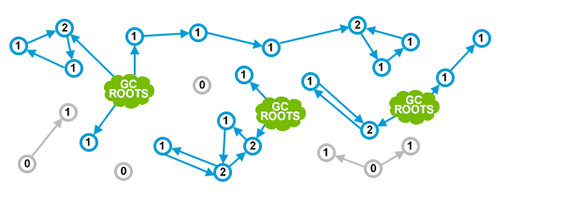
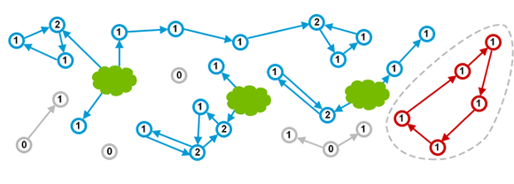
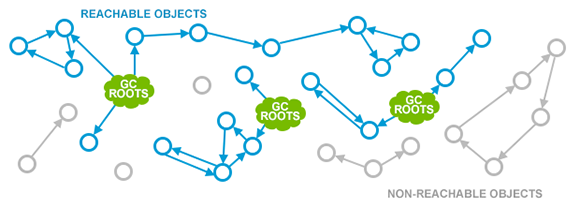
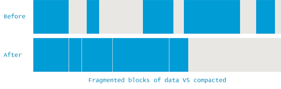
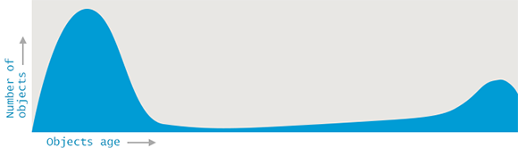
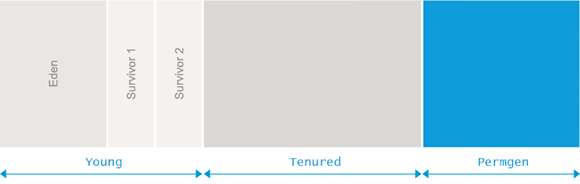
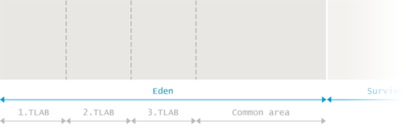
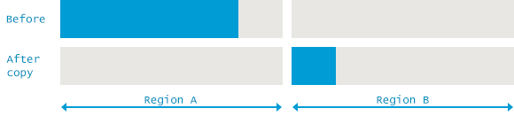
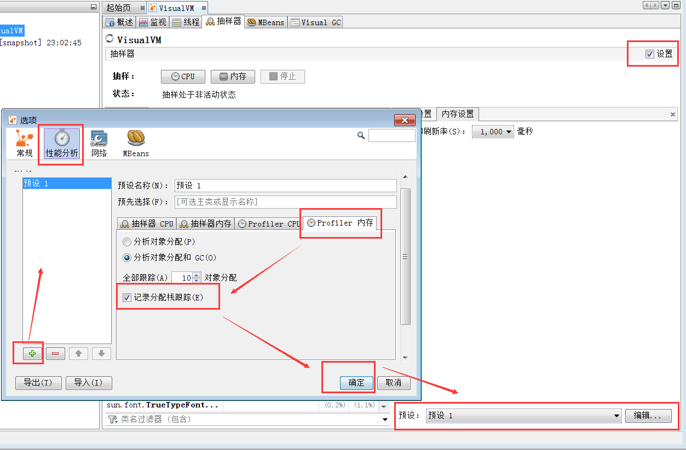

Java垃圾收集指南
==

> Github项目地址: [https://github.com/cncounter/gc-handbook](https://github.com/cncounter/gc-handbook)
>
> 时间: 2017年3月15日
>
> 版本: V0.2
>
> 状态: 第2次校对

## 目录

[1. 垃圾回收简介](#chapter1)

[2. Java的垃圾收集](#chapter2)

[3. GC 算法(基础篇)](#chapter3)

[4. GC 算法(实现篇)](#chapter4)

[5. GC 调优(基础篇)](#chapter5)

[6. GC 调优(工具篇)](#chapter6)

[7. GC 调优(实战篇)](#chapter7)

## 下载

<a target="_blank" href="https://github.com/cncounter/gc-handbook/raw/master/Java_GC_Hanbook_CN.pdf">Java垃圾收集指南_中文版.pdf</a>

 

##正文

> #### 说明: 
>
> 在本文中, `Garbage Collection` 翻译为 “`垃圾收集`”,  `garbage collector` 翻译为 “`垃圾收集器`”;  
>
> 一般认为, **垃圾回收** 和 **垃圾收集** 是同义词。
>
> `Minor GC` 翻译为： **小型GC**; 而不是 <del>次要GC</del>
>
> `Major GC` 翻译为： **大型GC**; 而不是 <del>主要GC</del>
>
> 原因在于,大部分情况下, 发生在年轻代的 `Minor GC` 次数会很多,翻译为<del>次要GC</del>明显不对。
>
> `Full GC` 翻译为： **完全GC**; 为了清晰起见,一般直接译为 Full GC,读者明白即可; 其中大型GC和完全GC差不多, 这些术语出自官方的各种分析工具和垃圾收集日志。并不是很统一。

# 1. 垃圾收集简介

顾名思义,垃圾收集(Garbage Collection)的意思就是 —— 找到垃圾并进行清理。但现有的垃圾收集实现却恰恰相反: **垃圾收集器跟踪所有正在使用的对象,并把其余部分当做垃圾**。记住这一点以后,  我们再深入讲解内存自动回收的原理，探究 JVM 中垃圾收集的具体实现, 。

我们不抠细节, 先从基础开始, 介绍垃圾收集的一般特征、核心概念以及实现算法。

> **免责声明**:  本文主要讲解 Oracle Hotspot 和 OpenJDK 的行为。对于其他JVM, 如 jRockit 或者 IBM J9, 在某些方面可能会略有不同。

## 手动内存管理(Manual Memory Management)

当今的自动垃圾收集算法极为先进, 但我们先来看看什么是手动内存管理。在那个时候, 如果要存储共享数据, 必须显式地进行 内存分配(allocate)和内存释放(free)。如果忘记释放, 则对应的那块内存不能再次使用。内存一直被占着, 却不再使用，这种情况就称为**内存泄漏**(`memory leak`)。

以下是用C语言来手动管理内存的一个示例程序:

	int send_request() {
	    size_t n = read_size();
	    int *elements = malloc(n * sizeof(int));
	
	    if(read_elements(n, elements) < n) {
	        // elements not freed!
	        return -1;
	    }
	
	    // …
	
	    free(elements)
	    return 0;
	}

可以看到,如果程序很长,或者结构比较复杂, 很可能就会忘记释放内存。内存泄漏曾经是个非常普遍的问题, 而且只能通过修复代码来解决。因此,业界迫切希望有一种更好的办法,来自动回收不再使用的内存,完全消除可能的人为错误。这种自动机制被称为 **垃圾收集**(`Garbage Collection`,简称GC)。

### 智能指针(Smart Pointers)

第一代自动垃圾收集算法, 使用的是**引用计数**(reference counting)。针对每个对象, 只需要记住被引用的次数, 当引用计数变为0时,  这个对象就可以被安全地回收(reclaimed)了。一个著名的示例是 C++ 的共享指针(shared pointers):

	int send_request() {
	    size_t n = read_size();
	    shared_ptr<vector<int>> elements 
	              = make_shared<vector<int>>();
	
	    if(read_elements(n, elements) < n) {
	        return -1;
	    }
	
	    return 0;
	}

`shared_ptr` 被用来跟踪引用的数量。作为参数传递时这个数字加1, 在离开作用域时这个数字减1。当引用计数变为0时,  `shared_ptr` 自动删除底层的 vector。需要向读者指出的是，这种方式在实际编程中并不常见, 此处仅用于演示。

## 自动内存管理(Automated Memory Management)

上面的C++代码中,我们要显式地声明什么时候需要进行内存管理。但不能让所有的对象都具备这种特征呢? 那样就太方便了, 开发者不再耗费脑细胞, 去考虑要在何处进行内存清理。运行时环境会自动算出哪些内存不再使用，并将其释放。换句话说,  **自动进行收集垃圾**。第一款垃圾收集器是1959年为Lisp语言开发的, 此后 Lisp 的垃圾收集技术也一直处于业界领先水平。

### 引用计数(Reference Counting)

刚刚演示的C++共享指针方式, 可以应用到所有对象。许多语言都采用这种方法, 包括 Perl、Python 和 PHP 等。下图很好地展示了这种方式:

图中绿色的云(GC ROOTS) 表示程序正在使用的对象。从技术上讲, 这些可能是当前正在执行的方法中的局部变量，或者是静态变量一类。在某些编程语言中,可能叫法不太一样,这里不必抠名词。 

蓝色的圆圈表示可以引用到的对象, 里面的数字就是引用计数。然后, 灰色的圆圈是各个作用域都不再引用的对象。灰色的对象被认为是垃圾, 随时会被垃圾收集器清理。

看起来很棒, 是吧!  但这种方式有个大坑, 很容易被**循环引用**(`detached cycle`) 给搞死。任何作用域中都没有引用指向这些对象，但由于循环引用, 导致引用计数一直大于零。如下图所示:

看到了吗?  红色的对象实际上属于垃圾。但由于引用计数的局限, 所以存在内存泄漏。

当然也有一些办法来应对这种情况, 例如 “**弱引用**”(‘weak’ references), 或者使用另外的算法来排查循环引用等。前面提到的 Perl、Python 和PHP 等语言, 都使用了某些方式来解决循环引用问题, 但本文不对其进行讨论。下面介绍JVM中使用的垃圾收集方法。

### 标记-清除(Mark and Sweep)

首先, JVM 明确定义了什么是对象的可达性(reachability)。我们前面所说的绿色云这种只能算是模糊的定义,  JVM 中有一类很明确很具体的对象, 称为 **垃圾收集根元素**(`Garbage Collection Roots`)，包括:

- 局部变量(Local variables)
- 活动线程(Active threads)
- 静态域(Static fields)
- JNI引用(JNI references)
- 其他对象(稍后介绍 ...)

JVM使用**标记-清除算法**(Mark and Sweep algorithm), 来跟踪所有的可达对象(即存活对象), 确保所有不可达对象(non-reachable objects)占用的内存都能被重用。其中包含两步:

- **`Marking`**(标记): 遍历所有的可达对象,并在本地内存(native)中分门别类记下。

- **`Sweeping`**(清除): 这一步保证了,不可达对象所占用的内存, 在之后进行内存分配时可以重用。

JVM中包含了多种GC算法, 如Parallel Scavenge(并行清除), Parallel Mark+Copy(并行标记+复制) 以及 CMS, 他们在实现上略有不同, 但理论上都采用了以上两个步骤。

标记清除算法最重要的优势, 就是不再因为循环引用而导致内存泄露:

而不好的地方在于, 垃圾收集过程中, 需要暂停应用程序的所有线程。假如不暂停,则对象间的引用关系会一直不停地发生变化, 那样就没法进行统计了。这种情况叫做 **STW停顿**(**`Stop The World pause`**, 全线暂停), 让应用程序暂时停止，让JVM进行内存清理工作。有很多原因会触发 STW停顿,  其中垃圾收集是最主要的因素。

在本手册中,我们将介绍JVM中垃圾收集的实现原理，以及如何高效地利用GC。

 

# 2. Java中的垃圾收集

**标记-清除**(Mark and Sweep)是最经典的垃圾收集算法。将理论用于生产实践时,  会有很多需要优化调整的地方,  以适应具体环境。下面通过一个简单的例子, 让我们一步步记录下来,  看看如何才能保证JVM能安全持续地分配对象。

## 碎片整理(Fragmenting and Compacting)

每次执行清除(sweeping), JVM 都必须保证不可达对象占用的内存能被回收重用。但这(最终)有可能会产生内存碎片(类似于磁盘碎片),  进而引发两个问题:

- 写入操作越来越耗时, 因为寻找一块足够大的空闲内存会变得非常麻烦。

- 在创建新对象时, JVM在连续的块中分配内存。如果碎片问题很严重, 直至没有空闲片段能存放下新创建的对象,就会发生内存分配错误(allocation error)。

要避免这类问题,JVM 必须确保碎片问题不失控。因此在垃圾收集过程中, 不仅仅是标记和清除, 还需要执行 “内存碎片整理” 过程。这个过程让所有可达对象(reachable objects)依次排列, 以消除(或减少)碎片。示意图如下所示:

> **说明**:
>
> JVM中的引用是一个抽象的概念,如果GC移动某个对象, 就会修改(栈和堆中)所有指向该对象的引用。
>
> 移动/拷贝/提升/压缩 是一个 STW 的过程,所以修改对象引用是一个安全的行为。但要更新所有的引用,对某些程序可能性能低下。

## 分代假设(Generational Hypothesis)

我们前面提到过,执行垃圾收集需要停止整个应用。很明显,对象越多则收集所有垃圾消耗的时间就越长。但可不可以只处理一个较小的内存区域呢? 为了探究这种可能性,研究人员发现,程序中的大多数可回收的内存可归为两类:

- 大部分对象很快就不再使用

- 还有一部分不会立即无用,但也不会持续(太)长时间

这些观测形成了 **弱代假设**(Weak Generational Hypothesis)。基于这一假设, VM中的内存被分为**年轻代**(Young Generation)和**老年代**(Old Generation)。老年代有时候也称为 **年老区**(Tenured)。

拆分为这样两个可清理的单独区域，允许采用不同的算法来大幅提高GC的性能。

这种方法也不是没有问题。例如，在不同分代中的对象可能会互相引用, 在收集某一个分代时就会成为 "事实上的" GC root。

当然,要着重强调的是,分代假设并不适用于所有程序。因为GC算法专门针对“要么死得快”，“否则活得长” 这类特征的对象来进行优化, JVM对收集那种存活时间半长不长的对象就显得非常尴尬了。

## 内存池(Memory Pools)

堆内存中的内存池划分也是类似的。不太容易理解的地方在于各个内存池中的垃圾收集是如何运行的。请注意,不同的GC算法在实现细节上可能会有所不同,但和本章所介绍的相关概念都是一致的。

### 新生代(Eden,伊甸园)

Eden 是内存中的一个区域, 用来分配新创建的对象。通常会有多个线程同时创建多个对象, 所以 Eden 区被划分为多个 **线程本地分配缓冲区**(Thread Local Allocation Buffer, 简称TLAB)。通过这种缓冲区划分,大部分对象直接由JVM 在对应线程的TLAB中分配, 避免与其他线程的同步操作。

如果 TLAB 中没有足够的内存空间, 就会在共享Eden区(shared Eden space)之中分配。如果共享Eden区也没有足够的空间, 就会触发一次 年轻代GC 来释放内存空间。如果GC之后 Eden 区依然没有足够的空闲内存区域, 则对象就会被分配到老年代空间(Old Generation)。

当 Eden 区进行垃圾收集时, GC将所有从 root 可达的对象过一遍, 并标记为存活对象。

我们曾指出,对象间可能会有跨代的引用, 所以需要一种方法来标记从其他分代中指向Eden的所有引用。这样做又会遭遇各个分代之间一遍又一遍的引用。JVM在实现时采用了一些绝招: 卡片标记(card-marking)。从本质上讲,JVM只需要记住Eden区中 “脏”对象的粗略位置, 可能有老年代的对象引用指向这部分区间。更多细节请参考: [Nitsan 的博客](http://psy-lob-saw.blogspot.com/2014/10/the-jvm-write-barrier-card-marking.html) 。

标记阶段完成后, Eden中所有存活的对象都会被复制到存活区(Survivor spaces)里面。整个Eden区就可以被认为是空的, 然后就能用来分配新对象。这种方法称为 “**标记-复制**”(Mark and Copy): 存活的对象被标记, 然后复制到一个存活区(注意,是复制,而不是移动)。

### 存活区(Survivor Spaces)

Eden 区的旁边是两个**存活区**, 称为 `from 空间`和 `to 空间`。需要着重强调的的是, 任意时刻总有一个存活区是空的(empty)。

空的那个存活区用于在下一次年轻代GC时存放收集的对象。年轻代中所有的存活对象(包括Edenq区和非空的那个 "from" 存活区)都会被复制到 ”to“ 存活区。GC过程完成后, ”to“ 区有对象,而 'from' 区里没有对象。两者的角色进行正好切换 。

存活的对象会在两个存活区之间复制多次, 直到某些对象的存活 时间达到一定的阀值。分代理论假设, 存活超过一定时间的对象很可能会继续存活更长时间。

这类“ 年老” 的对象因此被**提升**(promoted )到老年代。提升的时候， 存活区的对象不再是复制到另一个存活区,而是迁移到老年代, 并在老年代一直驻留, 直到变为不可达对象。

为了确定一个对象是否“足够老”, 可以被提升(Promotion)到老年代，GC模块跟踪记录每个存活区对象存活的次数。每次分代GC完成后,存活对象的年龄就会增长。当年龄超过**提升阈值**(tenuring threshold), 就会被提升到老年代区域。

具体的提升阈值由JVM动态调整,但也可以用参数 `-XX:+MaxTenuringThreshold` 来指定上限。如果设置 `-XX:+MaxTenuringThreshold=0` , 则GC时存活对象不在存活区之间复制，直接提升到老年代。现代 JVM 中这个阈值默认设置为**15**个 GC周期。这也是HotSpot中的最大值。

如果存活区空间不够存放年轻代中的存活对象，提升(Promotion)也可能更早地进行。

### 老年代(Old Generation)

老年代的GC实现要复杂得多。老年代内存空间通常会更大，里面的对象是垃圾的概率也更小。

老年代GC发生的频率比年轻代小很多。同时, 因为预期老年代中的对象大部分是存活的, 所以不再使用标记和复制(Mark and Copy)算法。而是采用移动对象的方式来实现最小化内存碎片。老年代空间的清理算法通常是建立在不同的基础上的。原则上,会执行以下这些步骤:

- 通过标志位(marked bit),标记所有通过 GC roots 可达的对象.

- 删除所有不可达对象

- 整理老年代空间中的内容，方法是将所有的存活对象复制,从老年代空间开始的地方,依次存放。

通过上面的描述可知, 老年代GC必须明确地进行整理,以避免内存碎片过多。

### 永久代(PermGen)

在Java 8 之前有一个特殊的空间,称为“永久代”(Permanent Generation)。这是存储元数据(metadata)的地方,比如 class 信息等。此外,这个区域中也保存有其他的数据和信息, 包括 内部化的字符串(internalized strings)等等。实际上这给Java开发者造成了很多麻烦,因为很难去计算这块区域到底需要占用多少内存空间。预测失败导致的结果就是产生 [`java.lang.OutOfMemoryError: Permgen space`](https://plumbr.eu/outofmemoryerror/permgen-space) 这种形式的错误。除非 ·OutOfMemoryError· 确实是内存泄漏导致的,否则就只能增加 permgen 的大小，例如下面的示例，就是设置 permgen 最大空间为 256 MB:

	java -XX:MaxPermSize=256m com.mycompany.MyApplication

### 元数据区(Metaspace)

既然估算元数据所需空间那么复杂, Java 8直接删除了永久代(Permanent Generation)，改用 Metaspace。从此以后, Java 中很多杂七杂八的东西都放置到普通的堆内存里。

当然，像类定义(class definitions)之类的信息会被加载到 Metaspace 中。元数据区位于本地内存(native memory),不再影响到普通的Java对象。默认情况下, Metaspace的大小只受限于 Java进程可用的本地内存。这样程序就不再因为多加载了几个类/JAR包就导致 [`java.lang.OutOfMemoryError: Permgen space. `](https://plumbr.eu/outofmemoryerror/permgen-space) 。注意, 这种不受限制的空间也不是没有代价的 —— 如果 Metaspace 失控, 则可能会导致很严重的内存交换(swapping), 或者导致本地内存分配失败。

如果需要避免这种最坏情况，那么可以通过下面这样的方式来限制 Metaspace 的大小, 如 256 MB:

	java -XX:MaxMetaspaceSize=256m com.mycompany.MyApplication

## Minor GC vs Major GC vs Full GC

垃圾收集事件(Garbage Collection events)通常分为: 小型GC(Minor GC) - 大型GC(Major GC) - 和完全GC(Full GC) 。本节介绍这些事件及其区别。然后你会发现这些区别也不是特别清晰。

最重要的是,应用程序是否满足 服务级别协议(Service Level Agreement, SLA), 并通过监控程序查看响应延迟和吞吐量。也只有那时候才能看到GC事件相关的结果。重要的是这些事件是否停止整个程序,以及持续多长时间。

虽然 Minor, Major 和 Full GC 这些术语被广泛应用, 但并没有标准的定义, 我们还是来深入了解一下具体的细节吧。

### 小型GC(Minor GC)

年轻代内存的垃圾收集事件称为**小型GC**。这个定义既清晰又得到广泛共识。对于小型GC事件,有一些有趣的事情你应该了解一下:

1. 当JVM无法为新对象分配内存空间时总会触发 Minor GC,比如 Eden 区占满时。所以(新对象)分配频率越高, Minor GC 的频率就越高。
2. Minor GC 事件实际上忽略了老年代。从老年代指向年轻代的引用都被认为是GC Root。而从年轻代指向老年代的引用在标记阶段全部被忽略。
3. 与一般的认识相反, Minor GC 每次都会引起全线停顿(stop-the-world ), 暂停所有的应用线程。对大多数程序而言,暂停时长基本上是可以忽略不计的, 因为 Eden 区的对象基本上都是垃圾, 也不怎么复制到存活区/老年代。如果情况不是这样, 大部分新创建的对象不能被垃圾回收清理掉, 则 Minor GC的停顿就会持续更长的时间。

所以 Minor GC 的定义很简单 —— **Minor GC 清理的就是年轻代**。

### Major GC vs Full GC

值得一提的是, 这些术语并没有正式的定义 —— 无论是在JVM规范还是在GC相关论文中。

我们知道,  Minor GC 清理的是年轻代空间(Young space)，相应的,其他定义也很简单:

- **Major GC**(大型GC) 清理的是老年代空间(Old space)。
- **Full GC**(完全GC)清理的是整个堆, 包括年轻代和老年代空间。

杯具的是更复杂的情况出现了。很多 Major GC 是由 Minor GC 触发的, 所以很多情况下这两者是不可分离的。另一方面, 像G1这样的垃圾收集算法执行的是部分区域垃圾回收, 所以，额，使用术语“cleaning”并不是非常准确。

这也让我们认识到,**不应该去操心是叫 Major GC 呢还是叫 Full GC, 我们应该关注的是: 某次GC事件 是否停止所有线程,或者是与其他线程并发执行**。

这些混淆甚至根植于标准的JVM工具中。我的意思可以通过实例来说明。让我们来对比同一JVM中两款工具的GC信息输出吧。这个JVM使用的是 **并发标记和清除收集器**（Concurrent Mark and Sweep collector，`-XX:+UseConcMarkSweepGC`).

首先我们来看 [`jstat`](http://docs.oracle.com/javase/8/docs/technotes/tools/unix/jstat.html) 的输出:

> `jstat -gc -t 4235 1s`

	Time   S0C    S1C     S0U    S1U      EC       EU        OC         OU       MC       MU     CCSC   CCSU     YGC    YGCT    FGC    FGCT     GCT   
	 5.7 34048.0 34048.0  0.0   34048.0 272640.0 194699.7 1756416.0   181419.9  18304.0 17865.1 2688.0 2497.6      3    0.275   0      0.000    0.275
	 6.7 34048.0 34048.0 34048.0  0.0   272640.0 247555.4 1756416.0   263447.9  18816.0 18123.3 2688.0 2523.1      4    0.359   0      0.000    0.359
	 7.7 34048.0 34048.0  0.0   34048.0 272640.0 257729.3 1756416.0   345109.8  19072.0 18396.6 2688.0 2550.3      5    0.451   0      0.000    0.451
	 8.7 34048.0 34048.0 34048.0 34048.0 272640.0 272640.0 1756416.0  444982.5  19456.0 18681.3 2816.0 2575.8      7    0.550   0      0.000    0.550
	 9.7 34048.0 34048.0 34046.7  0.0   272640.0 16777.0  1756416.0   587906.3  20096.0 19235.1 2944.0 2631.8      8    0.720   0      0.000    0.720
	10.7 34048.0 34048.0  0.0   34046.2 272640.0 80171.6  1756416.0   664913.4  20352.0 19495.9 2944.0 2657.4      9    0.810   0      0.000    0.810
	11.7 34048.0 34048.0 34048.0  0.0   272640.0 129480.8 1756416.0   745100.2  20608.0 19704.5 2944.0 2678.4     10    0.896   0      0.000    0.896
	12.7 34048.0 34048.0  0.0   34046.6 272640.0 164070.7 1756416.0   822073.7  20992.0 19937.1 3072.0 2702.8     11    0.978   0      0.000    0.978
	13.7 34048.0 34048.0 34048.0  0.0   272640.0 211949.9 1756416.0   897364.4  21248.0 20179.6 3072.0 2728.1     12    1.087   1      0.004    1.091
	14.7 34048.0 34048.0  0.0   34047.1 272640.0 245801.5 1756416.0   597362.6  21504.0 20390.6 3072.0 2750.3     13    1.183   2      0.050    1.233
	15.7 34048.0 34048.0  0.0   34048.0 272640.0 21474.1  1756416.0   757347.0  22012.0 20792.0 3200.0 2791.0     15    1.336   2      0.050    1.386
	16.7 34048.0 34048.0 34047.0  0.0   272640.0 48378.0  1756416.0   838594.4  22268.0 21003.5 3200.0 2813.2     16    1.433   2      0.050    1.484

此片段截取自JVM启动后的前17秒。根据这些信息可以得知: 有2次Full GC在12次Minor GC(YGC)之后触发执行, 总计耗时 **50ms**。当然,也可以通过具备图形界面的工具得出同样的信息, 比如 [jconsole](http://docs.oracle.com/javase/7/docs/technotes/guides/management/jconsole.html) 或者 [jvisualvm](http://download.oracle.com/javase/6/docs/technotes/tools/share/jvisualvm.html) (或者最新的 jmc)。

在下结论之前, 让我们看看此JVM进程的GC日志。显然需要配置 `-XX:+PrintGCDetails` 参数,GC日志的内容更详细,结果也有一些不同:

> `java -XX:+PrintGCDetails -XX:+UseConcMarkSweepGC eu.plumbr.demo.GarbageProducer`

	3.157: [GC (Allocation Failure) 3.157: [ParNew: 272640K->34048K(306688K), 0.0844702 secs] 272640K->69574K(2063104K), 0.0845560 secs] [Times: user=0.23 sys=0.03, real=0.09 secs] 
	4.092: [GC (Allocation Failure) 4.092: [ParNew: 306688K->34048K(306688K), 0.1013723 secs] 342214K->136584K(2063104K), 0.1014307 secs] [Times: user=0.25 sys=0.05, real=0.10 secs] 
	... cut for brevity ...
	
	11.292: [GC (Allocation Failure) 11.292: [ParNew: 306686K->34048K(306688K), 0.0857219 secs] 971599K->779148K(2063104K), 0.0857875 secs] [Times: user=0.26 sys=0.04, real=0.09 secs] 
	12.140: [GC (Allocation Failure) 12.140: [ParNew: 306688K->34046K(306688K), 0.0821774 secs] 1051788K->856120K(2063104K), 0.0822400 secs] [Times: user=0.25 sys=0.03, real=0.08 secs] 
	12.989: [GC (Allocation Failure) 12.989: [ParNew: 306686K->34048K(306688K), 0.1086667 secs] 1128760K->931412K(2063104K), 0.1087416 secs] [Times: user=0.24 sys=0.04, real=0.11 secs] 
	13.098: [GC (CMS Initial Mark) [1 CMS-initial-mark: 897364K(1756416K)] 936667K(2063104K), 0.0041705 secs] [Times: user=0.02 sys=0.00, real=0.00 secs] 
	13.102: [CMS-concurrent-mark-start]
	13.341: [CMS-concurrent-mark: 0.238/0.238 secs] [Times: user=0.36 sys=0.01, real=0.24 secs] 
	13.341: [CMS-concurrent-preclean-start]
	13.350: [CMS-concurrent-preclean: 0.009/0.009 secs] [Times: user=0.03 sys=0.00, real=0.01 secs] 
	13.350: [CMS-concurrent-abortable-preclean-start]
	13.878: [GC (Allocation Failure) 13.878: [ParNew: 306688K->34047K(306688K), 0.0960456 secs] 1204052K->1010638K(2063104K), 0.0961542 secs] [Times: user=0.29 sys=0.04, real=0.09 secs] 
	14.366: [CMS-concurrent-abortable-preclean: 0.917/1.016 secs] [Times: user=2.22 sys=0.07, real=1.01 secs] 
	14.366: [GC (CMS Final Remark) [YG occupancy: 182593 K (306688 K)]14.366: [Rescan (parallel) , 0.0291598 secs]14.395: [weak refs processing, 0.0000232 secs]14.395: [class unloading, 0.0117661 secs]14.407: [scrub symbol table, 0.0015323 secs]14.409: [scrub string table, 0.0003221 secs][1 CMS-remark: 976591K(1756416K)] 1159184K(2063104K), 0.0462010 secs] [Times: user=0.14 sys=0.00, real=0.05 secs] 
	14.412: [CMS-concurrent-sweep-start]
	14.633: [CMS-concurrent-sweep: 0.221/0.221 secs] [Times: user=0.37 sys=0.00, real=0.22 secs] 
	14.633: [CMS-concurrent-reset-start]
	14.636: [CMS-concurrent-reset: 0.002/0.002 secs] [Times: user=0.00 sys=0.00, real=0.00 secs]

通过GC日志可以看到, 在12 次 Minor GC之后发生了一些 "不同的事情"。并不是两个 Full GC, 而是在老年代执行了一次 GC, 分为多个阶段执行:

- 初始标记阶段(Initial Mark phase),耗时 0.0041705秒(约4ms)。此阶段是全线停顿(STW)事件,暂停所有应用线程,以便执行初始标记。
- 标记和预清理阶段(Markup and Preclean phase)。和应用线程并发执行。
- 最终标记阶段(Final Remark phase), 耗时 0.0462010秒(约46ms)。此阶段也是全线停顿(STW)事件。
- 清除操作(Sweep)是并发执行的, 不需要暂停应用线程。

所以从实际的GC日志可以看到, 并不是执行了两次 Full GC操作, 而是只执行了一次清理老年代空间的 Major GC 。

如果只关心延迟, 通过后面 `jstat` 显示的数据, 也能得出正确的结果。它正确地列出了两次  STW 事件,总计耗时 50 ms。这段时间影响了所有应用线程的延迟。如果想要优化吞吐量, 这个结果就会有误导性 —— jstat 只列出了 stop-the-world 的初始标记阶段和最终标记阶段,  jstat 的输出完全隐藏了并发执行的GC阶段。

 

# 3. GC 算法(基础篇)

> **相关术语翻译说明**: 
>
> Mark,标记;
>
> Sweep,清除; 
>
> Compact,整理; 也有人翻译为压缩,译者认为GC时不存在压缩这回事。
>
> Copy,复制; copy 用作名词时一般翻译为拷贝/副本,用作动词时翻译为复制。
>
> 注: 《[垃圾回收算法手册](https://book.douban.com/subject/26740958/)》将 Mark and Sweep 翻译为: **标记-清扫**算法; 译者认为 **标记-清除** 更容易理解。

本章简要介绍GC的基本原理和相关技术, [下一章节](04_GC_Algorithms_Implementations.md)再详细讲解GC算法的具体实现。各种垃圾收集器的实现细节虽然并不相同,但总体而言,垃圾收集器都专注于两件事情:

- 查找所有存活对象
- 抛弃其他的部分,即死对象,不再使用的对象。

第一步, 记录(census)所有的存活对象, 在垃圾收集中有一个叫做 **标记(Marking)** 的过程专门干这件事。

## 标记可达对象(Marking Reachable Objects)

现代JVM中所有的GC算法,第一步都是找出所有存活的对象。下面的示意图对此做了最好的诠释:

首先,有一些特定的对象被指定为 **Garbage Collection Roots**(GC根元素)。包括:

- 当前正在执行的方法里的局部变量和输入参数
- 活动线程(Active threads)
- 内存中所有类的静态字段(static field)
- JNI引用

其次, GC遍历(traverses)内存中整体的对象关系图(object graph),从GC根元素开始扫描, 到直接引用，以及其他对象(通过对象的属性域)。所有GC访问到的对象都被**标记(marked)**为存活对象。

存活对象在上图中用蓝色表示。标记阶段完成后, 所有存活对象都被标记了。而其他对象(上图中灰色的数据结构)就是从GC根元素不可达的, 也就是说程序不能再使用这些不可达的对象(unreachable object)。这样的对象被认为是垃圾, GC会在接下来的阶段中清除他们。

在标记阶段有几个需要注意的点:

在标记阶段,需要暂停所有应用线程, 以遍历所有对象的引用关系。因为不暂停就没法跟踪一直在变化的引用关系图。这种情景叫做 **Stop The World pause** (**全线停顿**),而可以安全地暂停线程的点叫做安全点(safe point), 然后, JVM就可以专心执行清理工作。安全点可能有多种因素触发, 当前, GC是触发安全点最常见的原因。

此阶段暂停的时间, 与堆内存大小,对象的总数没有直接关系, 而是由**存活对象**(alive objects)的数量来决定。所以增加堆内存的大小并不会直接影响标记阶段占用的时间。

**标记** 阶段完成后, GC进行下一步操作, 删除不可达对象。

## 删除不可达对象(Removing Unused Objects)

各种GC算法在删除不可达对象时略有不同, 但总体可分为三类: 清除(sweeping)、整理(compacting)和复制(copying)。[下一章节](04_GC_Algorithms_Implementations.md)将详细讲解这些算法。

### Sweep(清除)

**Mark and Sweep(标记-清除)** 算法的概念非常简单: 直接忽略所有的垃圾。也就是说在标记阶段完成后, 所有不可达对象占用的内存空间, 都被认为是空闲的, 因此可以用来分配新对象。

这种算法需要使用 **空闲表(free-list)**,来记录所有的空闲区域, 以及每个区域的大小。维护空闲表增加了对象分配时的开销。此外还存在另一个弱点 —— 明明还有很多空闲内存, 却可能没有一个区域的大小能够存放需要分配的对象, 从而导致分配失败(在Java 中就是 [OutOfMemoryError](http://plumbr.eu/outofmemoryerror))。

### Compact(整理)

**标记-清除-整理算法(Mark-Sweep-Compact)**, 将所有被标记的对象(存活对象), 迁移到内存空间的起始处, 消除了标记-清除算法的缺点。 相应的缺点就是GC暂停时间会增加, 因为需要将所有对象复制到另一个地方, 然后修改指向这些对象的引用。此算法的优势也很明显, 碎片整理之后, 分配新对象就很简单, 只需要通过指针碰撞(pointer bumping)即可。使用这种算法, 内存空间剩余的容量一直是清楚的, 不会再导致内存碎片问题。

### Copy(复制)

**标记-复制算法(Mark and Copy)** 和 标记-整理算法(Mark and Compact) 十分相似: 两者都会移动所有存活的对象。区别在于, 标记-复制算法是将内存移动到另外一个空间: 存活区。标记-复制方法的优点在于:  标记和复制可以同时进行。缺点则是需要一个额外的内存区间, 来存放所有的存活对象。

 

# 4. GC 算法(实现篇)

学习了GC算法的相关概念之后, 我们将介绍在JVM中这些算法的具体实现。首先要记住的是, 大多数JVM都需要使用两种不同的GC算法 —— 一种用来清理年轻代, 另一种用来清理老年代。

我们可以选择JVM内置的各种算法。如果不通过参数明确指定垃圾收集算法, 则会使用宿主平台的默认实现。本章会详细介绍各种算法的实现原理。

下面是关于Java 8中各种组合的垃圾收集器概要列表,对于之前的Java版本来说,可用组合会有一些不同:

<table>
<thead>
<tr>
<th><b>Young</b></th>
<th><b>Tenured</b></th>
<th><b>JVM options</b></th>
</tr>
</thead>
<tbody>
<tr>
<td>Incremental(增量GC)</td>
<td>Incremental</td>
<td>-Xincgc</td>
</tr>
<tr>
<td><b>Serial</b></td>
<td><b>Serial</b></td>
<td><b>-XX:+UseSerialGC</b></td>
</tr>
<tr>
<td>Parallel Scavenge</td>
<td>Serial</td>
<td>-XX:+UseParallelGC -XX:-UseParallelOldGC</td>
</tr>
<tr>
<td>Parallel New</td>
<td>Serial</td>
<td>N/A</td>
</tr>
<tr>
<td>Serial</td>
<td>Parallel Old</td>
<td>N/A</td>
</tr>
<tr>
<td><b>Parallel Scavenge</b></td>
<td><b>Parallel Old</b></td>
<td><b>-XX:+UseParallelGC -XX:+UseParallelOldGC</b></td>
</tr>
<tr>
<td>Parallel New</td>
<td>Parallel Old</td>
<td>N/A</td>
</tr>
<tr>
<td>Serial</td>
<td>CMS</td>
<td>-XX:-UseParNewGC -XX:+UseConcMarkSweepGC</td>
</tr>
<tr>
<td>Parallel Scavenge</td>
<td>CMS</td>
<td>N/A</td>
</tr>
<tr>
<td><b>Parallel New</b></td>
<td><b>CMS</b></td>
<td><b>-XX:+UseParNewGC -XX:+UseConcMarkSweepGC</b></td>
</tr>
<tr>
<td colspan="2" align="middle"><b>G1</b></td>
<td><b>-XX:+UseG1GC</b></td>
</tr>
</tbody>
</table>

看起来有些复杂, 不用担心。主要使用的是上表中黑体字表示的这四种组合。其余的要么是[被废弃(deprecated)](http://openjdk.java.net/jeps/173), 要么是不支持或者是不太适用于生产环境。所以,接下来我们只介绍下面这些组合及其工作原理:

- 年轻代和老年代的串行GC(Serial GC)
- 年轻代和老年代的并行GC(Parallel GC)
- 年轻代的并行GC(Parallel New) + 老年代的CMS(Concurrent Mark and Sweep)
- G1, 负责回收年轻代和老年代

## Serial GC(串行GC)

Serial GC 对年轻代使用 [mark-copy(标记-复制) 算法](https://plumbr.eu/handbook/garbage-collection-algorithms/removing-unused-objects/copy), 对老年代使用 [mark-sweep-compact(标记-清除-整理)算法](https://plumbr.eu/handbook/garbage-collection-algorithms/removing-unused-objects/compact). 顾名思义, 两者都是单线程的垃圾收集器,不能进行并行处理。两者都会触发全线暂停(STW),停止所有的应用线程。

因此这种GC算法不能充分利用多核CPU。不管有多少CPU内核, JVM 在垃圾收集时都只能使用单个核心。

要启用此款收集器, 只需要指定一个JVM启动参数即可,同时对年轻代和老年代生效:

	java -XX:+UseSerialGC com.mypackages.MyExecutableClass

该选项只适合几百MB堆内存的JVM,而且是单核CPU时比较有用。 对于服务器端来说, 因为一般是多个CPU内核, 并不推荐使用, 除非确实需要限制JVM所使用的资源。大多数服务器端应用部署在多核平台上, 选择 Serial GC 就表示人为的限制系统资源的使用。 导致的就是资源闲置, 多的CPU资源也不能用来降低延迟,也不能用来增加吞吐量。

下面让我们看看Serial GC的垃圾收集日志, 并从中提取什么有用的信息。为了打开GC日志记录, 我们使用下面的JVM启动参数:

	-XX:+PrintGCDetails -XX:+PrintGCDateStamps 
	-XX:+PrintGCTimeStamps

产生的GC日志输出类似这样(为了排版,已手工折行):

	2015-05-26T14:45:37.987-0200: 
			151.126: [GC (Allocation Failure) 
			151.126: [DefNew: 629119K->69888K(629120K), 0.0584157 secs] 
			1619346K->1273247K(2027264K), 0.0585007 secs]
		[Times: user=0.06 sys=0.00, real=0.06 secs]
	2015-05-26T14:45:59.690-0200: 
			172.829: [GC (Allocation Failure) 
			172.829: [DefNew: 629120K->629120K(629120K), 0.0000372 secs]
			172.829: [Tenured: 1203359K->755802K(1398144K), 0.1855567 secs] 
			1832479K->755802K(2027264K), 
			[Metaspace: 6741K->6741K(1056768K)], 0.1856954 secs] 
		[Times: user=0.18 sys=0.00, real=0.18 secs]

此GC日志片段展示了在JVM中发生的很多事情。 实际上,在这段日志中产生了两个GC事件, 其中一次清理的是年轻代,另一次清理的是整个堆内存。让我们先来分析前一次GC,其在年轻代中产生。

### Minor GC(小型GC)

以下代码片段展示了清理年轻代内存的GC事件:

> <a>`2015-05-26T14:45:37.987-0200`1</a> : <a>`151.1262`2</a> : [ <a>`GC`3</a> (<a>`Allocation Failure`4</a> 151.126:  
> [<a>`DefNew`5</a> : <a>`629119K->69888K`6</a> <a>`(629120K)`7</a> , 0.0584157 secs] <a>`1619346K->1273247K`8</a>  
> <a>`(2027264K)`9</a>, <a>`0.0585007 secs`10</a>] <a>`[Times: user=0.06 sys=0.00, real=0.06 secs]`11</a>

 

> 1. <a>`2015-05-26T14:45:37.987-0200`</a> – GC事件开始的时间. 其中`-0200`表示西二时区,而中国所在的东8区为 `+0800`。
>
> 2. <a>`151.126`</a> – GC事件开始时,相对于JVM启动时的间隔时间,单位是秒。
>
> 3. <a>`GC`</a> – 用来区分 Minor GC 还是 Full GC 的标志。`GC`表明这是一次**小型GC**(Minor GC)
>
> 4. <a>`Allocation Failure`</a> – 触发 GC 的原因。本次GC事件, 是由于年轻代中没有空间来存放新的数据结构引起的。
>
> 5. <a>`DefNew`</a> – 垃圾收集器的名称。这个神秘的名字表示的是在年轻代中使用的: 单线程, 标记-复制(mark-copy), 全线暂停(STW) 垃圾收集器。
>
> 6. <a>`629119K->69888K`</a> – 在垃圾收集之前和之后年轻代的使用量。
>
> 7. <a>`(629120K)`</a> – 年轻代总的空间大小。
>
> 8. <a>`1619346K->1273247K`</a> – 在垃圾收集之前和之后整个堆内存的使用情况。
>
> 9. <a>`(2027264K)`</a> – 可用堆的总空间大小。
>
> 10. <a>`0.0585007 secs`</a> – GC事件持续的时间,以秒为单位。
>
> 11. <a>`[Times: user=0.06 sys=0.00, real=0.06 secs]`</a> – GC事件的持续时间, 通过三个部分来衡量:
>
- user – 在此次垃圾回收过程中, 所有 GC线程所消耗的CPU时间之和。

> 
- sys – GC过程中中操作系统调用和系统等待事件所消耗的时间。
> 
- real – 应用程序暂停的时间。因为串行垃圾收集器(Serial Garbage Collector)只使用单线程, 因此 real time 等于 user 和 system 时间的总和。

可以从上面的日志片段了解到, 在GC事件中,JVM 的内存使用情况发生了怎样的变化。此次垃圾收集之前, 堆内存总的使用量为 **1,619,346K**。其中,年轻代使用了 **629,119K**。可以算出,老年代使用量为 **990,227K**。

更重要的信息蕴含在下一批数字中, 垃圾收集之后, 年轻代的使用量减少了 **559,231K**, 但堆内存的总体使用量只下降了 **346,099K**。 从中可以算出,有 **213,132K** 的对象从年轻代提升到了老年代。

此次GC事件也可以用下面的示意图来说明, 显示的是GC开始之前, 以及刚刚结束之后, 这两个时间点内存使用情况的快照:

### Full GC(完全GC)

理解第一次 minor GC 事件后,让我们看看日志中的第二次GC事件:

> <a>`2015-05-26T14:45:59.690-0200`1</a> : <a>`172.829`2</a> : [GC (Allocation Failure 172.829:  
> <a>`[DefNew: 629120K->629120K(629120K), 0.0000372 secs`3</a>] 172.829:[<a>`Tenured`4</a>:  
> <a>`1203359K->755802K`5</a> <a>`(1398144K)`6</a>, <a>`0.1855567 secs`7</a> ] <a>`1832479K->755802K`8</a>  
> <a>`(2027264K)`9</a>, <a>`[Metaspace: 6741K->6741K(1056768K)]`10</a>  
> <a>`[Times: user=0.18 sys=0.00, real=0.18 secs]`11</a>

 

>
> 1. <a>`2015-05-26T14:45:59.690-0200`</a> – GC事件开始的时间. 其中`-0200`表示西二时区,而中国所在的东8区为 `+0800`。
> 2. <a>`172.829`</a> – GC事件开始时,相对于JVM启动时的间隔时间,单位是秒。
> 3. <a>`[DefNew: 629120K->629120K(629120K), 0.0000372 secs`</a> – 与上面的示例类似, 因为内存分配失败,在年轻代中发生了一次 minor GC。此次GC同样使用的是 DefNew 收集器, 让年轻代的使用量从 629120K 降为 0。注意,JVM对此次GC的报告有些问题,误将年轻代认为是完全填满的。此次垃圾收集消耗了 0.0000372秒。

> 1. <a>`Tenured`</a> – 用于清理老年代空间的垃圾收集器名称。**Tenured** 表明使用的是单线程的全线暂停垃圾收集器, 收集算法为 标记-清除-整理(mark-sweep-compact )。
> 2. <a>`1203359K->755802K`</a>  – 在垃圾收集之前和之后老年代的使用量。
> 3. <a>`(1398144K)`</a>  – 老年代的总空间大小。
> 4. <a>`0.1855567 secs`</a> – 清理老年代所花的时间。
> 5. <a>`1832479K->755802K`</a> – 在垃圾收集之前和之后,整个堆内存的使用情况。
> 6. <a>`(2027264K)`</a> – 可用堆的总空间大小。
> 7. <a>`[Metaspace: 6741K->6741K(1056768K)]`</a> – 关于 Metaspace 空间, 同样的信息。可以看出, 此次GC过程中 Metaspace 中没有收集到任何垃圾。
> 8. <a>`[Times: user=0.18 sys=0.00, real=0.18 secs]`</a> – GC事件的持续时间, 通过三个部分来衡量:
- user – 在此次垃圾回收过程中, 所有 GC线程所消耗的CPU时间之和。
- sys –  GC过程中中操作系统调用和系统等待事件所消耗的时间。
- real – 应用程序暂停的时间。因为串行垃圾收集器(Serial Garbage Collector)只使用单线程, 因此 real time 等于 user 和 system 时间的总和。

和 Minor GC 相比,最明显的区别是 —— 在此次GC事件中, 除了年轻代, 还清理了老年代和Metaspace. 在GC事件开始之前, 以及刚刚结束之后的内存布局,可以用下面的示意图来说明:

## Parallel GC(并行GC)

并行垃圾收集器这一类组合, 在年轻代使用 [标记-复制(mark-copy)算法](https://plumbr.eu/handbook/garbage-collection-algorithms/removing-unused-objects/copy), 在老年代使用 [标记-清除-整理(mark-sweep-compact)算法](https://plumbr.eu/handbook/garbage-collection-algorithms/removing-unused-objects/compact)。年轻代和老年代的垃圾回收都会触发STW事件,暂停所有的应用线程来执行垃圾收集。两者在执行 标记和 复制/整理阶段时都使用多个线程, 因此得名“**(Parallel)**”。通过并行执行, 使得GC时间大幅减少。

通过命令行参数 `-XX:ParallelGCThreads=NNN` 来指定 GC 线程数。 其默认值为CPU内核数。

可以通过下面的任意一组命令行参数来指定并行GC:

	java -XX:+UseParallelGC com.mypackages.MyExecutableClass
	java -XX:+UseParallelOldGC com.mypackages.MyExecutableClass
	java -XX:+UseParallelGC -XX:+UseParallelOldGC com.mypackages.MyExecutableClass

并行垃圾收集器适用于多核服务器,主要目标是增加吞吐量。因为对系统资源的有效使用,能达到更高的吞吐量:

- 在GC期间, 所有 CPU 内核都在并行清理垃圾, 所以暂停时间更短
- 在两次GC周期的间隔期, 没有GC线程在运行,不会消耗任何系统资源

另一方面, 因为此GC的所有阶段都不能中断, 所以并行GC很容易出现长时间的卡顿. 如果延迟是系统的主要目标, 那么就应该选择其他垃圾收集器组合。

> **译者注**: 长时间卡顿的意思是，此GC启动之后，属于一次性完成所有操作, 于是单次 pause 的时间会较长。

让我们看看并行垃圾收集器的GC日志长什么样, 从中我们可以得到哪些有用信息。下面的GC日志中显示了一次 minor GC 暂停 和一次 major GC 暂停:

	2015-05-26T14:27:40.915-0200: 116.115: [GC (Allocation Failure) 
			[PSYoungGen: 2694440K->1305132K(2796544K)] 
		9556775K->8438926K(11185152K)
		, 0.2406675 secs] 
		[Times: user=1.77 sys=0.01, real=0.24 secs]
	2015-05-26T14:27:41.155-0200: 116.356: [Full GC (Ergonomics) 
			[PSYoungGen: 1305132K->0K(2796544K)] 
			[ParOldGen: 7133794K->6597672K(8388608K)] 8438926K->6597672K(11185152K), 
			[Metaspace: 6745K->6745K(1056768K)]
		, 0.9158801 secs]
		[Times: user=4.49 sys=0.64, real=0.92 secs]

### Minor GC(小型GC)

第一次GC事件表示发生在年轻代的垃圾收集:

> <a>`2015-05-26T14:27:40.915-0200`1</a>: <a>`116.115`2</a>:  <a>`[ GC`3</a> (<a>`Allocation Failure`4</a>) 
> [<a>`PSYoungGen`5</a>: <a>`2694440K->1305132K`6</a> <a>`(2796544K)`7</a>] <a>`9556775K->8438926K`8</a> 
> <a>`(11185152K)`9</a>, <a>`0.2406675 secs`10</a>] 
> <a>`[Times: user=1.77 sys=0.01, real=0.24 secs]`11</a>

 

>
> 1. <a>`2015-05-26T14:27:40.915-0200`</a> – GC事件开始的时间. 其中`-0200`表示西二时区,而中国所在的东8区为 `+0800`。
> 2. <a>`116.115`</a> – GC事件开始时,相对于JVM启动时的间隔时间,单位是秒。
> 3. <a>`GC`</a> – 用来区分 Minor GC 还是 Full GC 的标志。`GC`表明这是一次**小型GC**(Minor GC)
> 4. <a>`Allocation Failure`</a> – 触发垃圾收集的原因。本次GC事件, 是由于年轻代中没有适当的空间存放新的数据结构引起的。
> 5. <a>`PSYoungGen`</a> – 垃圾收集器的名称。这个名字表示的是在年轻代中使用的: 并行的 标记-复制(mark-copy), 全线暂停(STW) 垃圾收集器。
> 6. <a>`2694440K->1305132K`</a> – 在垃圾收集之前和之后的年轻代使用量。
> 7. <a>`(2796544K)`</a> – 年轻代的总大小。
> 8. <a>`9556775K->8438926K`</a> – 在垃圾收集之前和之后整个堆内存的使用量。
> 9. <a>`(11185152K)`</a> – 可用堆的总大小。
> 10. <a>`0.2406675 secs`</a> – GC事件持续的时间,以秒为单位。
> 11. <a>`[Times: user=1.77 sys=0.01, real=0.24 secs]`</a> – GC事件的持续时间, 通过三个部分来衡量:
- user – 在此次垃圾回收过程中, 由GC线程所消耗的总的CPU时间。
- sys – GC过程中中操作系统调用和系统等待事件所消耗的时间。
- real – 应用程序暂停的时间。在 Parallel GC 中, 这个数字约等于: (user time + system time)/GC线程数。 这里使用了8个线程。 请注意,总有一定比例的处理过程是不能并行进行的。

所以,可以简单地算出, 在垃圾收集之前, 堆内存总使用量为 **9,556,775K**。 其中年轻代为 **2,694,440K**。同时算出老年代使用量为 **6,862,335K**. 在垃圾收集之后, 年轻代使用量减少为 **1,389,308K**, 但总的堆内存使用量只减少了 `1,117,849K`。这表示有大小为 **271,459K** 的对象从年轻代提升到老年代。

### Full GC(完全GC)

学习了并行GC如何清理年轻代之后, 下面介绍清理整个堆内存的GC日志以及如何进行分析:

> <a>`2015-05-26T14:27:41.155-0200`</a> : <a>`116.356`</a> : [<a>`Full GC`</a>  (<a>`Ergonomics`</a>) 
> <a>`[PSYoungGen: 1305132K->0K(2796544K)]`</a> [<a>`ParOldGen`</a> :<a>`7133794K->6597672K `</a>  
> <a>`(8388608K)`</a>] <a>`8438926K->6597672K`</a> <a>`(11185152K)`</a>,  
> <a>`[Metaspace: 6745K->6745K(1056768K)] `</a>, <a>`0.9158801 secs`</a>, 
> <a>`[Times: user=4.49 sys=0.64, real=0.92 secs]`</a>

 

> 1. <a>`2015-05-26T14:27:41.155-0200`</a> – GC事件开始的时间. 其中`-0200`表示西二时区,而中国所在的东8区为 `+0800`。
> 2. <a>`116.356`</a> – GC事件开始时,相对于JVM启动时的间隔时间,单位是秒。 我们可以看到, 此次事件在前一次 MinorGC完成之后立刻就开始了。
> 3. <a>`Full GC`</a> – 用来表示此次是 Full GC 的标志。`Full GC`表明本次清理的是年轻代和老年代。
> 4. <a>`Ergonomics`</a> – 触发垃圾收集的原因。`Ergonomics` 表示JVM内部环境认为此时可以进行一次垃圾收集。
> 5. <a>`[PSYoungGen: 1305132K->0K(2796544K)]`</a> – 和上面的示例一样, 清理年轻代的垃圾收集器是名为 “PSYoungGen” 的STW收集器, 采用**标记-复制**(mark-copy)算法。 年轻代使用量从 **1305132K** 变为 `0`, 一般 Full GC 的结果都是这样。
> 6. <a>`ParOldGen`</a> – 用于清理老年代空间的垃圾收集器类型。在这里使用的是名为 **ParOldGen** 的垃圾收集器, 这是一款并行 STW垃圾收集器, 算法为 标记-清除-整理(mark-sweep-compact)。
> 7. <a>`7133794K->6597672K `</a> – 在垃圾收集之前和之后老年代内存的使用情况。
> 8. <a>`(8388608K)`</a> – 老年代的总空间大小。
> 9. <a>`8438926K->6597672K`</a> – 在垃圾收集之前和之后堆内存的使用情况。
> 10. <a>`(11185152K)`</a> – 可用堆内存的总容量。
> 11. <a>`[Metaspace: 6745K->6745K(1056768K)] `</a> – 类似的信息,关于 Metaspace 空间的。可以看出, 在GC事件中 Metaspace 里面没有回收任何对象。
> 12. <a>`0.9158801 secs`</a> – GC事件持续的时间,以秒为单位。
> 13. <a>`[Times: user=4.49 sys=0.64, real=0.92 secs]`</a> – GC事件的持续时间, 通过三个部分来衡量:
- user – 在此次垃圾回收过程中, 由GC线程所消耗的总的CPU时间。
- sys – GC过程中中操作系统调用和系统等待事件所消耗的时间。
- real –  应用程序暂停的时间。在 Parallel GC 中, 这个数字约等于: (user time + system time)/GC线程数。 这里使用了8个线程。 请注意,总有一定比例的处理过程是不能并行进行的。

同样,和 Minor GC 的区别是很明显的 —— 在此次GC事件中, 除了年轻代, 还清理了老年代和 Metaspace. 在GC事件前后的内存布局如下图所示:

## Concurrent Mark and Sweep(并发标记-清除)

CMS的官方名称为 “**Mostly Concurrent Mark and Sweep Garbage Collector**”(主要并发-标记-清除-垃圾收集器). 其对年轻代采用并行 STW方式的 [mark-copy (标记-复制)算法](https://plumbr.eu/handbook/garbage-collection-algorithms/removing-unused-objects/copy), 对老年代主要使用并发 [mark-sweep (标记-清除)算法](https://plumbr.eu/handbook/garbage-collection-algorithms/removing-unused-objects/sweep)。

CMS的设计目标是避免在老年代垃圾收集时出现长时间的卡顿。主要通过两种手段来达成此目标。

- 第一, 不对老年代进行整理, 而是使用空闲列表(free-lists)来管理内存空间的回收。
- 第二, 在 **mark-and-sweep** (标记-清除) 阶段的大部分工作和应用线程一起并发执行。

也就是说, 在这些阶段并没有明显的应用线程暂停。但值得注意的是, 它仍然和应用线程争抢CPU时间。默认情况下, CMS 使用的并发线程数等于CPU内核数的 `1/4`。

通过以下选项来指定CMS垃圾收集器:

	java -XX:+UseConcMarkSweepGC com.mypackages.MyExecutableClass

如果服务器是多核CPU，并且主要调优目标是降低延迟, 那么使用CMS是个很明智的选择. 减少每一次GC停顿的时间,会直接影响到终端用户对系统的体验, 用户会认为系统非常灵敏。 因为多数时候都有部分CPU资源被GC消耗, 所以在CPU资源受限的情况下,CMS会比并行GC的吞吐量差一些。

和前面的GC算法一样, 我们先来看看CMS算法在实际应用中的GC日志, 其中包括一次 minor GC, 以及一次 major GC 停顿:

	2015-05-26T16:23:07.219-0200: 64.322: [GC (Allocation Failure) 64.322: 
				[ParNew: 613404K->68068K(613440K), 0.1020465 secs]
				10885349K->10880154K(12514816K), 0.1021309 secs]
			[Times: user=0.78 sys=0.01, real=0.11 secs]
	2015-05-26T16:23:07.321-0200: 64.425: [GC (CMS Initial Mark) 
				[1 CMS-initial-mark: 10812086K(11901376K)] 
				10887844K(12514816K), 0.0001997 secs] 
			[Times: user=0.00 sys=0.00, real=0.00 secs]
	2015-05-26T16:23:07.321-0200: 64.425: [CMS-concurrent-mark-start]
	2015-05-26T16:23:07.357-0200: 64.460: [CMS-concurrent-mark: 0.035/0.035 secs] 
			[Times: user=0.07 sys=0.00, real=0.03 secs]
	2015-05-26T16:23:07.357-0200: 64.460: [CMS-concurrent-preclean-start]
	2015-05-26T16:23:07.373-0200: 64.476: [CMS-concurrent-preclean: 0.016/0.016 secs] 
			[Times: user=0.02 sys=0.00, real=0.02 secs]
	2015-05-26T16:23:07.373-0200: 64.476: [CMS-concurrent-abortable-preclean-start]
	2015-05-26T16:23:08.446-0200: 65.550: [CMS-concurrent-abortable-preclean: 0.167/1.074 secs] 
			[Times: user=0.20 sys=0.00, real=1.07 secs]
	2015-05-26T16:23:08.447-0200: 65.550: [GC (CMS Final Remark) 
				[YG occupancy: 387920 K (613440 K)]
				65.550: [Rescan (parallel) , 0.0085125 secs]
				65.559: [weak refs processing, 0.0000243 secs]
				65.559: [class unloading, 0.0013120 secs]
				65.560: [scrub symbol table, 0.0008345 secs]
				65.561: [scrub string table, 0.0001759 secs]
				[1 CMS-remark: 10812086K(11901376K)] 
				11200006K(12514816K), 0.0110730 secs] 
			[Times: user=0.06 sys=0.00, real=0.01 secs]
	2015-05-26T16:23:08.458-0200: 65.561: [CMS-concurrent-sweep-start]
	2015-05-26T16:23:08.485-0200: 65.588: [CMS-concurrent-sweep: 0.027/0.027 secs] 
			[Times: user=0.03 sys=0.00, real=0.03 secs]
	2015-05-26T16:23:08.485-0200: 65.589: [CMS-concurrent-reset-start]
	2015-05-26T16:23:08.497-0200: 65.601: [CMS-concurrent-reset: 0.012/0.012 secs] 
			[Times: user=0.01 sys=0.00, real=0.01 secs]

### Minor GC(小型GC)

日志中的第一次GC事件是清理年轻代的小型GC(Minor GC)。让我们来分析 CMS 垃圾收集器的行为:

> <a>`2015-05-26T16:23:07.219-0200`</a>: <a>`64.322`</a>:[<a>`GC`</a>(<a>`Allocation Failure`</a>) 64.322:  
> [<a>`ParNew`</a>: <a>`613404K->68068K`</a><a>`(613440K) `</a>, <a>`0.1020465 secs`</a>] 
> <a>`10885349K->10880154K `</a><a>`(12514816K)`</a>, <a>`0.1021309 secs`</a>] 
> <a>`[Times: user=0.78 sys=0.01, real=0.11 secs]`</a>

 

>
> 1. <a>`2015-05-26T16:23:07.219-0200`</a> – GC事件开始的时间. 其中`-0200`表示西二时区,而中国所在的东8区为 `+0800`。
> 2. <a>`64.322`</a> – GC事件开始时,相对于JVM启动时的间隔时间,单位是秒。
> 3. <a>`GC`</a> – 用来区分 Minor GC 还是 Full GC 的标志。`GC`表明这是一次**小型GC**(Minor GC)
> 4. <a>`Allocation Failure`</a> – 触发垃圾收集的原因。本次GC事件, 是由于年轻代中没有适当的空间存放新的数据结构引起的。
> 5. <a>`ParNew`</a> – 垃圾收集器的名称。这个名字表示的是在年轻代中使用的: 并行的 标记-复制(mark-copy), 全线暂停(STW)垃圾收集器, 专门设计了用来配合老年代使用的 Concurrent Mark & Sweep 垃圾收集器。
> 6. <a>`613404K->68068K`</a> – 在垃圾收集之前和之后的年轻代使用量。
> 7. <a>`(613440K) `</a> –  年轻代的总大小。
> 8. <a>`0.1020465 secs`</a> – 垃圾收集器在 w/o final cleanup 阶段消耗的时间
> 9. <a>`10885349K->10880154K `</a> – 在垃圾收集之前和之后堆内存的使用情况。
> 10. <a>`(12514816K)`</a> – 可用堆的总大小。
> 11. <a>`0.1021309 secs`</a> – 垃圾收集器在标记和复制年轻代存活对象时所消耗的时间。包括和ConcurrentMarkSweep收集器的通信开销, 提升存活时间达标的对象到老年代,以及垃圾收集后期的一些最终清理。
> 12. <a>`[Times: user=0.78 sys=0.01, real=0.11 secs]`</a> – GC事件的持续时间, 通过三个部分来衡量:
- user – 在此次垃圾回收过程中, 由GC线程所消耗的总的CPU时间。
- sys – GC过程中中操作系统调用和系统等待事件所消耗的时间。
- real – 应用程序暂停的时间。在并行GC(Parallel GC)中, 这个数字约等于: (user time + system time)/GC线程数。 这里使用的是8个线程。 请注意,总是有固定比例的处理过程是不能并行化的。

从上面的日志可以看出,在GC之前总的堆内存使用量为 **10,885,349K**, 年轻代的使用量为 **613,404K**。这意味着老年代使用量等于 **10,271,945K**。GC之后,年轻代的使用量减少了 545,336K, 而总的堆内存使用只下降了 **5,195K**。可以算出有 **540,141K** 的对象从年轻代提升到老年代。

### Full GC(完全GC)

现在, 我们已经熟悉了如何解读GC日志, 接下来将介绍一种完全不同的日志格式。下面这一段很长很长的日志, 就是CMS对老年代进行垃圾收集时输出的各阶段日志。为了简洁,我们对这些阶段逐个介绍。 首先来看CMS收集器整个GC事件的日志:

	2015-05-26T16:23:07.321-0200: 64.425: [GC (CMS Initial Mark) 
			[1 CMS-initial-mark: 10812086K(11901376K)] 
		10887844K(12514816K), 0.0001997 secs] 
		[Times: user=0.00 sys=0.00, real=0.00 secs]
	2015-05-26T16:23:07.321-0200: 64.425: [CMS-concurrent-mark-start]
	2015-05-26T16:23:07.357-0200: 64.460: [CMS-concurrent-mark: 0.035/0.035 secs] 
		[Times: user=0.07 sys=0.00, real=0.03 secs]
	2015-05-26T16:23:07.357-0200: 64.460: [CMS-concurrent-preclean-start]
	2015-05-26T16:23:07.373-0200: 64.476: [CMS-concurrent-preclean: 0.016/0.016 secs] 
		[Times: user=0.02 sys=0.00, real=0.02 secs]
	2015-05-26T16:23:07.373-0200: 64.476: [CMS-concurrent-abortable-preclean-start]
	2015-05-26T16:23:08.446-0200: 65.550: [CMS-concurrent-abortable-preclean: 0.167/1.074 secs] 
		[Times: user=0.20 sys=0.00, real=1.07 secs]
	2015-05-26T16:23:08.447-0200: 65.550: [GC (CMS Final Remark) 
			[YG occupancy: 387920 K (613440 K)]
			65.550: [Rescan (parallel) , 0.0085125 secs]
			65.559: [weak refs processing, 0.0000243 secs]
			65.559: [class unloading, 0.0013120 secs]
			65.560: [scrub symbol table, 0.0008345 secs]
			65.561: [scrub string table, 0.0001759 secs]
			[1 CMS-remark: 10812086K(11901376K)] 
		11200006K(12514816K), 0.0110730 secs] 
		[Times: user=0.06 sys=0.00, real=0.01 secs]
	2015-05-26T16:23:08.458-0200: 65.561: [CMS-concurrent-sweep-start]
	2015-05-26T16:23:08.485-0200: 65.588: [CMS-concurrent-sweep: 0.027/0.027 secs] 
		[Times: user=0.03 sys=0.00, real=0.03 secs]
	2015-05-26T16:23:08.485-0200: 65.589: [CMS-concurrent-reset-start]
	2015-05-26T16:23:08.497-0200: 65.601: [CMS-concurrent-reset: 0.012/0.012 secs] 
		[Times: user=0.01 sys=0.00, real=0.01 secs]

只是要记住 —— 在实际情况下, 进行老年代的并发回收时, 可能会伴随着多次年轻代的小型GC. 在这种情况下, 大型GC的日志中就会掺杂着多次小型GC事件, 像前面所介绍的一样。

**阶段 1: Initial Mark(初始标记)**. 这是第一次STW事件。 此阶段的目标是标记老年代中所有存活的对象, 包括 GC ROOR 的直接引用, 以及由年轻代中存活对象所引用的对象。 后者也非常重要, 因为老年代是独立进行回收的。

><a>`2015-05-26T16:23:07.321-0200: 64.42`1</a>: [GC (<a>`CMS Initial Mark`1</a> 
>[1 CMS-initial-mark: <a>`10812086K`1</a><a>`(11901376K)`1</a>] <a>`10887844K`1</a><a>`(12514816K)`1</a>, 
> <a>`0.0001997 secs] [Times: user=0.00 sys=0.00, real=0.00 secs]`1</a>

 

>
> 1. <a>`2015-05-26T16:23:07.321-0200: 64.42`</a> – GC事件开始的时间. 其中 `-0200` 是时区,而中国所在的东8区为 +0800。 而 **64.42** 是相对于JVM启动的时间。 下面的其他阶段也是一样,所以就不再重复介绍。
> 2. <a>`CMS Initial Mark`</a> – 垃圾回收的阶段名称为 “Initial Mark”。 标记所有的 GC Root。
> 3. <a>`10812086K`</a> – 老年代的当前使用量。
> 4. <a>`(11901376K)`</a> – 老年代中可用内存总量。
> 5. <a>`10887844K`</a> – 当前堆内存的使用量。
> 6. <a>`(12514816K)`</a> – 可用堆的总大小。
> 7. <a>`0.0001997 secs] [Times: user=0.00 sys=0.00, real=0.00 secs]`</a> – 此次暂停的持续时间, 以 user, system 和 real time 3个部分进行衡量。

**阶段 2: Concurrent Mark(并发标记).** 在此阶段, 垃圾收集器遍历老年代, 标记所有的存活对象, 从前一阶段 “Initial Mark” 找到的 root 根开始算起。 顾名思义, “并发标记”阶段, 就是与应用程序同时运行,不用暂停的阶段。 请注意, 并非所有老年代中存活的对象都在此阶段被标记, 因为在标记过程中对象的引用关系还在发生变化。

在上面的示意图中, “Current object” 旁边的一个引用被标记线程并发删除了。

>2015-05-26T16:23:07.321-0200: 64.425: [CMS-concurrent-mark-start] 
>2015-05-26T16:23:07.357-0200: 64.460: [<a>`CMS-concurrent-mark`1</a>: <a>`035/0.035 secs`1</a>] 
><a>`[Times: user=0.07 sys=0.00, real=0.03 secs]`1</a> 

 

>
> 1. <a>`CMS-concurrent-mark`</a> – 并发标记("Concurrent Mark") 是CMS垃圾收集中的一个阶段, 遍历老年代并标记所有的存活对象。
> 2. <a>`035/0.035 secs`</a> – 此阶段的持续时间, 分别是运行时间和相应的实际时间。
> 3. <a>`[Times: user=0.07 sys=0.00, real=0.03 secs]`</a> – `Times` 这部分对并发阶段来说没多少意义, 因为是从并发标记开始时计算的,而这段时间内不仅并发标记在运行,程序也在运行

**阶段 3: Concurrent Preclean(并发预清理).** 此阶段同样是与应用线程并行执行的, 不需要停止应用线程。 因为前一阶段是与程序并发进行的,可能有一些引用已经改变。如果在并发标记过程中发生了引用关系变化,JVM会(通过“Card”)将发生了改变的区域标记为“脏”区(这就是所谓的[卡片标记,Card Marking](http://psy-lob-saw.blogspot.com.ee/2014/10/the-jvm-write-barrier-card-marking.html))。

在预清理阶段,这些脏对象会被统计出来,从他们可达的对象也被标记下来。此阶段完成后, 用以标记的 card 也就被清空了。

此外, 本阶段也会执行一些必要的细节处理, 并为 Final Remark 阶段做一些准备工作。

>
>2015-05-26T16:23:07.357-0200: 64.460: [CMS-concurrent-preclean-start]
>
>2015-05-26T16:23:07.373-0200: 64.476: [<a>`CMS-concurrent-preclean`</a>: <a>`0.016/0.016 secs`</a>] <a>`[Times: user=0.02 sys=0.00, real=0.02 secs]`</a>

 

>
> 1. <a>`CMS-concurrent-preclean`</a> – 并发预清理阶段, 统计此前的标记阶段中发生了改变的对象。
> 2. <a>`0.016/0.016 secs`</a> – 此阶段的持续时间, 分别是运行时间和对应的实际时间。
> 3. <a>`[Times: user=0.02 sys=0.00, real=0.02 secs]`</a> – Times 这部分对并发阶段来说没多少意义, 因为是从并发标记开始时计算的,而这段时间内不仅GC的并发标记在运行,程序也在运行。

**阶段 4: Concurrent Abortable Preclean(并发可取消的预清理).** 此阶段也不停止应用线程. 本阶段尝试在 STW 的 Final Remark 之前尽可能地多做一些工作。本阶段的具体时间取决于多种因素, 因为它循环做同样的事情,直到满足某个退出条件( 如迭代次数, 有用工作量, 消耗的系统时间,等等)。

>
>2015-05-26T16:23:07.373-0200: 64.476: [CMS-concurrent-abortable-preclean-start]
>
>2015-05-26T16:23:08.446-0200: 65.550: [CMS-concurrent-abortable-preclean1: 0.167/1.074 secs2][Times: user=0.20 sys=0.00, real=1.07 secs]3

 

>
> 1. <a>`CMS-concurrent-abortable-preclean`</a> – 此阶段的名称: “Concurrent Abortable Preclean”。
> 2. <a>`0.167/1.074 secs`</a> – 此阶段的持续时间, 运行时间和对应的实际时间。有趣的是, 用户时间明显比时钟时间要小很多。通常情况下我们看到的都是时钟时间小于用户时间, 这意味着因为有一些并行工作, 所以运行时间才会小于使用的CPU时间。这里只进行了少量的工作 — 0.167秒的CPU时间,GC线程经历了很多系统等待。从本质上讲,GC线程试图在必须执行 STW暂停之前等待尽可能长的时间。默认条件下,此阶段可以持续最多5秒钟。

> 1. <a>`[Times: user=0.20 sys=0.00, real=1.07 secs]`</a> – “Times” 这部分对并发阶段来说没多少意义, 因为是从并发标记开始时计算的,而这段时间内不仅GC的并发标记线程在运行,程序也在运行

此阶段可能显著影响STW停顿的持续时间, 并且有许多重要的[配置选项](https://blogs.oracle.com/jonthecollector/entry/did_you_know)和失败模式。

**阶段 5: Final Remark(最终标记).** 这是此次GC事件中第二次(也是最后一次)STW阶段。本阶段的目标是完成老年代中所有存活对象的标记. 因为之前的 preclean 阶段是并发的, 有可能无法跟上应用程序的变化速度。所以需要 STW暂停来处理复杂情况。

通常CMS会尝试在年轻代尽可能空的情况运行 final remark 阶段, 以免接连多次发生 STW 事件。

看起来稍微比之前的阶段要复杂一些:

> <a>`2015-05-26T16:23:08.447-0200: 65.550`</a>: [GC (<a>`CMS Final Remark`</a>) [<a>`YG occupancy: 387920 K (613440 K)`</a>]
> 65.550: <a>`[Rescan (parallel) , 0.0085125 secs]`</a> 65.559: [<a>`weak refs processing, 0.0000243 secs]65.559`</a>:  [<a>`class unloading, 0.0013120 secs]65.560`</a>: [<a>`scrub string table, 0.0001759 secs`</a>]
> [1 CMS-remark: <a>`10812086K(11901376K)`</a>] <a>`11200006K(12514816K) `</a>,<a>`0.0110730 secs`</a>] <a>`[Times: user=0.06 sys=0.00, real=0.01 secs]`

 

>
> 1. <a>`2015-05-26T16:23:08.447-0200: 65.550`</a> – GC事件开始的时间. 包括时钟时间,以及相对于JVM启动的时间. 其中`-0200`表示西二时区,而中国所在的东8区为 `+0800`。
> 2. <a>`CMS Final Remark`</a> – 此阶段的名称为 “Final Remark”, 标记老年代中所有存活的对象，包括在此前的并发标记过程中创建/修改的引用。
> 3. <a>`YG occupancy: 387920 K (613440 K)`</a> – 当前年轻代的使用量和总容量。
> 4. <a>`[Rescan (parallel) , 0.0085125 secs]`</a> – 在程序暂停时重新进行扫描(Rescan),以完成存活对象的标记。此时 rescan 是并行执行的,消耗的时间为  **0.0085125秒**。
> 5. <a>`weak refs processing, 0.0000243 secs]65.559`</a> – 处理弱引用的第一个子阶段(sub-phases)。 显示的是持续时间和开始时间戳。
> 6. <a>`class unloading, 0.0013120 secs]65.560`</a> – 第二个子阶段, 卸载不使用的类。 显示的是持续时间和开始的时间戳。
> 7. <a>`scrub string table, 0.0001759 secs`</a> – 最后一个子阶段, 清理持有class级别 metadata 的符号表(symbol tables),以及内部化字符串对应的 string tables。当然也显示了暂停的时钟时间。
> 8. <a>`10812086K(11901376K)`</a> – 此阶段完成后老年代的使用量和总容量
> 9. <a>`11200006K(12514816K) `</a> – 此阶段完成后整个堆内存的使用量和总容量
> 10. <a>`0.0110730 secs`</a> – 此阶段的持续时间。
> 11. <a>`[Times: user=0.06 sys=0.00, real=0.01 secs]`</a> – GC事件的持续时间, 通过不同的类别来衡量: user, system and real time。

在5个标记阶段完成之后, 老年代中所有的存活对象都被标记了, 现在GC将清除所有不使用的对象来回收老年代空间:

**阶段 6: Concurrent Sweep(并发清除).** 此阶段与应用程序并发执行,不需要STW停顿。目的是删除未使用的对象,并收回他们占用的空间。

>
>2015-05-26T16:23:08.458-0200: 65.561: [CMS-concurrent-sweep-start] 2015-05-26T16:23:08.485-0200: 65.588: [<a>`CMS-concurrent-sweep`</a>: <a>`0.027/0.027 secs`</a>] <a>`[Times: user=0.03 sys=0.00, real=0.03 secs] `</a>

 

>
> 1. <a>`CMS-concurrent-sweep`</a> – 此阶段的名称, “Concurrent Sweep”, 清除未被标记、不再使用的对象以释放内存空间。
> 2. <a>`0.027/0.027 secs`</a> – 此阶段的持续时间, 分别是运行时间和实际时间
> 3. <a>`[Times: user=0.03 sys=0.00, real=0.03 secs] `</a> – “Times”部分对并发阶段来说没有多少意义, 因为是从并发标记开始时计算的,而这段时间内不仅是并发标记在运行,程序也在运行。

**阶段 7: Concurrent Reset(并发重置).** 此阶段与应用程序并发执行,重置CMS算法相关的内部数据, 为下一次GC循环做准备。

>
>2015-05-26T16:23:08.485-0200: 65.589: [CMS-concurrent-reset-start] 2015-05-26T16:23:08.497-0200: 65.601: [<a>`CMS-concurrent-reset`</a>: <a>`0.012/0.012 secs`</a>] <a>`[Times: user=0.01 sys=0.00, real=0.01 secs]`</a>

 

>
> 1. <a>`CMS-concurrent-reset`</a> – 此阶段的名称, “Concurrent Reset”, 重置CMS算法的内部数据结构, 为下一次GC循环做准备。
> 2. <a>`0.012/0.012 secs`</a> – 此阶段的持续时间, 分别是运行时间和对应的实际时间
> 3. <a>`[Times: user=0.01 sys=0.00, real=0.01 secs]`</a> – “Times”部分对并发阶段来说没多少意义, 因为是从并发标记开始时计算的,而这段时间内不仅GC线程在运行,程序也在运行。

总之, CMS垃圾收集器在减少停顿时间上做了很多给力的工作, 大量的并发线程执行的工作并不需要暂停应用线程。 当然, CMS也有一些缺点,其中最大的问题就是老年代内存碎片问题, 在某些情况下GC会造成不可预测的暂停时间, 特别是堆内存较大的情况下。

## G1 – Garbage First(垃圾优先算法)

G1最主要的设计目标是: 将STW停顿的时间和分布变成可预期以及可配置的。事实上, G1是一款软实时垃圾收集器, 也就是说可以为其设置某项特定的性能指标. 可以指定: 在任意 `xx` 毫秒的时间范围内, STW停顿不得超过 `x` 毫秒。 如: 任意1秒暂停时间不得超过5毫秒. Garbage-First GC 会尽力达成这个目标(有很大的概率会满足, 但并不完全确定,具体是多少将是硬实时的[hard real-time])。

为了达成这项指标, G1 有一些独特的实现。首先, 堆不再分成连续的年轻代和老年代空间。而是划分为多个(通常是2048个)可以存放对象的 **小堆区(smaller heap regions)**。每个小堆区都可能是 Eden区, Survivor区或者Old区. 在逻辑上, 所有的Eden区和Survivor区合起来就是年轻代, 所有的Old区拼在一起那就是老年代:

这样的划分使得 GC不必每次都去收集整个堆空间, 而是以增量的方式来处理: 每次只处理一部分小堆区,称为此次的回收集(collection set). 每次暂停都会收集所有年轻代的小堆区, 但可能只包含一部分老年代小堆区:

G1的另一项创新, 是在并发阶段估算每个小堆区存活对象的总数。用来构建回收集(collection set)的原则是: **垃圾最多的小堆区会被优先收集**。这也是G1名称的由来: garbage-first。

要启用G1收集器, 使用的命令行参数为:

	java -XX:+UseG1GC com.mypackages.MyExecutableClass

### Evacuation Pause: Fully Young(转移暂停:纯年轻代模式)

在应用程序刚启动时, G1还未执行过(not-yet-executed)并发阶段, 也就没有获得任何额外的信息, 处于初始的 fully-young 模式. 在年轻代空间用满之后, 应用线程被暂停, 年轻代堆区中的存活对象被复制到存活区, 如果还没有存活区,则选择任意一部分空闲的小堆区用作存活区。

复制的过程称为转移(Evacuation), 这和前面讲过的年轻代收集器基本上是一样的工作原理。转移暂停的日志信息很长,为简单起见, 我们去除了一些不重要的信息. 在并发阶段之后我们会进行详细的讲解。此外, 由于日志记录很多, 所以并行阶段和“其他”阶段的日志将拆分为多个部分来进行讲解:

> <a>`0.134: [GC pause (G1 Evacuation Pause) (young), 0.0144119 secs]`</a>  
>     <a>`[Parallel Time: 13.9 ms, GC Workers: 8]`</a> 
>      <a>`…`</a> 
>      <a>`[Code Root Fixup: 0.0 ms]`</a> 
>      <a>`[Code Root Purge: 0.0 ms]`</a> 
>          [Clear CT: 0.1 ms]  
>          <a>`[Other: 0.4 ms]`</a>
>      <a>`…`</a> 
>       <a>`[Eden: 24.0M(24.0M)->0.0B(13.0M) `</a> <a>`Survivors: 0.0B->3072.0K `</a>  <a>`Heap: 24.0M(256.0M)->21.9M(256.0M)]`</a>
>        <a>`[Times: user=0.04 sys=0.04, real=0.02 secs] `</a>

 

>
> 1. <a>`0.134: [GC pause (G1 Evacuation Pause) (young), 0.0144119 secs]`</a> – G1转移暂停,只清理年轻代空间。暂停在JVM启动之后 134 ms 开始, 持续的系统时间为 **0.0144秒** 。
> 2. <a>`[Parallel Time: 13.9 ms, GC Workers: 8]`</a> – 表明后面的活动由8个 Worker 线程并行执行, 消耗时间为13.9毫秒(real time)。
> 3. <a>`…`</a> – 为阅读方便, 省略了部分内容,请参考后文。
> 4. <a>`[Code Root Fixup: 0.0 ms]`</a> – 释放用于管理并行活动的内部数据。一般都接近于零。这是串行执行的过程。
> 5. <a>`[Code Root Purge: 0.0 ms]`</a> – 清理其他部分数据, 也是非常快的, 但如非必要则几乎等于零。这是串行执行的过程。
> 6. <a>`[Other: 0.4 ms]`</a> – 其他活动消耗的时间, 其中有很多是并行执行的。
> 7. <a>`…`</a> – 请参考后文。
> 8. <a>`[Eden: 24.0M(24.0M)->0.0B(13.0M) `</a> – 暂停之前和暂停之后, Eden 区的使用量/总容量。
> 9. <a>`Survivors: 0.0B->3072.0K `</a> – 暂停之前和暂停之后, 存活区的使用量。
> 10. <a>`Heap: 24.0M(256.0M)->21.9M(256.0M)]`</a> – 暂停之前和暂停之后, 整个堆内存的使用量与总容量。
> 11. <a>`[Times: user=0.04 sys=0.04, real=0.02 secs] `</a> – GC事件的持续时间, 通过三个部分来衡量:
- user – 在此次垃圾回收过程中, 由GC线程所消耗的总的CPU时间。
- sys – GC过程中, 系统调用和系统等待事件所消耗的时间。
- real – 应用程序暂停的时间。在并行GC(Parallel GC)中, 这个数字约等于: (user time + system time)/GC线程数。 这里使用的是8个线程。 请注意,总是有一定比例的处理过程是不能并行化的。

> 说明: 系统时间(wall clock time, elapsed time), 是指一段程序从运行到终止，系统时钟走过的时间。一般来说，系统时间都是要大于CPU时间

最繁重的GC任务由多个专用的 worker 线程来执行。下面的日志描述了他们的行为:

> <a>`[Parallel Time: 13.9 ms, GC Workers: 8]`</a>  
> <a>`[GC Worker Start (ms)`</a>:  Min: 134.0, Avg: 134.1, Max: 134.1, Diff: 0.1]  
> <a>`[Ext Root Scanning (ms)`</a>: Min: 0.1, Avg: 0.2, Max: 0.3, Diff: 0.2, Sum: 1.2] 	    [Update RS (ms): Min: 0.0, Avg: 0.0, Max: 0.0, Diff: 0.0, Sum: 0.0]  
> 	    [Processed Buffers: Min: 0, Avg: 0.0, Max: 0, Diff: 0, Sum: 0]  
> 	    [Scan RS (ms): Min: 0.0, Avg: 0.0, Max: 0.0, Diff: 0.0, Sum: 0.0]  
>   <a>`[Code Root Scanning (ms)`</a>: Min: 0.0, Avg: 0.0, Max: 0.2, Diff: 0.2, Sum: 0.2]  
>  <a>`[Object Copy (ms)`</a>: Min: 10.8, Avg: 12.1, Max: 12.6, Diff: 1.9, Sum: 96.5] 
>  <a>`[Termination (ms)`</a>: Min: 0.8, Avg: 1.5, Max: 2.8, Diff: 1.9, Sum: 12.2]  
>  <a>`[Termination Attempts`</a>: Min: 173, Avg: 293.2, Max: 362, Diff: 189, Sum: 2346]  
>  <a>`[GC Worker Other (ms)`</a>: Min: 0.0, Avg: 0.0, Max: 0.0, Diff: 0.0, Sum: 0.1]  
>  <a>`GC Worker Total (ms)`</a>: Min: 13.7, Avg: 13.8, Max: 13.8, Diff: 0.1, Sum: 110.2]  
>  <a>`[GC Worker End (ms)`</a>: Min: 147.8, Avg: 147.8, Max: 147.8, Diff: 0.0]  

 

>
> 1. <a>`[Parallel Time: 13.9 ms, GC Workers: 8]`</a> – 表明下列活动由8个线程并行执行,消耗的时间为13.9毫秒(real time)。
> 2. <a>`[GC Worker Start (ms)`</a> – GC的worker线程开始启动时,相对于 pause 开始的时间戳。如果 `Min` 和 `Max` 差别很大,则表明本机其他进程所使用的线程数量过多, 挤占了GC的CPU时间。
> 3. <a>`[Ext Root Scanning (ms)`</a> – 用了多长时间来扫描堆外(non-heap)的root, 如 classloaders, JNI引用, JVM的系统root等。后面显示了运行时间, “Sum” 指的是CPU时间。
> 4. <a>`[Code Root Scanning (ms)`</a> – 用了多长时间来扫描实际代码中的 root: 例如局部变量等等(local vars)。
> 5. <a>`[Object Copy (ms)`</a> – 用了多长时间来拷贝收集区内的存活对象。
> 6. <a>`[Termination (ms)`</a> – GC的worker线程用了多长时间来确保自身可以安全地停止, 这段时间什么也不用做, stop 之后该线程就终止运行了。
> 7. <a>`[Termination Attempts`</a> – GC的worker 线程尝试多少次 try 和 teminate。如果worker发现还有一些任务没处理完,则这一次尝试就是失败的, 暂时还不能终止。
> 8. <a>`[GC Worker Other (ms)`</a> – 一些琐碎的小活动,在GC日志中不值得单独列出来。
> 9. <a>`GC Worker Total (ms)`</a> – GC的worker 线程的工作时间总计。
> 10. <a>`[GC Worker End (ms)`</a> – GC的worker 线程完成作业的时间戳。通常来说这部分数字应该大致相等, 否则就说明有太多的线程被挂起, 很可能是因为[坏邻居效应(noisy neighbor)](https://github.com/cncounter/translation/blob/master/tiemao_2016/45_noisy_neighbors/noisy_neighbor_cloud%20_performance.md) 所导致的。

此外,在转移暂停期间,还有一些琐碎执行的小活动。这里我们只介绍其中的一部分, 其余的会在后面进行讨论。

> <a>`[Other: 0.4 ms]`</a>  
>    [Choose CSet: 0.0 ms]  
>    <a>`[Ref Proc: 0.2 ms]`</a>  
>    <a>`[Ref Enq: 0.0 ms]`</a>  
>    [Redirty Cards: 0.1 ms]  
>    [Humongous Register: 0.0 ms]  
>    [Humongous Reclaim: 0.0 ms]  
>    <a>`[Free CSet: 0.0 ms]`</a>  

 

>
> 1. <a>`[Other: 0.4 ms]`</a> – 其他活动消耗的时间, 其中有很多也是并行执行的。
> 2. <a>`[Ref Proc: 0.2 ms]`</a> – 处理非强引用(non-strong)的时间: 进行清理或者决定是否需要清理。
> 3. <a>`[Ref Enq: 0.0 ms]`</a> – 用来将剩下的 non-strong 引用排列到合适的 **ReferenceQueue**中。
> 4. <a>`[Free CSet: 0.0 ms]`</a> – 将回收集中被释放的小堆归还所消耗的时间, 以便他们能用来分配新的对象。

### Concurrent Marking(并发标记)

G1收集器的很多概念建立在CMS的基础上,所以下面的内容需要你对CMS有一定的理解. 虽然也有很多地方不同, 但并发标记的目标基本上是一样的. G1的并发标记通过 **Snapshot-At-The-Beginning(开始时快照)** 的方式, 在标记阶段开始时记下所有的存活对象。即使在标记的同时又有一些变成了垃圾. 通过对象是存活信息, 可以构建出每个小堆区的存活状态, 以便回收集能高效地进行选择。

这些信息在接下来的阶段会用来执行老年代区域的垃圾收集。在两种情况下是完全地并发执行的： 一、如果在标记阶段确定某个小堆区只包含垃圾; 二、在STW转移暂停期间, 同时包含垃圾和存活对象的老年代小堆区。

当堆内存的总体使用比例达到一定数值时,就会触发并发标记。默认值为 `45%`, 但也可以通过JVM参数 **`InitiatingHeapOccupancyPercent`** 来设置。和CMS一样, G1的并发标记也是由多个阶段组成, 其中一些是完全并发的, 还有一些阶段需要暂停应用线程。

**阶段 1: Initial Mark(初始标记)。** 此阶段标记所有从GC root 直接可达的对象。在CMS中需要一次STW暂停, 但G1里面通常是在转移暂停的同时处理这些事情, 所以它的开销是很小的. 可以在 Evacuation Pause 日志中的第一行看到(initial-mark)暂停:

	1.631: [GC pause (G1 Evacuation Pause) (young) (initial-mark), 0.0062656 secs]

**阶段 2: Root Region Scan(Root区扫描).** 此阶段标记所有从 "根区域" 可达的存活对象。 根区域包括: 非空的区域, 以及在标记过程中不得不收集的区域。因为在并发标记的过程中迁移对象会造成很多麻烦, 所以此阶段必须在下一次转移暂停之前完成。如果必须启动转移暂停, 则会先要求根区域扫描中止, 等它完成才能继续扫描. 在当前版本的实现中, 根区域是存活的小堆区:  y包括下一次转移暂停中肯定会被清理的那部分年轻代小堆区。

	1.362: [GC concurrent-root-region-scan-start]
	1.364: [GC concurrent-root-region-scan-end, 0.0028513 secs]

**阶段 3: Concurrent Mark(并发标记).** 此阶段非常类似于CMS: 它只是遍历对象图, 并在一个特殊的位图中标记能访问到的对象. 为了确保标记开始时的快照准确性, 所有应用线程并发对对象图执行的引用更新,G1 要求放弃前面阶段为了标记目的而引用的过时引用。

这是通过使用 `Pre-Write` 屏障来实现的,(不要和之后介绍的 `Post-Write ` 混淆, 也不要和多线程开发中的内存屏障(memory barriers)相混淆)。Pre-Write屏障的作用是: G1在进行并发标记时, 如果程序将对象的某个属性做了变更, 就会在 log buffers 中存储之前的引用。 由并发标记线程负责处理。

	1.364: [GC concurrent-mark-start]
	1.645: [GC co ncurrent-mark-end, 0.2803470 secs]

**阶段 4: Remark(再次标记).** 和CMS类似,这也是一次STW停顿,以完成标记过程。对于G1,它短暂地停止应用线程, 停止并发更新日志的写入, 处理其中的少量信息, 并标记所有在并发标记开始时未被标记的存活对象。这一阶段也执行某些额外的清理, 如引用处理(参见 Evacuation Pause log) 或者类卸载(class unloading)。

	1.645: [GC remark 1.645: [Finalize Marking, 0.0009461 secs]
	1.646: [GC ref-proc, 0.0000417 secs] 1.646: 
		[Unloading, 0.0011301 secs], 0.0074056 secs]
	[Times: user=0.01 sys=0.00, real=0.01 secs]

**阶段 5: Cleanup(清理).** 最后这个小阶段为即将到来的转移阶段做准备, 统计小堆区中所有存活的对象, 并将小堆区进行排序, 以提升GC的效率. 此阶段也为下一次标记执行所有必需的整理工作(house-keeping activities): 维护并发标记的内部状态。

最后要提醒的是, 所有不包含存活对象的小堆区在此阶段都被回收了。有一部分是并发的: 例如空堆区的回收,还有大部分的存活率计算, 此阶段也需要一个短暂的STW暂停, 以不受应用线程的影响来完成作业. 这种STW停顿的日志如下:

	1.652: [GC cleanup 1213M->1213M(1885M), 0.0030492 secs]
	[Times: user=0.01 sys=0.00, real=0.00 secs]

如果发现某些小堆区中只包含垃圾, 则日志格式可能会有点不同, 如:
​	
	1.872: [GC cleanup 1357M->173M(1996M), 0.0015664 secs]
	[Times: user=0.01 sys=0.00, real=0.01 secs]
	1.874: [GC concurrent-cleanup-start]
	1.876: [GC concurrent-cleanup-end, 0.0014846 secs]	

### Evacuation Pause: Mixed (转移暂停: 混合模式)

能并发清理老年代中整个整个的小堆区是一种最优情形, 但有时候并不是这样。并发标记完成之后, G1将执行一次混合收集(mixed collection), 不只清理年轻代, 还将一部分老年代区域也加入到 collection set 中。

混合模式的转移暂停(Evacuation pause)不一定紧跟着并发标记阶段。有很多规则和历史数据会影响混合模式的启动时机。比如, 假若在老年代中可以并发地腾出很多的小堆区,就没有必要启动混合模式。

因此, 在并发标记与混合转移暂停之间, 很可能会存在多次 fully-young 转移暂停。

添加到回收集的老年代小堆区的具体数字及其顺序, 也是基于许多规则来判定的。 其中包括指定的软实时性能指标, 存活性,以及在并发标记期间收集的GC效率等数据, 外加一些可配置的JVM选项. 混合收集的过程, 很大程度上和前面的 fully-young gc 是一样的, 但这里我们还要介绍一个概念: remembered sets(历史记忆集)。

Remembered sets (历史记忆集)是用来支持不同的小堆区进行独立回收的。例如,在收集A、B、C区时, 我们必须要知道是否有从D区或者E区指向其中的引用, 以确定他们的存活性. 但是遍历整个堆需要相当长的时间, 这就违背了增量收集的初衷, 因此必须采取某种优化手段. 其他GC算法有独立的 Card Table 来支持年轻代的垃圾收集一样, 而G1中使用的是 Remembered Sets。

如下图所示, 每个小堆区都有一个 **remembered set**, 列出了从外部指向本区的所有引用。这些引用将被视为附加的 GC root. 注意,在并发标记过程中,老年代中被确定为垃圾的对象会被忽略, 即使有外部引用指向他们: 因为在这种情况下引用者也是垃圾。

接下来的行为,和其他垃圾收集器一样: 多个GC线程并行地找出哪些是存活对象,确定哪些是垃圾:

最后, 存活对象被转移到存活区(survivor regions), 在必要时会创建新的小堆区。现在,空的小堆区被释放, 可用于存放新的对象了。

为了维护 remembered set, 在程序运行的过程中, 只要写入某个字段,就会产生一个 Post-Write 屏障。如果生成的引用是跨区域的(cross-region),即从一个区指向另一个区, 就会在目标区的Remembered Set中,出现一个对应的条目。为了减少 Write Barrier 造成的开销, 将卡片放入Remembered Set 的过程是异步的, 而且经过了很多的优化. 总体上是这样: Write Barrier 把脏卡信息存放到本地缓冲区(local buffer), 有专门的GC线程负责收集, 并将相关信息传给被引用区的 remembered set。

混合模式下的日志, 和纯年轻代模式相比, 可以发现一些有趣的地方:

> [<a>`[Update RS (ms)`</a>: Min: 0.7, Avg: 0.8, Max: 0.9, Diff: 0.2, Sum: 6.1]  
> <a>`[Processed Buffers`</a>: Min: 0, Avg: 2.2, Max: 5, Diff: 5, Sum: 18] 
> <a>`[Scan RS (ms)`</a>: Min: 0.0, Avg: 0.1, Max: 0.2, Diff: 0.2, Sum: 0.8] 
> <a>`[Clear CT: 0.2 ms]`</a>  
> <a>`[Redirty Cards: 0.1 ms]`</a>

 

> 

> 1. <a>`[Update RS (ms)`</a> – 因为 Remembered Sets 是并发处理的,必须确保在实际的垃圾收集之前, 缓冲区中的 card 得到处理。如果card数量很多, 则GC并发线程的负载可能就会很高。可能的原因是, 修改的字段过多, 或者CPU资源受限。

> 1. <a>`[Processed Buffers`</a> – 每个 worker 线程处理了多少个本地缓冲区(local buffer)。
> 2. <a>`[Scan RS (ms)`</a> – 用了多长时间扫描来自RSet的引用。
> 3. <a>`[Clear CT: 0.2 ms]`</a> – 清理 card table 中 cards 的时间。清理工作只是简单地删除“脏”状态, 此状态用来标识一个字段是否被更新的, 供Remembered Sets使用。
> 4. <a>`[Redirty Cards: 0.1 ms]`</a> – 将 card table 中适当的位置标记为 dirty 所花费的时间。"适当的位置"是由GC本身执行的堆内存改变所决定的, 例如引用排队等。

### 总结

通过本节内容的学习, 你应该对G1垃圾收集器有了一定了解。当然, 为了简洁, 我们省略了很多实现细节， 例如如何处理[巨无霸对象(humongous objects)](https://plumbr.eu/handbook/gc-tuning-in-practice#humongous-allocations)。 综合来看, G1是HotSpot中最先进的**准产品级(production-ready)**垃圾收集器。重要的是, HotSpot 工程师的主要精力都放在不断改进G1上面, 在新的java版本中,将会带来新的功能和优化。

可以看到, G1 解决了 CMS 中的各种疑难问题, 包括暂停时间的可预测性, 并终结了堆内存的碎片化。对单业务延迟非常敏感的系统来说, 如果CPU资源不受限制,那么G1可以说是 HotSpot 中最好的选择, 特别是在最新版本的Java虚拟机中。当然,这种降低延迟的优化也不是没有代价的: 由于额外的写屏障(write barriers)和更积极的守护线程, G1的开销会更大。所以, 如果系统属于吞吐量优先型的, 又或者CPU持续占用100%, 而又不在乎单次GC的暂停时间, 那么CMS是更好的选择。

> 总之: **G1适合大内存,需要低延迟的场景**。

选择正确的GC算法,唯一可行的方式就是去尝试,并找出不对劲的地方, 在下一章我们将给出一般指导原则。

注意,G1可能会成为Java 9的默认GC: [http://openjdk.java.net/jeps/248](http://openjdk.java.net/jeps/248)

## Shenandoah 的性能

> **译注**: Shenandoah: 谢南多厄河; 情人渡,水手谣; --> 此款GC暂时没有标准的中文译名; 翻译为大水手垃圾收集器?

我们列出了HotSpot中可用的所有 "准生产级" 算法。还有一种还在实验室中的算法, 称为**超低延迟垃圾收集器(Ultra-Low-Pause-Time Garbage Collector)**. 它的设计目标是管理大型的多核服务器上,超大型的堆内存: 管理 100GB 及以上的堆容量, GC暂停时间小于 10ms。 当然,也是需要和吞吐量进行权衡的: 没有GC暂停的时候,算法的实现对吞吐量的性能损失不能超过10%

在新算法作为准产品级进行发布之前, 我们不准备去讨论具体的实现细节, 但它也构建在前面所提到的很多算法的基础上, 例如并发标记和增量收集。但其中有很多东西是不同的。它不再将堆内存划分成多个代, 而是只采用单个空间. 没错, Shenandoah 并不是一款分代垃圾收集器。这也就不再需要 card tables 和 remembered sets. 它还使用转发指针(forwarding pointers), 以及Brooks 风格的读屏障(Brooks style read barrier), 以允许对存活对象的并发复制, 从而减少GC暂停的次数和时间。

关于 Shenandoah 的更多信息,请参考博客: [https://rkennke.wordpress.com/](https://rkennke.wordpress.com/),  JEP文档: [http://openjdk.java.net/jeps/189](http://openjdk.java.net/jeps/189), 或者Google搜索 "[Shenandoah GC](https://www.google.com.hk/search?q=Shenandoah+GC)"。

 

# 5. GC 调优(基础篇)

> **说明**:
>
> **Capacity**: 性能,能力,系统容量; 文中翻译为"**系统容量**"; 意为硬件配置。

GC调优(Tuning Garbage Collection)和其他性能调优是同样的原理。初学者可能会被 200 多个 GC参数弄得一头雾水, 然后随便调整几个来试试结果,又或者修改几行代码来测试。其实只要参照下面的步骤，就能保证你的调优方向正确:

1. 列出性能调优指标(State your performance goals)
2. 执行测试(Run tests)
3. 检查结果(Measure the results)
4. 与目标进行对比(Compare the results with the goals)
5. 如果达不到指标, 修改配置参数, 然后继续测试(go back to running tests)

第一步, 我们需要做的事情就是: 制定明确的GC性能指标。对所有性能监控和管理来说, 有三个维度是通用的:

- Latency(延迟)
- Throughput(吞吐量)
- Capacity(系统容量)

我们先讲解基本概念,然后再演示如何使用这些指标。如果您对 延迟、吞吐量和系统容量等概念很熟悉, 可以跳过这一小节。

## 核心概念(Core Concepts)

我们先来看一家工厂的装配流水线。工人在流水线将现成的组件按顺序拼接,组装成自行车。通过实地观测, 我们发现从组件进入生产线，到另一端组装成自行车需要4小时。

继续观察,我们还发现,此后每分钟就有1辆自行车完成组装, 每天24小时,一直如此。将这个模型简化, 并忽略维护窗口期后得出结论： **这条流水线每小时可以组装60辆自行车**。

> **说明**: 时间窗口/窗口期，请类比车站卖票的窗口，是一段规定/限定做某件事的时间段。

通过这两种测量方法, 就知道了生产线的相关性能信息： **延迟**与**吞吐量**:

- 生产线的延迟: **4小时**
- 生产线的吞吐量: **60辆/小时**

请注意, 衡量延迟的时间单位根据具体需要而确定 —— 从纳秒(nanosecond)到几千年(millennia)都有可能。系统的吞吐量是每个单位时间内完成的操作。操作(Operations)一般是特定系统相关的东西。在本例中,选择的时间单位是小时, 操作就是对自行车的组装。

掌握了延迟和吞吐量两个概念之后, 让我们对这个工厂来进行实际的调优。自行车的需求在一段时间内都很稳定, 生产线组装自行车有四个小时延迟, 而吞吐量在几个月以来都很稳定: 60辆/小时。假设某个销售团队突然业绩暴涨, 对自行车的需求增加了1倍。客户每天需要的自行车不再是 60 * 24 = 1440辆, 而是 2*1440 = 2880辆/天。老板对工厂的产能不满意，想要做些调整以提升产能。

看起来总经理很容易得出正确的判断, 系统的延迟没法子进行处理 —— 他关注的是每天的自行车生产总量。得出这个结论以后, 假若工厂资金充足, 那么应该立即采取措施, 改善吞吐量以增加产能。

我们很快会看到, 这家工厂有两条相同的生产线。每条生产线一分钟可以组装一辆成品自行车。 可以想象，每天生产的自行车数量会增加一倍。达到 2880辆/天。要注意的是, 不需要减少自行车的装配时间 —— 从开始到结束依然需要 4 小时。

巧合的是，这样进行的性能优化,同时增加了吞吐量和产能。一般来说，我们会先测量当前的系统性能, 再设定新目标, 只优化系统的某个方面来满足性能指标。

在这里做了一个很重要的决定 —— 要增加吞吐量,而不是减小延迟。在增加吞吐量的同时, 也需要增加系统容量。比起原来的情况, 现在需要两条流水线来生产出所需的自行车。在这种情况下, 增加系统的吞吐量并不是免费的, 需要水平扩展, 以满足增加的吞吐量需求。

在处理性能问题时, 应该考虑到还有另一种看似不相关的解决办法。假如生产线的延迟从1分钟降低为30秒,那么吞吐量同样可以增长 1 倍。

或者是降低延迟, 或者是客户非常有钱。软件工程里有一种相似的说法 —— 每个性能问题背后,总有两种不同的解决办法。 可以用更多的机器, 或者是花精力来改善性能低下的代码。

### Latency(延迟)

GC的延迟指标由一般的延迟需求决定。延迟指标通常如下所述:

- 所有交易必须在10秒内得到响应
- 90%的订单付款操作必须在3秒以内处理完成
- 推荐商品必须在 100 ms 内展示到用户面前

面对这类性能指标时, 需要确保在交易过程中, GC暂停不能占用太多时间，否则就满足不了指标。“不能占用太多” 的意思需要视具体情况而定, 还要考虑到其他因素, 比如外部数据源的交互时间(round-trips), 锁竞争(lock contention), 以及其他的安全点等等。

假设性能需求为: `90%`的交易要在 `1000ms` 以内完成, 每次交易最长不能超过 `10秒`。 根据经验, 假设GC暂停时间比例不能超过10%。 也就是说, 90%的GC暂停必须在 `100ms` 内结束, 也不能有超过 `1000ms` 的GC暂停。为简单起见, 我们忽略在同一次交易过程中发生多次GC停顿的可能性。

有了正式的需求,下一步就是检查暂停时间。有许多工具可以使用, 在接下来的 [6. GC 调优(工具篇)](06_GC_Tuning_Tooling.md) 中会进行详细的介绍, 在本节中我们通过查看GC日志, 检查一下GC暂停的时间。相关的信息散落在不同的日志片段中, 看下面的数据:

	2015-06-04T13:34:16.974-0200: 2.578: [Full GC (Ergonomics)
			[PSYoungGen: 93677K->70109K(254976K)] 
			[ParOldGen: 499597K->511230K(761856K)] 
			593275K->581339K(1016832K),
			[Metaspace: 2936K->2936K(1056768K)]
		, 0.0713174 secs]
		[Times: user=0.21 sys=0.02, real=0.07 secs

这表示一次GC暂停, 在 `2015-06-04T13:34:16` 这个时刻触发. 对应于JVM启动之后的 `2,578 ms`。

此事件将应用线程暂停了 `0.0713174` 秒。虽然花费的总时间为 210 ms, 但因为是多核CPU机器, 所以最重要的数字是应用线程被暂停的总时间, 这里使用的是并行GC, 所以暂停时间大约为 `70ms` 。 这次GC的暂停时间小于 `100ms` 的阈值，满足需求。

继续分析, 从所有GC日志中提取出暂停相关的数据, 汇总之后就可以得知是否满足需求。

### Throughput(吞吐量)

吞吐量和延迟指标有很大区别。当然两者都是根据一般吞吐量需求而得出的。一般吞吐量需求(Generic requirements for throughput) 类似这样:

- 解决方案每天必须处理 100万个订单
- 解决方案必须支持1000个登录用户,同时在5-10秒内执行某个操作: A、B或C
- 每周对所有客户进行统计, 时间不能超过6小时，时间窗口为每周日晚12点到次日6点之间。

可以看出,吞吐量需求不是针对单个操作的, 而是在给定的时间内, 系统必须完成多少个操作。和延迟需求类似, GC调优也需要确定GC行为所消耗的总时间。每个系统能接受的时间不同, 一般来说, GC占用的总时间比不能超过 `10%`。

现在假设需求为: 每分钟处理 1000 笔交易。同时, 每分钟GC暂停的总时间不能超过6秒(即10%)。

有了正式的需求, 下一步就是获取相关的信息。依然是从GC日志中提取数据, 可以看到类似这样的信息:

	2015-06-04T13:34:16.974-0200: 2.578: [Full GC (Ergonomics)
			[PSYoungGen: 93677K->70109K(254976K)] 
			[ParOldGen: 499597K->511230K(761856K)] 
			593275K->581339K(1016832K), 
			[Metaspace: 2936K->2936K(1056768K)], 
		 0.0713174 secs] 
		 [Times: user=0.21 sys=0.02, real=0.07 secs

此时我们对 用户耗时(user)和系统耗时(sys)感兴趣, 而不关心实际耗时(real)。在这里, 我们关心的时间为 `0.23s`(user + sys = 0.21 + 0.02 s), 这段时间内, GC暂停占用了 cpu 资源。 重要的是, 系统运行在多核机器上, 转换为实际的停顿时间(stop-the-world)为 `0.0713174秒`, 下面的计算会用到这个数字。

提取出有用的信息后, 剩下要做的就是统计每分钟内GC暂停的总时间。看看是否满足需求: 每分钟内总的暂停时间不得超过6000毫秒(6秒)。

### Capacity(系统容量)

系统容量(Capacity)需求,是在达成吞吐量和延迟指标的情况下,对硬件环境的额外约束。这类需求大多是来源于计算资源或者预算方面的原因。例如:

- 系统必须能部署到小于512 MB内存的Android设备上
- 系统必须部署在Amazon **EC2**实例上, 配置不得超过 **c3.xlarge(4核8GB)**。
- 每月的 Amazon EC2 账单不得超过 `$12,000`

因此, 在满足延迟和吞吐量需求的基础上必须考虑系统容量。可以说, 假若有无限的计算资源可供挥霍, 那么任何 延迟和吞吐量指标 都不成问题, 但现实情况是, 预算(budget)和其他约束限制了可用的资源。

## 相关示例

介绍完性能调优的三个维度后, 我们来进行实际的操作以达成GC性能指标。

请看下面的代码:

	//imports skipped for brevity
	public class Producer implements Runnable {
	
	  private static ScheduledExecutorService executorService
			 = Executors.newScheduledThreadPool(2);
	
	  private Deque<byte[]> deque;
	  private int objectSize;
	  private int queueSize;
	
	  public Producer(int objectSize, int ttl) {
	    this.deque = new ArrayDeque<byte[]>();
	    this.objectSize = objectSize;
	    this.queueSize = ttl * 1000;
	  }
	
	  @Override
	  public void run() {
	    for (int i = 0; i < 100; i++) { 
			deque.add(new byte[objectSize]); 
			if (deque.size() > queueSize) {
		        deque.poll();
			}
	    }
	  }
	
	  public static void main(String[] args) 
			throws InterruptedException {
	    executorService.scheduleAtFixedRate(
			new Producer(200 * 1024 * 1024 / 1000, 5), 
			0, 100, TimeUnit.MILLISECONDS
		);
	    executorService.scheduleAtFixedRate(
			new Producer(50 * 1024 * 1024 / 1000, 120), 
			0, 100, TimeUnit.MILLISECONDS);
	    TimeUnit.MINUTES.sleep(10);
	    executorService.shutdownNow();
	  }
	}

这段程序代码, 每 100毫秒 提交两个作业(job)来。每个作业都模拟特定的生命周期: 创建对象, 然后在预定的时间释放, 接着就不管了, 由GC来自动回收占用的内存。

在运行这个示例程序时，通过以下JVM参数打开GC日志记录:

	-XX:+PrintGCDetails -XX:+PrintGCDateStamps -XX:+PrintGCTimeStamps

还应该加上JVM参数 `-Xloggc`以指定GC日志的存储位置,类似这样:

	-Xloggc:C:\\Producer_gc.log

在日志文件中可以看到GC的行为, 类似下面这样:

	2015-06-04T13:34:16.119-0200: 1.723: [GC (Allocation Failure) 
			[PSYoungGen: 114016K->73191K(234496K)] 
		421540K->421269K(745984K), 
		0.0858176 secs] 
		[Times: user=0.04 sys=0.06, real=0.09 secs] 
	
	2015-06-04T13:34:16.738-0200: 2.342: [GC (Allocation Failure) 
			[PSYoungGen: 234462K->93677K(254976K)] 
		582540K->593275K(766464K), 
		0.2357086 secs] 
		[Times: user=0.11 sys=0.14, real=0.24 secs] 
	
	2015-06-04T13:34:16.974-0200: 2.578: [Full GC (Ergonomics) 
			[PSYoungGen: 93677K->70109K(254976K)] 
			[ParOldGen: 499597K->511230K(761856K)] 
		593275K->581339K(1016832K), 
			[Metaspace: 2936K->2936K(1056768K)], 
		0.0713174 secs] 
		[Times: user=0.21 sys=0.02, real=0.07 secs]

基于日志中的信息, 可以通过三个优化目标来提升性能:

1. 确保最坏情况下,GC暂停时间不超过预定阀值
2. 确保线程暂停的总时间不超过预定阀值
3. 在确保达到延迟和吞吐量指标的情况下, 降低硬件配置以及成本。

为此, 用三种不同的配置, 将代码运行10分钟, 得到了三种不同的结果, 汇总如下:

<table>
<thead>
<tr>
<th><b>堆内存大小(Heap)</b></th>
<th><b>GC算法(GC Algorithm)</b></th>
<th><b>有效时间比(Useful work)</b></th>
<th><b>最长停顿时间(Longest pause)</b></th>
</tr>
</thead>
<tbody>
<tr>
<td>-Xmx12g</td>
<td>-XX:+UseConcMarkSweepGC</td>
<td>89.8%</td>
<td><strong>560 ms</strong></td>
</tr>
<tr>
<td>-Xmx12g</td>
<td>-XX:+UseParallelGC</td>
<td>91.5%</td>
<td>1,104 ms</td>
</tr>
<tr>
<td>-Xmx8g</td>
<td>-XX:+UseConcMarkSweepGC</td>
<td>66.3%</td>
<td>1,610 ms</td>
</tr>
</tbody>
</table>

使用不同的GC算法,和不同的内存配置,运行相同的代码, 以测量GC暂停时间与 延迟、吞吐量的关系。实验的细节和结果在后面章节详细介绍。

注意, 为了尽量简单, 示例中只改变了很少的输入参数, 此实验也没有在不同CPU数量或者不同的堆布局下进行测试。

### Tuning for Latency(调优延迟指标)

假设有一个需求, **每次作业必须在 1000ms 内处理完成**。我们知道, 实际的作业处理只需要100 ms，简化后， 两者相减就可以算出对 GC暂停的延迟要求。现在需求变成:  **GC暂停不能超过900ms**。这个问题很容易找到答案, 只需要解析GC日志文件, 并找出GC暂停中最大的那个暂停时间即可。

再来看测试所用的三个配置:

<table>
<thead>
<tr>
<th><b>堆内存大小(Heap)</b></th>
<th><b>GC算法(GC Algorithm)</b></th>
<th><b>有效时间比(Useful work)</b></th>
<th><b>最长停顿时间(Longest pause)</b></th>
</tr>
</thead>
<tbody>
<tr>
<td>-Xmx12g</td>
<td>-XX:+UseConcMarkSweepGC</td>
<td>89.8%</td>
<td><strong>560 ms</strong></td>
</tr>
<tr>
<td>-Xmx12g</td>
<td>-XX:+UseParallelGC</td>
<td>91.5%</td>
<td>1,104 ms</td>
</tr>
<tr>
<td>-Xmx8g</td>
<td>-XX:+UseConcMarkSweepGC</td>
<td>66.3%</td>
<td>1,610 ms</td>
</tr>
</tbody>
</table>

可以看到,其中有一个配置达到了要求。运行的参数为:

	java -Xmx12g -XX:+UseConcMarkSweepGC Producer

对应的GC日志中,暂停时间最大为 `560 ms`, 这达到了延迟指标 `900 ms` 的要求。如果还满足吞吐量和系统容量需求的话,就可以说成功达成了GC调优目标, 调优结束。

### Tuning for Throughput(吞吐量调优)

假定吞吐量指标为: **每小时完成 1300万次操作处理**。同样是上面的配置, 其中有一种配置满足了需求:

<table>
<thead>
<tr>
<th><b>堆内存大小(Heap)</b></th>
<th><b>GC算法(GC Algorithm)</b></th>
<th><b>有效时间比(Useful work)</b></th>
<th><b>最长停顿时间(Longest pause)</b></th>
</tr>
</thead>
<tbody>
<tr>
<td>-Xmx12g</td>
<td>-XX:+UseConcMarkSweepGC</td>
<td>89.8%</td>
<td>560 ms</td>
</tr>
<tr>
<td>-Xmx12g</td>
<td>-XX:+UseParallelGC</td>
<td><strong>91.5%</strong></td>
<td>1,104 ms</td>
</tr>
<tr>
<td>-Xmx8g</td>
<td>-XX:+UseConcMarkSweepGC</td>
<td>66.3%</td>
<td>1,610 ms</td>
</tr>
</tbody>
</table>

此配置对应的命令行参数为:

	java -Xmx12g -XX:+UseParallelGC Producer

可以看到,GC占用了 8.5%的CPU时间,剩下的 `91.5%` 是有效的计算时间。为简单起见, 忽略示例中的其他安全点。现在需要考虑:

1. 每个CPU核心处理一次作业需要耗时 `100ms`
2. 因此, 一分钟内每个核心可以执行 60,000 次操作(**每个job完成100次操作**)
3. 一小时内, 一个核心可以执行 360万次操作
4. 有四个CPU内核, 则每小时可以执行: 4 x 3.6M = 1440万次操作

理论上，通过简单的计算就可以得出结论, 每小时可以执行的操作数为: `14.4 M *  91.5% = 13,176,000` 次, 满足需求。

值得一提的是, 假若还要满足延迟指标, 那就有问题了, 最坏情况下, GC暂停时间为 `1,104 ms`, 最大延迟时间是前一种配置的两倍。

### Tuning for Capacity(调优系统容量)

假设需要将软件部署到服务器上(commodity-class hardware), 配置为 `4核10G`。这样的话, 系统容量的要求就变成: 最大的堆内存空间不能超过 `8GB`。有了这个需求, 我们需要调整为第三套配置进行测试:

<table>
<thead>
<tr>
<th><b>堆内存大小(Heap)</b></th>
<th><b>GC算法(GC Algorithm)</b></th>
<th><b>有效时间比(Useful work)</b></th>
<th><b>最长停顿时间(Longest pause)</b></th>
</tr>
</thead>
<tbody>
<tr>
<td>-Xmx12g</td>
<td>-XX:+UseConcMarkSweepGC</td>
<td>89.8%</td>
<td>560 ms</td>
</tr>
<tr>
<td>-Xmx12g</td>
<td>-XX:+UseParallelGC</td>
<td>91.5%</td>
<td>1,104 ms</td>
</tr>
<tr>
<td><strong>-Xmx8g</strong></td>
<td>-XX:+UseConcMarkSweepGC</td>
<td>66.3%</td>
<td>1,610 ms</td>
</tr>
</tbody>
</table>

程序可以通过如下参数执行:

	java -Xmx8g -XX:+UseConcMarkSweepGC Producer

测试结果是延迟大幅增长, 吞吐量同样大幅降低:

- 现在,GC占用了更多的CPU资源, 这个配置只有 `66.3%` 的有效CPU时间。因此,这个配置让吞吐量从最好的情况 **13,176,000 操作/小时** 下降到 **不足 9,547,200次操作/小时**.
- 最坏情况下的延迟变成了 **1,610 ms**, 而不再是 **560ms**。 

通过对这三个维度的介绍, 你应该了解, 不是简单的进行“性能(performance)”优化, 而是需要从三种不同的维度来进行考虑, 测量, 并调优延迟和吞吐量, 此外还需要考虑系统容量的约束。

 

# 6. GC 调优(工具篇)

进行GC性能调优时, 需要明确了解, 当前的GC行为对系统和用户有多大的影响。有多种监控GC的工具和方法,  本章将逐一介绍常用的工具。

JVM 在程序执行的过程中, 提供了GC行为的原生数据。那么, 我们就可以利用这些原生数据来生成各种报告。原生数据(*raw data*) 包括:

- 各个内存池的当前使用情况,
- 各个内存池的总容量,
- 每次GC暂停的持续时间,
- GC暂停在各个阶段的持续时间。

可以通过这些数据算出各种指标, 例如:  程序的内存分配率, 提升率等等。本章主要介绍如何获取原生数据。 后续的章节将对重要的派生指标(derived metrics)展开讨论, 并引入GC性能相关的话题。

## JMX API

从 JVM 运行时获取GC行为数据, 最简单的办法是使用标准 [JMX API 接口](https://docs.oracle.com/javase/tutorial/jmx/index.html). JMX是获取 JVM内部运行时状态信息 的标准API. 可以编写程序代码, 通过 JMX API 来访问本程序所在的JVM，也可以通过JMX客户端执行(远程)访问。

最常见的 JMX客户端是 [JConsole](http://docs.oracle.com/javase/7/docs/technotes/guides/management/jconsole.html) 和 [JVisualVM](http://docs.oracle.com/javase/7/docs/technotes/tools/share/jvisualvm.html) (可以安装各种插件,十分强大)。两个工具都是标准JDK的一部分, 而且很容易使用. 如果使用的是 JDK 7u40 及更高版本, 还可以使用另一个工具: [Java Mission Control](http://www.oracle.com/technetwork/java/javaseproducts/mission-control/java-mission-control-1998576.html)( 大致翻译为 Java控制中心, `jmc.exe`)。

> JVisualVM安装MBeans插件的步骤: 通过 工具(T) -- 插件(G) -- 可用插件 -- 勾选VisualVM-MBeans -- 安装 -- 下一步 -- 等待安装完成...... 其他插件的安装过程基本一致。

所有 JMX客户端都是独立的程序,可以连接到目标JVM上。目标JVM可以在本机, 也可能是远端JVM. 如果要连接远端JVM, 则目标JVM启动时必须指定特定的环境变量,以开启远程JMX连接/以及端口号。 示例如下:

	java -Dcom.sun.management.jmxremote.port=5432 com.yourcompany.YourApp

在此处, JVM 打开端口`5432`以支持JMX连接。

通过 JVisualVM  连接到某个JVM以后, 切换到 MBeans 标签, 展开 “java.lang/GarbageCollector” . 就可以看到GC行为信息, 下图是 JVisualVM 中的截图:

下图是Java Mission Control 中的截图: 

从以上截图中可以看到两款垃圾收集器。其中一款负责清理年轻代(**PS Scavenge**)，另一款负责清理老年代(**PS MarkSweep**); 列表中显示的就是垃圾收集器的名称。可以看到 , jmc 的功能和展示数据的方式更强大。

对所有的垃圾收集器, 通过 JMX API 获取的信息包括:

- **CollectionCount** :  垃圾收集器执行的GC总次数,
- **CollectionTime**: 收集器运行时间的累计。这个值等于所有GC事件持续时间的总和,
- **LastGcInfo**: 最近一次GC事件的详细信息。包括 GC事件的持续时间(duration),  开始时间(startTime) 和 结束时间(endTime), 以及各个内存池在最近一次GC之前和之后的使用情况,
- **MemoryPoolNames**:  各个内存池的名称,
- **Name**: 垃圾收集器的名称
- **ObjectName**: 由JMX规范定义的 MBean的名字,,
- **Valid**: 此收集器是否有效。本人只见过 "`true`"的情况 (^_^)

根据经验, 这些信息对GC的性能来说,不能得出什么结论.  只有编写程序,  获取GC相关的 JMX 信息来进行统计和分析。 在下文可以看到, 一般也不怎么关注 MBean , 但 MBean  对于理解GC的原理倒是挺有用的。

## JVisualVM

[JVisualVM](http://docs.oracle.com/javase/7/docs/technotes/tools/share/jvisualvm.html) 工具的 “[VisualGC](http://www.oracle.com/technetwork/java/visualgc-136680.html)” 插件提供了基本的 JMX客户端功能,  还实时显示出 GC事件以及各个内存空间的使用情况。

Visual GC 插件常用来监控本机运行的Java程序, 比如开发者和性能调优专家经常会使用此插件, 以快速获取程序运行时的GC信息。

左侧的图表展示了各个内存池的使用情况: Metaspace/永久代, 老年代, Eden区以及两个存活区。

在右边, 顶部的两个图表与 GC无关, 显示的是 JIT编译时间 和 类加载时间。下面的6个图显示的是内存池的历史记录, 每个内存池的GC次数,GC总时间, 以及最大值，峰值, 当前使用情况。

再下面是 HistoGram, 显示了年轻代对象的年龄分布。至于对象的年龄监控(objects tenuring monitoring),  本章不进行讲解。

与纯粹的JMX工具相比, VisualGC 插件提供了更友好的界面, 如果没有其他趁手的工具, 请选择VisualGC. 本章接下来会介绍其他工具, 这些工具可以提供更多的信息, 以及更好的视角. 当然, 在“Profilers(分析器)”一节中，也会介绍 JVisualVM 的适用场景 —— 如: 分配分析(allocation profiling), 所以我们绝不会贬低哪一款工具, 关键还得看实际情况。

## jstat

[jstat](https://docs.oracle.com/javase/8/docs/technotes/tools/unix/jstat.html) 也是标准JDK提供的一款监控工具(Java Virtual Machine statistics monitoring tool),可以统计各种指标。既可以连接到本地JVM,也可以连到远程JVM.  查看支持的指标和对应选项可以执行 “`jstat -options`” 。例如:

	+-----------------+---------------------------------------------------------------+
	|     Option      |                          Displays...                          |
	+-----------------+---------------------------------------------------------------+
	|class            | Statistics on the behavior of the class loader                |
	|compiler         | Statistics  on  the behavior of the HotSpot Just-In-Time com- |
	|                 | piler                                                         |
	|gc               | Statistics on the behavior of the garbage collected heap      |
	|gccapacity       | Statistics of the capacities of  the  generations  and  their |
	|                 | corresponding spaces.                                         |
	|gccause          | Summary  of  garbage collection statistics (same as -gcutil), |
	|                 | with the cause  of  the  last  and  current  (if  applicable) |
	|                 | garbage collection events.                                    |
	|gcnew            | Statistics of the behavior of the new generation.             |
	|gcnewcapacity    | Statistics of the sizes of the new generations and its corre- |
	|                 | sponding spaces.                                              |
	|gcold            | Statistics of the behavior of the old and  permanent  genera- |
	|                 | tions.                                                        |
	|gcoldcapacity    | Statistics of the sizes of the old generation.                |
	|gcpermcapacity   | Statistics of the sizes of the permanent generation.          |
	|gcutil           | Summary of garbage collection statistics.                     |
	|printcompilation | Summary of garbage collection statistics.                     |
	+-----------------+---------------------------------------------------------------+

jstat 对于快速确定GC行为是否健康非常有用。启动方式为: “`jstat -gc -t PID 1s`” , 其中,PID 就是要监视的Java进程ID。可以通过 `jps` 命令查看正在运行的Java进程列表。

	jps

	jstat -gc -t 2428 1s

以上命令的结果, 是 jstat 每秒向标准输出输出一行新内容,  比如:

	Timestamp  S0C    S1C    S0U    S1U      EC       EU        OC         OU       MC     MU    CCSC   CCSU   YGC     YGCT    FGC    FGCT     GCT   
	200.0  	 8448.0 8448.0 8448.0  0.0   67712.0  67712.0   169344.0   169344.0  21248.0 20534.3 3072.0 2807.7     34    0.720  658   133.684  134.404
	201.0 	 8448.0 8448.0 8448.0  0.0   67712.0  67712.0   169344.0   169343.2  21248.0 20534.3 3072.0 2807.7     34    0.720  662   134.712  135.432
	202.0 	 8448.0 8448.0 8102.5  0.0   67712.0  67598.5   169344.0   169343.6  21248.0 20534.3 3072.0 2807.7     34    0.720  667   135.840  136.559
	203.0 	 8448.0 8448.0 8126.3  0.0   67712.0  67702.2   169344.0   169343.6  21248.0 20547.2 3072.0 2807.7     34    0.720  669   136.178  136.898
	204.0 	 8448.0 8448.0 8126.3  0.0   67712.0  67702.2   169344.0   169343.6  21248.0 20547.2 3072.0 2807.7     34    0.720  669   136.178  136.898
	205.0 	 8448.0 8448.0 8134.6  0.0   67712.0  67712.0   169344.0   169343.5  21248.0 20547.2 3072.0 2807.7     34    0.720  671   136.234  136.954
	206.0 	 8448.0 8448.0 8134.6  0.0   67712.0  67712.0   169344.0   169343.5  21248.0 20547.2 3072.0 2807.7     34    0.720  671   136.234  136.954
	207.0 	 8448.0 8448.0 8154.8  0.0   67712.0  67712.0   169344.0   169343.5  21248.0 20547.2 3072.0 2807.7     34    0.720  673   136.289  137.009
	208.0 	 8448.0 8448.0 8154.8  0.0   67712.0  67712.0   169344.0   169343.5  21248.0 20547.2 3072.0 2807.7     34    0.720  673   136.289  137.009

稍微解释一下上面的内容。参考 [jstat manpage](http://www.manpagez.com/man/1/jstat/) , 我们可以知道:

- jstat 连接到 JVM 的时间, 是JVM启动后的 200秒。此信息从第一行的 “**Timestamp**” 列得知。继续看下一行, jstat 每秒钟从JVM 接收一次信息, 也就是命令行参数中 "`1s`" 的含义。
- 从第一行的 “**YGC**” 列得知年轻代共执行了34次GC,   由  “**FGC**” 列得知整个堆内存已经执行了 658次 full GC。
- 年轻代的GC耗时总共为 `0.720 秒`, 显示在“**YGCT**” 这一列。
- Full GC 的总计耗时为 `133.684 秒`, 由“**FGCT**”列得知。 这立马就吸引了我们的目光,  总的JVM 运行时间只有 200 秒, **但其中有 66% 的部分被 Full GC 消耗了**。

再看下一行, 问题就更明显了。

- 在接下来的一秒内共执行了 4 次 Full GC。参见 "**FGC**" 列.
- 这4次 Full GC 暂停占用了差不多 1秒的时间(根据 **FGCT**列的差得知)。与第一行相比,  Full GC 耗费了`928 毫秒`, 即 `92.8%` 的时间。
- 根据 “**OC** 和 “**OU**” 列得知, **整个老年代的空间**为 `169,344.0 KB` (“OC“), 在 4 次 Full GC 后依然占用了 `169,344.2 KB` (“OU“)。用了 `928ms` 的时间却只释放了 800 字节的内存, 怎么看都觉得很不正常。

只看这两行的内容, 就知道程序出了很严重的问题。继续分析下一行, 可以确定问题依然存在,而且变得更糟。

JVM几乎完全卡住了(stalled), 因为GC占用了90%以上的计算资源。GC之后, 所有的老代空间仍然还在占用。事实上, 程序在一分钟以后就挂了, 抛出了 “[java.lang.OutOfMemoryError: GC overhead limit exceeded](https://plumbr.eu/outofmemoryerror/gc-overhead-limit-exceeded)”  错误。

可以看到, 通过 jstat 能很快发现对JVM健康极为不利的GC行为。一般来说, 只看 jstat 的输出就能快速发现以下问题:

- 最后一列 “**GCT**”, 与JVM的总运行时间 “**Timestamp**” 的比值, 就是GC 的开销。如果每一秒内, "**GCT**" 的值都会明显增大, 与总运行时间相比, 就暴露出GC开销过大的问题.  不同系统对GC开销有不同的容忍度, 由性能需求决定, 一般来讲, 超过 `10%` 的GC开销都是有问题的。
- “**YGC**” 和 “**FGC**” 列的快速变化往往也是有问题的征兆。频繁的GC暂停会累积,并导致更多的线程停顿(stop-the-world pauses), 进而影响吞吐量。
- 如果看到 “**OU**” 列中,老年代的使用量约等于老年代的最大容量(**OC**), 并且不降低的话, 就表示虽然执行了老年代GC, 但基本上属于无效GC。

## GC日志(GC logs)

通过日志内容也可以得到GC相关的信息。因为GC日志模块内置于JVM中,  所以日志中包含了对GC活动最全面的描述。 这就是事实上的标准, 可作为GC性能评估和优化的最真实数据来源。

GC日志一般输出到文件之中, 是纯 text 格式的, 当然也可以打印到控制台。有多个可以控制GC日志的JVM参数。例如,可以打印每次GC的持续时间, 以及程序暂停时间(`-XX:+PrintGCApplicationStoppedTime`), 还有GC清理了多少引用类型(`-XX:+PrintReferenceGC`)。

要打印GC日志, 需要在启动脚本中指定以下参数:

	-XX:+PrintGCTimeStamps -XX:+PrintGCDateStamps -XX:+PrintGCDetails -Xloggc:<filename>

以上参数指示JVM:  将所有GC事件打印到日志文件中,  输出每次GC的日期和时间戳。不同GC算法输出的内容略有不同. ParallelGC 输出的日志类似这样:

	199.879: [Full GC (Ergonomics) [PSYoungGen: 64000K->63998K(74240K)] [ParOldGen: 169318K->169318K(169472K)] 233318K->233317K(243712K), [Metaspace: 20427K->20427K(1067008K)], 0.1473386 secs] [Times: user=0.43 sys=0.01, real=0.15 secs]
	200.027: [Full GC (Ergonomics) [PSYoungGen: 64000K->63998K(74240K)] [ParOldGen: 169318K->169318K(169472K)] 233318K->233317K(243712K), [Metaspace: 20427K->20427K(1067008K)], 0.1567794 secs] [Times: user=0.41 sys=0.00, real=0.16 secs]
	200.184: [Full GC (Ergonomics) [PSYoungGen: 64000K->63998K(74240K)] [ParOldGen: 169318K->169318K(169472K)] 233318K->233317K(243712K), [Metaspace: 20427K->20427K(1067008K)], 0.1621946 secs] [Times: user=0.43 sys=0.00, real=0.16 secs]
	200.346: [Full GC (Ergonomics) [PSYoungGen: 64000K->63998K(74240K)] [ParOldGen: 169318K->169318K(169472K)] 233318K->233317K(243712K), [Metaspace: 20427K->20427K(1067008K)], 0.1547695 secs] [Times: user=0.41 sys=0.00, real=0.15 secs]
	200.502: [Full GC (Ergonomics) [PSYoungGen: 64000K->63999K(74240K)] [ParOldGen: 169318K->169318K(169472K)] 233318K->233317K(243712K), [Metaspace: 20427K->20427K(1067008K)], 0.1563071 secs] [Times: user=0.42 sys=0.01, real=0.16 secs]
	200.659: [Full GC (Ergonomics) [PSYoungGen: 64000K->63999K(74240K)] [ParOldGen: 169318K->169318K(169472K)] 233318K->233317K(243712K), [Metaspace: 20427K->20427K(1067008K)], 0.1538778 secs] [Times: user=0.42 sys=0.00, real=0.16 secs]

在 “[04. GC算法:实现篇](http://blog.csdn.net/renfufei/article/details/54885190)” 中详细介绍了这些格式, 如果对此不了解, 可以先阅读该章节。 

分析以上日志内容, 可以得知:

- 这部分日志截取自JVM启动后200秒左右。
- 日志片段中显示, 在`780毫秒`以内, 因为垃圾回收 导致了5次 Full GC 暂停(去掉第六次暂停,这样更精确一些)。
- 这些暂停事件的总持续时间是 `777毫秒`, 占总运行时间的 **99.6%**。
- 在GC完成之后,  几乎所有的老年代空间(`169,472 KB`)依然被占用(`169,318 KB`)。

通过日志信息可以确定, 该应用的GC情况非常糟糕。JVM几乎完全停滞, 因为GC占用了超过`99%`的CPU时间。 而GC的结果是, 老年代空间仍然被占满,  这进一步肯定了我们的结论。 示例程序和jstat 小节中的是同一个, 几分钟之后系统就挂了, 抛出 “[java.lang.OutOfMemoryError: GC overhead limit exceeded](https://plumbr.eu/outofmemoryerror/gc-overhead-limit-exceeded)” 错误, 不用说, 问题是很严重的.

从此示例可以看出, GC日志对监控GC行为和JVM是否处于健康状态非常有用。一般情况下, 查看 GC 日志就可以快速确定以下症状:

- GC开销太大。如果GC暂停的总时间很长, 就会损害系统的吞吐量。不同的系统允许不同比例的GC开销, 但一般认为, 正常范围在  `10%` 以内。
- 极个别的GC事件暂停时间过长。当某次GC暂停时间太长, 就会影响系统的延迟指标.  如果延迟指标规定交易必须在 `1,000 ms`内完成, 那就不能容忍任何超过 `1000毫秒`的GC暂停。
- 老年代的使用量超过限制。如果老年代空间在 Full GC 之后仍然接近全满, 那么GC就成为了性能瓶颈, 可能是内存太小, 也可能是存在内存泄漏。这种症状会让GC的开销暴增。

可以看到,GC日志中的信息非常详细。但除了这些简单的小程序,  生产系统一般都会生成大量的GC日志, 纯靠人工是很难阅读和进行解析的。

## GCViewer

我们可以自己编写解析器,  来将庞大的GC日志解析为直观易读的图形信息。 但很多时候自己写程序也不是个好办法,  因为各种GC算法的复杂性, 导致日志信息格式互相之间不太兼容。那么神器来了: [GCViewer](https://github.com/chewiebug/GCViewer)。

[GCViewer](https://github.com/chewiebug/GCViewer) 是一款开源的GC日志分析工具。项目的 GitHub 主页对各项指标进行了完整的描述.  下面我们介绍最常用的一些指标。

第一步是获取GC日志文件。这些日志文件要能够反映系统在性能调优时的具体场景. 假若运营部门(operational department)反馈: 每周五下午,系统就运行缓慢, 不管GC是不是主要原因, 分析周一早晨的日志是没有多少意义的。

获取到日志文件之后, 就可以用 GCViewer 进行分析, 大致会看到类似下面的图形界面:

使用的命令行大致如下:

	java -jar gcviewer_1.3.4.jar gc.log

当然, 如果不想打开程序界面,也可以在后面加上其他参数,直接将分析结果输出到文件。

命令大致如下: 

	java -jar gcviewer_1.3.4.jar gc.log summary.csv chart.png

以上命令将信息汇总到当前目录下的 Excel 文件 `summary.csv` 之中, 将图形信息保存为 `chart.png` 文件。

点击下载: [gcviewer的jar包及使用示例](http://download.csdn.net/detail/renfufei/9753654) 。

上图中, Chart 区域是对GC事件的图形化展示。包括各个内存池的大小和GC事件。上图中, 只有两个可视化指标: 蓝色线条表示堆内存的使用情况, 黑色的Bar则表示每次GC暂停时间的长短。

从图中可以看到, 内存使用量增长很快。一分钟左右就达到了堆内存的最大值.  堆内存几乎全部被消耗, 不能顺利分配新对象, 并引发频繁的 Full GC 事件. 这说明程序可能存在内存泄露, 或者启动时指定的内存空间不足。

从图中还可以看到 GC暂停的频率和持续时间。`30秒`之后, GC几乎不间断地运行,最长的暂停时间超过`1.4秒`。

在右边有三个选项卡。“**`Summary`**(摘要)” 中比较有用的是 “`Throughput`”(吞吐量百分比) 和 “`Number of GC pauses`”(GC暂停的次数), 以及“`Number of full GC pauses`”(Full GC 暂停的次数). 吞吐量显示了有效工作的时间比例, 剩下的部分就是GC的消耗。

以上示例中的吞吐量为 **`6.28%`**。这意味着有 **`93.72%`** 的CPU时间用在了GC上面. 很明显系统所面临的情况很糟糕 —— 宝贵的CPU时间没有用于执行实际工作, 而是在试图清理垃圾。

下一个有意思的地方是“**Pause**”(暂停)选项卡:

“`Pause`” 展示了GC暂停的总时间,平均值,最小值和最大值, 并且将 total 与minor/major 暂停分开统计。如果要优化程序的延迟指标, 这些统计可以很快判断出暂停时间是否过长。另外, 我们可以得出明确的信息: 累计暂停时间为 `634.59 秒`, GC暂停的总次数为 `3,938 次`, 这在`11分钟/660秒`的总运行时间里那不是一般的高。

更详细的GC暂停汇总信息, 请查看主界面中的 “**Event details**” 标签:

从“**Event details**” 标签中, 可以看到日志中所有重要的GC事件汇总: `普通GC停顿` 和 `Full GC 停顿次数`, 以及`并发执行数`, `非 stop-the-world 事件`等。此示例中, 可以看到一个明显的地方, Full GC 暂停严重影响了吞吐量和延迟, 依据是: `3,928 次 Full GC`, 暂停了`634秒`。

可以看到, GCViewer 能用图形界面快速展现异常的GC行为。一般来说, 图像化信息能迅速揭示以下症状:

- 低吞吐量。当应用的吞吐量下降到不能容忍的地步时, 有用工作的总时间就大量减少. 具体有多大的 “容忍度”(tolerable) 取决于具体场景。按照经验, 低于 90% 的有效时间就值得警惕了, 可能需要好好优化下GC。
- 单次GC的暂停时间过长。只要有一次GC停顿时间过长,就会影响程序的延迟指标. 例如, 延迟需求规定必须在 1000 ms以内完成交易, 那就不能容忍任何一次GC暂停超过1000毫秒。
- 堆内存使用率过高。如果老年代空间在 Full GC 之后仍然接近全满,  程序性能就会大幅降低,  可能是资源不足或者内存泄漏。这种症状会对吞吐量产生严重影响。

业界良心 —— 图形化展示的GC日志信息绝对是我们重磅推荐的。不用去阅读冗长而又复杂的GC日志,通过容易理解的图形, 也可以得到同样的信息。

## 分析器(Profilers)

下面介绍分析器([profilers](http://zeroturnaround.com/rebellabs/developer-productivity-report-2015-java-performance-survey-results/3/), Oracle官方翻译是:`抽样器`)。相对于前面的工具, 分析器只关心GC中的一部分领域. 本节我们也只关注分析器相关的GC功能。

首先警告 —— 不要认为分析器适用于所有的场景。分析器有时确实作用很大, 比如检测代码中的CPU热点时。但某些情况使用分析器不一定是个好方案。

对GC调优来说也是一样的。要检测是否因为GC而引起延迟或吞吐量问题时, 不需要使用分析器. 前面提到的工具( `jstat` 或 原生/可视化GC日志)就能更好更快地检测出是否存在GC问题. 特别是从生产环境中收集性能数据时, 最好不要使用分析器, 因为性能开销非常大。

如果确实需要对GC进行优化, 那么分析器就可以派上用场了, 可以对 Object 的创建信息一目了然. 换个角度看, 如果GC暂停的原因不在某个内存池中, 那就只会是因为创建对象太多了。 所有分析器都能够跟踪对象分配(via allocation profiling), 根据内存分配的轨迹, 让你知道 **实际驻留在内存中的是哪些对象**。

分配分析能定位到在哪个地方创建了大量的对象. 使用分析器辅助进行GC调优的好处是, 能确定哪种类型的对象最占用内存, 以及哪些线程创建了最多的对象。

下面我们通过实例介绍3种分配分析器: **`hprof`**, **`JVisualV`M** 和 **`AProf`**。实际上还有很多分析器可供选择, 有商业产品,也有免费工具, 但其功能和应用基本上都是类似的。

### hprof

[hprof 分析器](http://docs.oracle.com/javase/8/docs/technotes/samples/hprof.html)内置于JDK之中。 在各种环境下都可以使用, 一般优先使用这款工具。

要让 `hprof` 和程序一起运行, 需要修改启动脚本, 类似这样:

	java -agentlib:hprof=heap=sites com.yourcompany.YourApplication

在程序退出时,会将分配信息dump(转储)到工作目录下的 `java.hprof.txt` 文件中。使用文本编辑器打开, 并搜索 “**SITES BEGIN**” 关键字, 可以看到:

	SITES BEGIN (ordered by live bytes) Tue Dec  8 11:16:15 2015
	          percent          live          alloc'ed  stack class
	 rank   self  accum     bytes objs     bytes  objs trace name
	    1  64.43% 4.43%   8370336 20121  27513408 66138 302116 int[]
	    2  3.26% 88.49%    482976 20124   1587696 66154 302104 java.util.ArrayList
	    3  1.76% 88.74%    241704 20121   1587312 66138 302115 eu.plumbr.demo.largeheap.ClonableClass0006
	    ... 部分省略 ...
	
	SITES END

从以上片段可以看到, allocations 是根据每次创建的对象数量来排序的。第一行显示所有对象中有 **`64.43%`** 的对象是整型数组(`int[]`), 在标识为 `302116` 的位置创建。搜索 “**TRACE 302116**” 可以看到:

	TRACE 302116:	
		eu.plumbr.demo.largeheap.ClonableClass0006.<init>(GeneratorClass.java:11)
		sun.reflect.GeneratedConstructorAccessor7.newInstance(<Unknown Source>:Unknown line)
		sun.reflect.DelegatingConstructorAccessorImpl.newInstance(DelegatingConstructorAccessorImpl.java:45)
		java.lang.reflect.Constructor.newInstance(Constructor.java:422)

现在, 知道有 `64.43%` 的对象是整数数组, 在 `ClonableClass0006` 类的构造函数中, 第11行的位置, 接下来就可以优化代码, 以减少GC的压力。

### Java VisualVM

本章前面的第一部分, 在监控 JVM 的GC行为工具时介绍了 JVisualVM , 本节介绍其在分配分析上的应用。

JVisualVM 通过GUI的方式连接到正在运行的JVM。 连接上目标JVM之后 :

1. 打开 “工具” --> “选项” 菜单, 点击 **性能分析(Profiler)** 标签, 新增配置, 选择 Profiler 内存, 确保勾选了 “Record allocations stack traces”(记录分配栈跟踪)。
2. 勾选 “Settings”(设置) 复选框, 在内存设置标签下,修改预设配置。
3. 点击 “Memory”(内存) 按钮开始进行内存分析。
4. 让程序运行一段时间,以收集关于对象分配的足够信息。
5. 单击下方的 “Snapshot”(快照) 按钮。可以获取收集到的快照信息。

完成上面的步骤后, 可以得到类似这样的信息:

上图按照每个类被创建的对象数量多少来排序。看第一行可以知道, 创建的最多的对象是 `int[]` 数组. 鼠标右键单击这行, 就可以看到这些对象都在哪些地方创建的:

与 `hprof` 相比, JVisualVM 更加容易使用 —— 比如上面的截图中, 在一个地方就可以看到所有`int[]` 的分配信息, 所以多次在同一处代码进行分配的情况就很容易发现。

### AProf

最重要的一款分析器,是由 Devexperts 开发的 **[AProf](https://code.devexperts.com/display/AProf/About+Aprof)**。 内存分配分析器 AProf 也被打包为 Java agent 的形式。

用 AProf 分析应用程序, 需要修改 JVM 启动脚本,类似这样:

	java -javaagent:/path-to/aprof.jar com.yourcompany.YourApplication

重启应用之后, 工作目录下会生成一个 `aprof.txt` 文件。此文件每分钟更新一次, 包含这样的信息:

	========================================================================================================================
	TOTAL allocation dump for 91,289 ms (0h01m31s)
	Allocated 1,769,670,584 bytes in 24,868,088 objects of 425 classes in 2,127 locations
	========================================================================================================================
	
	Top allocation-inducing locations with the data types allocated from them
	------------------------------------------------------------------------------------------------------------------------
	eu.plumbr.demo.largeheap.ManyTargetsGarbageProducer.newRandomClassObject: 1,423,675,776 (80.44%) bytes in 17,113,721 (68.81%) objects (avg size 83 bytes)
		int[]: 711,322,976 (40.19%) bytes in 1,709,911 (6.87%) objects (avg size 416 bytes)
		char[]: 369,550,816 (20.88%) bytes in 5,132,759 (20.63%) objects (avg size 72 bytes)
		java.lang.reflect.Constructor: 136,800,000 (7.73%) bytes in 1,710,000 (6.87%) objects (avg size 80 bytes)
		java.lang.Object[]: 41,079,872 (2.32%) bytes in 1,710,712 (6.87%) objects (avg size 24 bytes)
		java.lang.String: 41,063,496 (2.32%) bytes in 1,710,979 (6.88%) objects (avg size 24 bytes)
		java.util.ArrayList: 41,050,680 (2.31%) bytes in 1,710,445 (6.87%) objects (avg size 24 bytes)
	          ... cut for brevity ... 

上面的输出是按照 `size` 进行排序的。可以看出, `80.44%` 的 bytes 和 `68.81%` 的 objects 是在 `ManyTargetsGarbageProducer.newRandomClassObject()` 方法中分配的。 其中, **int[]** 数组占用了 `40.19%` 的内存, 是最大的一个。

继续往下看, 会发现 `allocation traces`(分配痕迹)相关的内容, 也是以 allocation size 排序的:

	Top allocated data types with reverse location traces
	------------------------------------------------------------------------------------------------------------------------
	int[]: 725,306,304 (40.98%) bytes in 1,954,234 (7.85%) objects (avg size 371 bytes)
		eu.plumbr.demo.largeheap.ClonableClass0006.: 38,357,696 (2.16%) bytes in 92,206 (0.37%) objects (avg size 416 bytes)
			java.lang.reflect.Constructor.newInstance: 38,357,696 (2.16%) bytes in 92,206 (0.37%) objects (avg size 416 bytes)
				eu.plumbr.demo.largeheap.ManyTargetsGarbageProducer.newRandomClassObject: 38,357,280 (2.16%) bytes in 92,205 (0.37%) objects (avg size 416 bytes)
				java.lang.reflect.Constructor.newInstance: 416 (0.00%) bytes in 1 (0.00%) objects (avg size 416 bytes)
	... cut for brevity ... 

可以看到, `int[]` 数组的分配, 在 `ClonableClass0006` 构造函数中继续增大。

和其他工具一样, `AProf` 揭露了 分配的大小以及位置信息(`allocation size and locations`), 从而能够快速找到最耗内存的部分。在我们看来, **AProf** 是最有用的分配分析器, 因为它只专注于内存分配, 所以做得最好。 当然, 这款工具是开源免费的, 资源开销也最小。

 

# 7. GC 调优(实战篇)

本章介绍导致GC性能问题的典型情况。相关示例都来源于生产环境, 为演示需要做了一定长度的精简。

> **说明**:  `Allocation Rate`, 翻译为`分配速率`, 而不是分配率; 因为不是百分比,而是单位时间内分配的量;
>
> 同理, `Promotion Rate` 翻译为 `提升速率`;

## 高分配速率(High Allocation Rate)

分配速率(`Allocation rate`)表示单位时间内分配的内存量。通常使用 `MB/sec`作为单位, 也可以使用 `PB/year` 等。

分配速率过高就会严重影响程序的性能。在JVM中会导致巨大的GC开销。

### 如何测量分配速率?

指定JVM参数: `-XX:+PrintGCDetails -XX:+PrintGCTimeStamps` , 通过GC日志来计算分配速率.  GC日志如下所示:

	0.291: [GC (Allocation Failure) 
			[PSYoungGen: 33280K->5088K(38400K)] 
			33280K->24360K(125952K), 0.0365286 secs] 
		[Times: user=0.11 sys=0.02, real=0.04 secs] 
	0.446: [GC (Allocation Failure) 
			[PSYoungGen: 38368K->5120K(71680K)] 
			57640K->46240K(159232K), 0.0456796 secs] 
		[Times: user=0.15 sys=0.02, real=0.04 secs] 
	0.829: [GC (Allocation Failure) 
			[PSYoungGen: 71680K->5120K(71680K)] 
			112800K->81912K(159232K), 0.0861795 secs] 
		[Times: user=0.23 sys=0.03, real=0.09 secs]

计算 `上一次垃圾收集之后`,与`下一次GC开始之前`的年轻代使用量, 两者的差值除以时间,就是分配速率。 通过上面的日志, 可以计算出以下信息:

- JVM启动之后 `291ms`, 共创建了 `33,280 KB` 的对象。 第一次 Minor GC(小型GC) 完成后, 年轻代中还有 `5,088 KB` 的对象存活。
- 在启动之后 `446 ms`, 年轻代的使用量增加到 `38,368 KB`, 触发第二次GC, 完成后年轻代的使用量减少到 `5,120 KB`。
- 在启动之后 `829 ms`, 年轻代的使用量为 `71,680 KB`, GC后变为 `5,120 KB`。

可以通过年轻代的使用量来计算分配速率, 如下表所示:

<table class="data compact">
<thead>
<tr>
<th><strong>Event</strong></th>
<th><strong>Time</strong></th>
<th><strong>Young before</strong></th>
<th><strong>Young after</strong></th>
<th><strong>Allocated during</strong></th>
<th><strong>Allocation rate</strong></th>
</tr>
</thead>
<tbody>
<tr>
<td>1st GC</td>
<td>291ms</td>
<td>33,280KB</td>
<td>5,088KB</td>
<td>33,280KB</td>
<td><strong>114MB/sec</strong></td>
</tr>
<tr>
<td>2nd GC</td>
<td>446ms</td>
<td>38,368KB</td>
<td>5,120KB</td>
<td>33,280KB</td>
<td><strong>215MB/sec</strong></td>
</tr>
<tr>
<td>3rd GC</td>
<td>829ms</td>
<td>71,680KB</td>
<td>5,120KB</td>
<td>66,560KB</td>
<td><strong>174MB/sec</strong></td>
</tr>
<tr>
<td>Total</td>
<td>829ms</td>
<td>N/A</td>
<td>N/A</td>
<td>133,120KB</td>
<td><strong>161MB/sec</strong></td>
</tr>
</tbody>
</table>

通过这些信息可以知道, 在测量期间, 该程序的内存分配速率为 `161 MB/sec`。

### 分配速率的意义

分配速率的变化,会增加或降低GC暂停的频率, 从而影响吞吐量。 但只有年轻代的 [minor GC](http://blog.csdn.net/renfufei/article/details/54144385#t9) 受分配速率的影响,  老年代GC的频率和持续时间不受 **分配速率**(`allocation rate`)的直接影响, 而是受到 **提升速率**(`promotion rate`)的影响, 请参见下文。

现在我们只关心 [Minor GC](http://blog.csdn.net/renfufei/article/details/54144385#t9) 暂停, 查看年轻代的3个内存池。因为对象在 [Eden区](http://blog.csdn.net/renfufei/article/details/54144385#t3)分配, 所以我们一起来看 Eden 区的大小和分配速率的关系.  看看增加 Eden 区的容量, 能不能减少 Minor GC 暂停次数, 从而使程序能够维持更高的分配速率。

经过我们的实验, 通过参数 `-XX:NewSize`、 `-XX:MaxNewSize` 以及 `-XX:SurvivorRatio` 设置不同的 Eden 空间, 运行同一程序时, 可以发现:

- Eden 空间为 `100 MB` 时, 分配速率低于 `100 MB/秒`。
- 将 Eden 区增大为 `1 GB`, 分配速率也随之增长,大约等于 `200 MB/秒`。

为什么会这样? —— 因为减少GC暂停,就等价于减少了任务线程的停顿，就可以做更多工作, 也就创建了更多对象, 所以对同一应用来说, 分配速率越高越好。

在得出 “Eden区越大越好” 这个结论前, 我们注意到, 分配速率可能会,也可能不会影响程序的实际吞吐量。 吞吐量和分配速率有一定关系, 因为分配速率会影响 minor GC 暂停, 但对于总体吞吐量的影响, 还要考虑 Major GC(大型GC)暂停, 而且吞吐量的单位不是 `MB/秒`， 而是系统所处理的业务量。

### 示例

参考 [Demo程序](https://github.com/gvsmirnov/java-perv/blob/master/labs-8/src/main/java/ru/gvsmirnov/perv/labs/gc/Boxing.java)。假设系统连接了一个外部的数字传感器。应用通过专有线程, 不断地获取传感器的值,(此处使用随机数模拟), 其他线程会调用 `processSensorValue()` 方法, 传入传感器的值来执行某些操作, :

	public class BoxingFailure {
	  private static volatile Double sensorValue;
	
	  private static void readSensor() {
	    while(true) sensorValue = Math.random();
	  }
	
	  private static void processSensorValue(Double value) {
	    if(value != null) {
	      //...
	    }
	  }
	}

如同类名所示, 这个Demo是模拟 boxing 的。为了 null 值判断, 使用的是包装类型 `Double`。 程序基于传感器的最新值进行计算, 但从传感器取值是一个重量级操作, 所以采用了异步方式： 一个线程不断获取新值, 计算线程则直接使用暂存的最新值, 从而避免同步等待。

[Demo 程序](https://github.com/gvsmirnov/java-perv/blob/master/labs-8/src/main/java/ru/gvsmirnov/perv/labs/gc/Boxing.java)在运行的过程中, 由于分配速率太大而受到GC的影响。下一节将确认问题, 并给出解决办法。

### 高分配速率对JVM的影响

首先，我们应该检查程序的吞吐量是否降低。如果创建了过多的临时对象, minor GC的次数就会增加。如果并发较大, 则GC可能会严重影响吞吐量。

遇到这种情况时, GC日志将会像下面这样，当然这是上面的[示例程序](https://github.com/gvsmirnov/java-perv/blob/master/labs-8/src/main/java/ru/gvsmirnov/perv/labs/gc/Boxing.java) 产生的GC日志。 JVM启动参数为 `-XX:+PrintGCDetails -XX:+PrintGCTimeStamps -Xmx32m`:

	2.808: [GC (Allocation Failure) 
			[PSYoungGen: 9760K->32K(10240K)], 0.0003076 secs]
	2.819: [GC (Allocation Failure) 
			[PSYoungGen: 9760K->32K(10240K)], 0.0003079 secs]
	2.830: [GC (Allocation Failure) 
			[PSYoungGen: 9760K->32K(10240K)], 0.0002968 secs]
	2.842: [GC (Allocation Failure) 
			[PSYoungGen: 9760K->32K(10240K)], 0.0003374 secs]
	2.853: [GC (Allocation Failure) 
			[PSYoungGen: 9760K->32K(10240K)], 0.0004672 secs]
	2.864: [GC (Allocation Failure) 
			[PSYoungGen: 9760K->32K(10240K)], 0.0003371 secs]
	2.875: [GC (Allocation Failure) 
			[PSYoungGen: 9760K->32K(10240K)], 0.0003214 secs]
	2.886: [GC (Allocation Failure) 
			[PSYoungGen: 9760K->32K(10240K)], 0.0003374 secs]
	2.896: [GC (Allocation Failure) 
			[PSYoungGen: 9760K->32K(10240K)], 0.0003588 secs]

很显然 minor GC 的频率太高了。这说明创建了大量的对象。另外, 年轻代在 GC 之后的使用量又很低, 也没有 full GC 发生。 种种迹象表明, GC对吞吐量造成了严重的影响。

### 解决方案

在某些情况下,只要增加年轻代的大小, 即可降低分配速率过高所造成的影响。增加年轻代空间并不会降低分配速率, 但是会减少GC的频率。如果每次GC后只有少量对象存活, minor GC 的暂停时间就不会明显增加。

运行 [示例程序](https://github.com/gvsmirnov/java-perv/blob/master/labs-8/src/main/java/ru/gvsmirnov/perv/labs/gc/Boxing.java) 时, 增加堆内存大小,(同时也就增大了年轻代的大小), 使用的JVM参数为 `-Xmx64m`:

	2.808: [GC (Allocation Failure) 
			[PSYoungGen: 20512K->32K(20992K)], 0.0003748 secs]
	2.831: [GC (Allocation Failure) 
			[PSYoungGen: 20512K->32K(20992K)], 0.0004538 secs]
	2.855: [GC (Allocation Failure) 
			[PSYoungGen: 20512K->32K(20992K)], 0.0003355 secs]
	2.879: [GC (Allocation Failure) 
			[PSYoungGen: 20512K->32K(20992K)], 0.0005592 secs]

但有时候增加堆内存的大小,并不能解决问题。通过前面学到的知识, 我们可以通过分配分析器找出大部分垃圾产生的位置。实际上在此示例中, 99%的对象属于 `Double` 包装类, 在`readSensor` 方法中创建。最简单的优化, 将创建的 `Double` 对象替换为原生类型 `double`, 而针对 null 值的检测, 可以使用  [Double.NaN](https://docs.oracle.com/javase/7/docs/api/java/lang/Double.html#NaN) 来进行。由于原生类型不算是对象, 也就不会产生垃圾, 导致GC事件。优化之后, 不在堆中分配新对象, 而是直接覆盖一个属性域即可。

对示例程序进行[简单的改造](https://github.com/gvsmirnov/java-perv/blob/master/labs-8/src/main/java/ru/gvsmirnov/perv/labs/gc/FixedBoxing.java)( [查看diff](https://gist.github.com/gvsmirnov/0270f0f15f9498e3b655) ) 后, GC暂停基本上完全消除。有时候 JVM 也很智能, 会使用 逃逸分析技术(escape analysis technique) 来避免过度分配。简单来说,JIT编译器可以通过分析得知, 方法创建的某些对象永远都不会“逃出”此方法的作用域。这时候就不需要在堆上分配这些对象, 也就不会产生垃圾, 所以JIT编译器的一种优化手段就是: 消除内存分配。请参考 [基准测试](https://github.com/gvsmirnov/java-perv/blob/master/labs-8/src/main/java/ru/gvsmirnov/perv/labs/jit/EscapeAnalysis.java) 。

## 过早提升(Premature Promotion)

**提升速率**(`promotion rate`), 用于衡量单位时间内从年轻代提升到老年代的数据量。一般使用 `MB/sec` 作为单位, 和`分配速率`类似。

JVM会将长时间存活的对象从年轻代提升到老年代。根据分代假设, 可能存在一种情况, 老年代中不仅有存活时间长的对象,也可能有存活时间短的对象。这就是过早提升：对象存活时间还不够长的时候就被提升到了老年代。

major GC 不是为频繁回收而设计的, 但 major GC 现在也要清理这些生命短暂的对象, 就会导致GC暂停时间过长。这会严重影响系统的吞吐量。

### 如何测量提升速率

可以指定JVM参数 `-XX:+PrintGCDetails -XX:+PrintGCTimeStamps` , 通过GC日志来测量提升速率. JVM记录的GC暂停信息如下所示:

	0.291: [GC (Allocation Failure) 
			[PSYoungGen: 33280K->5088K(38400K)] 
			33280K->24360K(125952K), 0.0365286 secs] 
		[Times: user=0.11 sys=0.02, real=0.04 secs] 
	0.446: [GC (Allocation Failure) 
			[PSYoungGen: 38368K->5120K(71680K)] 
			57640K->46240K(159232K), 0.0456796 secs] 
		[Times: user=0.15 sys=0.02, real=0.04 secs] 
	0.829: [GC (Allocation Failure) 
			[PSYoungGen: 71680K->5120K(71680K)] 
			112800K->81912K(159232K), 0.0861795 secs] 
		[Times: user=0.23 sys=0.03, real=0.09 secs]

从上面的日志可以得知： GC之前和之后的 年轻代使用量以及堆内存使用量。这样就可以通过差值算出老年代的使用量。GC日志中的信息可以表述为:

<table class="data compact">
<thead>
<tr>
<th><strong>Event</strong></th>
<th><strong>Time</strong></th>
<th><strong>Young decreased</strong></th>
<th><strong>Total decreased</strong></th>
<th><strong>Promoted</strong></th>
<th><strong>Promotion rate</strong></th>
</tr>
<tr>
<th><strong>(事件)</strong></th>
<th><strong>(耗时)</strong></th>
<th><strong>(年轻代减少)</strong></th>
<th><strong>(整个堆内存减少)</strong></th>
<th><strong>(提升量)</strong></th>
<th><strong>(提升速率)</strong></th>
</tr>
</thead>
<tbody>
<tr>
<td>1st GC</td>
<td>291ms</td>
<td>28,192K</td>
<td>8,920K</td>
<td>19,272K</td>
<td><strong>66.2 MB/sec</strong></td>
</tr>
<tr>
<td>2nd GC</td>
<td>446ms</td>
<td>33,248K</td>
<td>11,400K</td>
<td>21,848K</td>
<td><strong>140.95 MB/sec</strong></td>
</tr>
<tr>
<td>3rd GC</td>
<td>829ms</td>
<td>66,560K</td>
<td>30,888K</td>
<td>35,672K</td>
<td><strong>93.14 MB/sec</strong></td>
</tr>
<tr>
<td>Total</td>
<td>829ms</td>
<td></td>
<td></td>
<td>76,792K</td>
<td><strong>92.63 MB/sec</strong></td>
</tr>
</tbody>
</table>

根据这些信息, 就可以计算出观测周期内的提升速率。平均提升速率为 `92 MB/秒`, 峰值为 `140.95 MB/秒`。

请注意, **只能根据 minor GC 计算提升速率**。 Full GC 的日志不能用于计算提升速率, 因为 major GC 会清理掉老年代中的一部分对象。

### 提升速率的意义

和分配速率一样, 提升速率也会影响GC暂停的频率。但分配速率主要影响 [minor GC](http://blog.csdn.net/renfufei/article/details/54144385#t8), 而提升速率则影响 [major GC](http://blog.csdn.net/renfufei/article/details/54144385#t8) 的频率。有大量的对象提升,自然很快将老年代填满。 老年代填充的越快, 则 major GC 事件的频率就会越高。

此前说过, full GC 通常需要更多的时间, 因为需要处理更多的对象, 还要执行碎片整理等额外的复杂过程。

### 示例

让我们看一个[过早提升的示例](https://github.com/gvsmirnov/java-perv/blob/master/labs-8/src/main/java/ru/gvsmirnov/perv/labs/gc/PrematurePromotion.java)。 这个程序创建/获取大量的对象/数据,并暂存到集合之中, 达到一定数量后进行批处理:

	public class PrematurePromotion {

	   private static final Collection<byte[]> accumulatedChunks 
					= new ArrayList<>();
	
	   private static void onNewChunk(byte[] bytes) {
	       accumulatedChunks.add(bytes);
	
	       if(accumulatedChunks.size() > MAX_CHUNKS) {
	           processBatch(accumulatedChunks);
	           accumulatedChunks.clear();
	       }
	   }
	}

此 [Demo 程序](https://github.com/gvsmirnov/java-perv/blob/master/labs-8/src/main/java/ru/gvsmirnov/perv/labs/gc/PrematurePromotion.java) 受到过早提升的影响。下文将进行验证并给出解决办法。

### 过早提升的影响

一般来说,过早提升的症状表现为以下形式:

- 短时间内频繁地执行 full GC。
- 每次 full GC 后老年代的使用率都很低, 在10-20%或以下。
- 提升速率接近于分配速率。

要演示这种情况稍微有点麻烦, 所以我们使用特殊手段, 让对象提升到老年代的年龄比默认情况小很多。指定GC参数 `-Xmx24m -XX:NewSize=16m -XX:MaxTenuringThreshold=1`, 运行程序之后,可以看到下面的GC日志:

	2.176: [Full GC (Ergonomics) 
			[PSYoungGen: 9216K->0K(10752K)] 
			[ParOldGen: 10020K->9042K(12288K)] 
			19236K->9042K(23040K), 0.0036840 secs]
	2.394: [Full GC (Ergonomics) 
			[PSYoungGen: 9216K->0K(10752K)] 
			[ParOldGen: 9042K->8064K(12288K)] 
			18258K->8064K(23040K), 0.0032855 secs]
	2.611: [Full GC (Ergonomics) 
			[PSYoungGen: 9216K->0K(10752K)] 
			[ParOldGen: 8064K->7085K(12288K)] 
			17280K->7085K(23040K), 0.0031675 secs]
	2.817: [Full GC (Ergonomics) 
			[PSYoungGen: 9216K->0K(10752K)] 
			[ParOldGen: 7085K->6107K(12288K)] 
			16301K->6107K(23040K), 0.0030652 secs]

乍一看似乎不是过早提升的问题。事实上,在每次GC之后老年代的使用率似乎在减少。但反过来想, 要是没有对象提升或者提升率很小, 也就不会看到这么多的 Full GC 了。

简单解释一下这里的GC行为: 有很多对象提升到老年代, 同时老年代中也有很多对象被回收了, 这就造成了老年代使用量减少的假象. 但事实是大量的对象不断地被提升到老年代, 并触发 full GC。

### 解决方案

简单来说, 要解决这类问题, 需要让年轻代存放得下暂存的数据。有两种简单的方法:

一是增加年轻代的大小, 设置JVM启动参数, 类似这样: ` -Xmx64m -XX:NewSize=32m`, 程序在执行时, Full GC 的次数自然会减少很多, 只会对 minor GC的持续时间产生影响:

	2.251: [GC (Allocation Failure) 
			[PSYoungGen: 28672K->3872K(28672K)] 
			37126K->12358K(61440K), 0.0008543 secs]
	2.776: [GC (Allocation Failure) 
			[PSYoungGen: 28448K->4096K(28672K)] 
			36934K->16974K(61440K), 0.0033022 secs]

二是减少每次批处理的数量, 也能得到类似的结果. 至于选用哪个方案, 要根据业务需求决定。在某些情况下, 业务逻辑不允许减少批处理的数量, 那就只能增加堆内存,或者重新指定年轻代的大小。

如果都不可行, 就只能优化数据结构, 减少内存消耗。但总体目标依然是一致的: 让临时数据能够在年轻代存放得下。

## Weak, Soft 及 Phantom 引用

另一类影响GC的问题是程序中的 `non-strong 引用`。虽然这类引用在很多情况下可以避免出现 [`OutOfMemoryError`](https://plumbr.eu/outofmemory),  但过量使用也会对GC造成严重的影响, 反而降低系统性能。

## 弱引用的缺点

首先, `弱引用`(`weak reference`) 是可以被GC强制回收的。当垃圾收集器发现一个弱可达对象(`weakly reachable`,即指向该对象的引用只剩下弱引用) 时, 就会将其置入相应的`ReferenceQueue` 中, 变成可终结的对象. 之后可能会遍历这个 reference queue, 并执行相应的清理。典型的示例是清除缓存中不再引用的KEY。

当然, 在这个时候, 我们还可以将该对象赋值给新的强引用, 在最后终结和回收前, GC会再次确认该对象是否可以安全回收。因此, 弱引用对象的回收过程是横跨多个GC周期的。

实际上弱引用使用的很多。大部分缓存框架(**caching solution**)都是基于弱引用实现的, 所以虽然业务代码中没有直接使用弱引用, 但程序中依然会大量存在。

其次, `软引用`(soft reference) 比弱引用更难被垃圾收集器回收. 回收软引用没有确切的时间点, 由JVM自己决定. 一般只会在即将耗尽可用内存时, 才会回收软引用,以作最后手段。这意味着, 可能会有更频繁的 full GC, 暂停时间也比预期更长, 因为老年代中的存活对象会很多。

最后,  使用`虚引用`(phantom reference)时, 必须手动进行内存管理, 以标识这些对象是否可以安全地回收。表面上看起来很正常, 但实际上并不是这样。 javadoc 中写道:

> In order to ensure that a reclaimable object remains so, the referent of a phantom reference may not be retrieved: The get method of a phantom reference always returns null.

> 为了防止可回收对象的残留, 虚引用对象不应该被获取:  `phantom reference` 的 `get` 方法返回值永远是 `null`。

令人惊讶的是, 很多开发者忽略了下一段内容(**这才是重点**):

> Unlike soft and weak references, phantom references are not automatically cleared by the garbage collector as they are enqueued. An object that is reachable via phantom references will remain so until all such references are cleared or themselves become unreachable.

> 与软引用和弱引用不同, 虚引用不会被 GC 自动清除, 因为他们被存放到队列中. 通过虚引用可达的对象会继续留在内存中, 直到调用此引用的 clear 方法, 或者引用自身变为不可达。

也就是说,我们必须手动调用 [clear()](http://docs.oracle.com/javase/7/docs/api/java/lang/ref/Reference.html#clear()) 来清除虚引用, 否则可能会造成 [OutOfMemoryError](https://plumbr.eu/outofmemory) 而导致 JVM 挂掉.  使用虚引用的理由是, 对于用编程手段来跟踪某个对象何时变为不可达对象, 这是唯一的常规手段。 和软引用/弱引用不同的是, 我们不能复活虚可达(phantom-reachable)对象。

## 示例

让我们看[一个弱引用示例](https://github.com/gvsmirnov/java-perv/blob/master/labs-8/src/main/java/ru/gvsmirnov/perv/labs/gc/WeakReferences.java), 其中创建了大量的对象, 并在 minor GC 中完成回收。和前面一样, 修改提升阀值。使用的JVM参数为: ` -Xmx24m -XX:NewSize=16m -XX:MaxTenuringThreshold=1` , GC日志如下所示:

	2.330: [GC (Allocation Failure)  20933K->8229K(22528K), 0.0033848 secs]
	2.335: [GC (Allocation Failure)  20517K->7813K(22528K), 0.0022426 secs]
	2.339: [GC (Allocation Failure)  20101K->7429K(22528K), 0.0010920 secs]
	2.341: [GC (Allocation Failure)  19717K->9157K(22528K), 0.0056285 secs]
	2.348: [GC (Allocation Failure)  21445K->8997K(22528K), 0.0041313 secs]
	2.354: [GC (Allocation Failure)  21285K->8581K(22528K), 0.0033737 secs]
	2.359: [GC (Allocation Failure)  20869K->8197K(22528K), 0.0023407 secs]
	2.362: [GC (Allocation Failure)  20485K->7845K(22528K), 0.0011553 secs]
	2.365: [GC (Allocation Failure)  20133K->9501K(22528K), 0.0060705 secs]
	2.371: [Full GC (Ergonomics)  9501K->2987K(22528K), 0.0171452 secs]

可以看到, Full GC 的次数很少。但如果使用弱引用来指向创建的对象, 使用JVM参数 `-Dweak.refs=true`, 则情况会发生明显变化. 使用弱引用的原因很多, 比如在 weak hash map 中将对象作为Key的情况。在任何情况下, 使用弱引用都可能会导致以下情形:

	2.059: [Full GC (Ergonomics)  20365K->19611K(22528K), 0.0654090 secs]
	2.125: [Full GC (Ergonomics)  20365K->19711K(22528K), 0.0707499 secs]
	2.196: [Full GC (Ergonomics)  20365K->19798K(22528K), 0.0717052 secs]
	2.268: [Full GC (Ergonomics)  20365K->19873K(22528K), 0.0686290 secs]
	2.337: [Full GC (Ergonomics)  20365K->19939K(22528K), 0.0702009 secs]
	2.407: [Full GC (Ergonomics)  20365K->19995K(22528K), 0.0694095 secs]

可以看到, 发生了多次 full GC, 比起前一节的示例, GC时间增加了一个数量级!  这是过早提升的另一个例子, 但这次情况更加棘手. 当然,问题的根源在于弱引用。这些临死的对象, 在添加弱引用之后, 被提升到了老年代。 但是, 他们现在陷入另一次GC循环之中, 所以需要对其做一些适当的清理。像之前一样, 最简单的办法是增加年轻代的大小, 例如指定JVM参数: `-Xmx64m -XX:NewSize=32m`:

	2.328: [GC (Allocation Failure)  38940K->13596K(61440K), 0.0012818 secs]
	2.332: [GC (Allocation Failure)  38172K->14812K(61440K), 0.0060333 secs]
	2.341: [GC (Allocation Failure)  39388K->13948K(61440K), 0.0029427 secs]
	2.347: [GC (Allocation Failure)  38524K->15228K(61440K), 0.0101199 secs]
	2.361: [GC (Allocation Failure)  39804K->14428K(61440K), 0.0040940 secs]
	2.368: [GC (Allocation Failure)  39004K->13532K(61440K), 0.0012451 secs]

这时候, 对象在 minor GC 中就被回收了。

更坏的情况是使用软引用,例如这个[软引用示例程序](https://github.com/gvsmirnov/java-perv/blob/master/labs-8/src/main/java/ru/gvsmirnov/perv/labs/gc/SoftReferences.java)。如果程序不是即将发生 `OutOfMemoryError` , 软引用对象就不会被回收. 在示例程序中,用软引用替代弱引用, 立即出现了更多的 Full GC 事件:

	2.162: [Full GC (Ergonomics)  31561K->12865K(61440K), 0.0181392 secs]
	2.184: [GC (Allocation Failure)  37441K->17585K(61440K), 0.0024479 secs]
	2.189: [GC (Allocation Failure)  42161K->27033K(61440K), 0.0061485 secs]
	2.195: [Full GC (Ergonomics)  27033K->14385K(61440K), 0.0228773 secs]
	2.221: [GC (Allocation Failure)  38961K->20633K(61440K), 0.0030729 secs]
	2.227: [GC (Allocation Failure)  45209K->31609K(61440K), 0.0069772 secs]
	2.234: [Full GC (Ergonomics)  31609K->15905K(61440K), 0.0257689 secs]

最有趣的是[虚引用示例](https://github.com/gvsmirnov/java-perv/blob/master/labs-8/src/main/java/ru/gvsmirnov/perv/labs/gc/PhantomReferences.java)中的虚引用, 使用同样的JVM参数启动, 其结果和弱引用示例非常相似。实际上, full GC 暂停的次数会小得多, 原因前面说过, 他们有不同的终结方式。

如果禁用虚引用清理, 增加JVM启动参数 (`-Dno.ref.clearing=true`), 则可以看到:

	4.180: [Full GC (Ergonomics)  57343K->57087K(61440K), 0.0879851 secs]
	4.269: [Full GC (Ergonomics)  57089K->57088K(61440K), 0.0973912 secs]
	4.366: [Full GC (Ergonomics)  57091K->57089K(61440K), 0.0948099 secs]

main 线程中抛出异常 ` java.lang.OutOfMemoryError: Java heap space`.

使用虚引用时要小心谨慎, 并及时清理虚可达对象。如果不清理, 很可能会发生 [`OutOfMemoryError`](https://plumbr.eu/outofmemory). 请相信我们的经验教训:  处理 reference queue 的线程中如果没 catch 住 exception , 系统很快就会被整挂了。

### 使用非强引用的影响

建议使用JVM参数 `-XX:+PrintReferenceGC` 来看看各种引用对GC的影响.  如果将此参数用于启动 [弱引用示例](https://github.com/gvsmirnov/java-perv/blob/master/labs-8/src/main/java/ru/gvsmirnov/perv/labs/gc/WeakReferences.java) , 将会看到:

	2.173: [Full GC (Ergonomics) 
			2.234: [SoftReference, 0 refs, 0.0000151 secs]
			2.234: [WeakReference, 2648 refs, 0.0001714 secs]
			2.234: [FinalReference, 1 refs, 0.0000037 secs]
			2.234: [PhantomReference, 0 refs, 0 refs, 0.0000039 secs]
			2.234: [JNI Weak Reference, 0.0000027 secs]
				[PSYoungGen: 9216K->8676K(10752K)] 
				[ParOldGen: 12115K->12115K(12288K)] 
				21331K->20792K(23040K), 
			[Metaspace: 3725K->3725K(1056768K)], 
			0.0766685 secs] 
		[Times: user=0.49 sys=0.01, real=0.08 secs] 
	2.250: [Full GC (Ergonomics) 
			2.307: [SoftReference, 0 refs, 0.0000173 secs]
			2.307: [WeakReference, 2298 refs, 0.0001535 secs]
			2.307: [FinalReference, 3 refs, 0.0000043 secs]
			2.307: [PhantomReference, 0 refs, 0 refs, 0.0000042 secs]
			2.307: [JNI Weak Reference, 0.0000029 secs]
				[PSYoungGen: 9215K->8747K(10752K)] 
				[ParOldGen: 12115K->12115K(12288K)] 
				21331K->20863K(23040K), 
			[Metaspace: 3725K->3725K(1056768K)], 
			0.0734832 secs] 
		[Times: user=0.52 sys=0.01, real=0.07 secs] 
	2.323: [Full GC (Ergonomics) 
			2.383: [SoftReference, 0 refs, 0.0000161 secs]
			2.383: [WeakReference, 1981 refs, 0.0001292 secs]
			2.383: [FinalReference, 16 refs, 0.0000049 secs]
			2.383: [PhantomReference, 0 refs, 0 refs, 0.0000040 secs]
			2.383: [JNI Weak Reference, 0.0000027 secs]
				[PSYoungGen: 9216K->8809K(10752K)] 
				[ParOldGen: 12115K->12115K(12288K)] 
				21331K->20925K(23040K), 
			[Metaspace: 3725K->3725K(1056768K)], 
			0.0738414 secs] 
		[Times: user=0.52 sys=0.01, real=0.08 secs]

只有确定 GC 对应用的吞吐量和延迟造成影响之后, 才应该花心思来分析这些信息, 审查这部分日志。通常情况下, 每次GC清理的引用数量都是很少的, 大部分情况下为 `0`。如果GC 花了较多时间来清理这类引用, 或者清除了很多的此类引用,  就需要进一步观察和分析了。

### 解决方案

如果程序确实碰到了 `mis-`,  `ab-` 问题或者滥用 weak, soft, phantom  引用,  一般都要修改程序的实现逻辑。每个系统不一样, 因此很难提供通用的指导建议, 但有一些常用的办法:

- `弱引用`(`Weak references`) —— 如果某个内存池的使用量增大, 造成了性能问题, 那么增加这个内存池的大小(可能也要增加堆内存的最大容量)。如同示例中所看到的, 增加堆内存的大小, 以及年轻代的大小, 可以减轻症状。
- `虚引用`(`Phantom references`) —— 请确保在程序中调用了虚引用的 `clear` 方法。编程中很容易忽略某些虚引用, 或者清理的速度跟不上生产的速度, 又或者清除引用队列的线程挂了, 就会对GC 造成很大压力, 最终可能引起 [`OutOfMemoryError`](http://www.oracle.com/technetwork/articles/javaee/index-jsp-136424.html)。
- `软引用`(`Soft references`) ——  如果确定问题的根源是软引用,  唯一的解决办法是修改程序源码, 改变内部实现逻辑。

## 其他示例

前面介绍了最常见的GC性能问题。但我们学到的很多原理都没有具体的场景来展现。本节介绍一些不常发生, 但也可能会碰到的问题。

### RMI 与 GC

如果系统提供或者消费 [RMI](http://www.oracle.com/technetwork/articles/javaee/index-jsp-136424.html) 服务, 则JVM会定期执行 full GC 来确保本地未使用的对象在另一端也不占用空间. 记住, 即使你的代码中没有发布 RMI 服务, 但第三方或者工具库也可能会打开 RMI 终端. 最常见的元凶是 JMX, 如果通过JMX连接到远端, 底层则会使用 RMI 发布数据。

问题是有很多不必要的周期性 full GC。查看老年代的使用情况, 一般是没有内存压力, 其中还存在大量的空闲区域, 但 full GC 就是被触发了, 也就会暂停所有的应用线程。

这种周期性调用 `System.gc()` 删除远程引用的行为, 是在  `sun.rmi.transport.ObjectTable` 类中, 通过  `sun.misc.GC.requestLatency(long gcInterval)` 调用的。

对许多应用来说, 根本没必要, 甚至对性能有害。 禁止这种周期性的 GC 行为, 可以使用以下 JVM 参数:

	java -Dsun.rmi.dgc.server.gcInterval=9223372036854775807L 
		-Dsun.rmi.dgc.client.gcInterval=9223372036854775807L 
		com.yourcompany.YourApplication

这让 `Long.MAX_VALUE` 毫秒之后, 才调用 [`System.gc()`](http://docs.oracle.com/javase/7/docs/api/java/lang/System.html#gc()), 实际运行的系统可能永远都不会触发。

> ObjectTable.class

	private static final long gcInterval = 
	((Long)AccessController.doPrivileged(
		new GetLongAction("sun.rmi.dgc.server.gcInterval", 3600000L)
		)).longValue();

可以看到, 默认值为 `3600000L`,也就是1小时触发一次 Full GC。

另一种方式是指定JVM参数 `-XX:+DisableExplicitGC`, 禁止显式地调用 `System.gc()`.  但我们**强烈反对** 这种方式, 因为埋有地雷。

### JVMTI tagging 与 GC

如果在程序启动时指定了 Java Agent (`-javaagent`), agent 就可以使用 [JVMTI tagging](http://docs.oracle.com/javase/7/docs/platform/jvmti/jvmti.html#Heap) 标记堆中的对象。agent 使用tagging的种种原因本手册不详细讲解, 但如果 tagging 标记了大量的对象, 很可能会引起 GC 性能问题, 导致延迟增加, 以及吞吐量降低。

问题发生在 native 代码中, `JvmtiTagMap::do_weak_oops` 在每次GC时, 都会遍历所有标签(tag),并执行一些比较耗时的操作。更坑的是, 这种操作是串行执行的。

如果存在大量的标签, 就意味着 GC 时有很大一部分工作是单线程执行的, GC暂停时间可能会增加一个数量级。

检查是否因为 agent 增加了GC暂停时间, 可以使用诊断参数 `–XX:+TraceJVMTIObjectTagging`. 启用跟踪之后, 可以估算出内存中 tag 映射了多少 native 内存, 以及遍历所消耗的时间。

如果你不是 agent 的作者, 那一般是搞不定这类问题的。除了提BUG之外你什么都做不了. 如果发生了这种情况, 请建议厂商清理不必要的标签。

### 巨无霸对象的分配(Humongous Allocations)

如果使用 G1 垃圾收集算法, 会产生一种巨无霸对象引起的 GC 性能问题。

> **说明**: 在G1中, 巨无霸对象是指所占空间超过一个小堆区(region) `50%` 的对象。

频繁的创建巨无霸对象, 无疑会造成GC的性能问题, 看看G1的处理方式:

- 如果某个 region 中含有巨无霸对象, 则巨无霸对象后面的空间将不会被分配。如果所有巨无霸对象都超过某个比例, 则未使用的空间就会引发内存碎片问题。
- G1 没有对巨无霸对象进行优化。这在 JDK 8 以前是个特别棘手的问题 —— 在 [**Java 1.8u40**](https://bugs.openjdk.java.net/browse/JDK-8027959) 之前的版本中, 巨无霸对象所在 region 的回收只能在 full GC 中进行。最新版本的 Hotspot JVM, 在 marking 阶段之后的 cleanup 阶段中释放巨无霸区间, 所以这个问题在新版本JVM中的影响已大大降低。

要监控是否存在巨无霸对象, 可以打开GC日志, 使用的命令如下:

	java -XX:+PrintGCDetails -XX:+PrintGCTimeStamps 
		-XX:+PrintReferenceGC -XX:+UseG1GC 
		-XX:+PrintAdaptiveSizePolicy -Xmx128m 
		MyClass

GC 日志中可能会发现这样的部分:

	 0.106: [G1Ergonomics (Concurrent Cycles) 
			request concurrent cycle initiation, 
			reason: occupancy higher than threshold, 
			occupancy: 60817408 bytes, 
			allocation request: 1048592 bytes, 
			threshold: 60397965 bytes (45.00 %), 
			source: concurrent humongous allocation]
	 0.106: [G1Ergonomics (Concurrent Cycles) 
			request concurrent cycle initiation, 
			reason: requested by GC cause, 
			GC cause: G1 Humongous Allocation]
	 0.106: [G1Ergonomics (Concurrent Cycles) 
			initiate concurrent cycle, 
			reason: concurrent cycle initiation requested]
	 0.106: [GC pause (G1 Humongous Allocation) 
			(young) (initial-mark) 
			0.106: [G1Ergonomics (CSet Construction) 
				start choosing CSet, 
				_pending_cards: 0, 
				predicted base 
				time: 10.00 ms, 
				remaining time: 190.00 ms, 
				target pause time: 200.00 ms]

这样的日志就是证据, 表明程序中确实创建了巨无霸对象. 可以看到: `G1 Humongous Allocation ` 是 GC暂停的原因。 再看前面一点的 `allocation request: 1048592 bytes` , 可以发现程序试图分配一个 `1,048,592` 字节的对象, 这要比巨无霸区域(`2MB`)的 `50%` 多出 16 个字节。

第一种解决方式, 是修改 region size , 以使得大多数的对象不超过 `50%`, 也就不进行巨无霸对象区域的分配。 region 的默认大小在启动时根据堆内存的大小算出。但也可以指定参数来覆盖默认设置, `-XX:G1HeapRegionSize=XX`。 指定的 region size 必须在 `1~32MB` 之间, 还必须是2的幂 【2^10 = 1024 = 1KB; 2^20=1MB; 所以 region size 只能是: `1m`,`2m`,`4m`,`8m`,`16m`,`32m`】。

这种方式也有副作用, 增加 region 的大小也就变相地减少了 region 的数量, 所以需要谨慎使用,  最好进行一些测试, 看看是否改善了吞吐量和延迟。

更好的方式需要一些工作量, 如果可以的话, 在程序中限制对象的大小。最好是使用分析器,  展示出巨无霸对象的信息, 以及分配时所在的堆栈跟踪信息。

### 总结

JVM上运行的程序多种多样, 启动参数也有上百个, 其中有很多会影响到 GC, 所以调优GC性能的方法也有很多种。

还是那句话, 没有真正的银弹, 能满足所有的性能调优指标。 我们能做的只是介绍一些常见的/和不常见的示例, 让你在碰到类似问题时知道是怎么回事。深入理解GC的工作原理, 熟练应用各种工具, 就可以进行GC调优, 提高程序性能。

## 相关链接

翻译人员: [铁锚 http://blog.csdn.net/renfufei](http://blog.csdn.net/renfufei)

加入【[CNC开源技术交流群: 316630025](http://jq.qq.com/?_wv=1027&k=2FzyKg3)】

